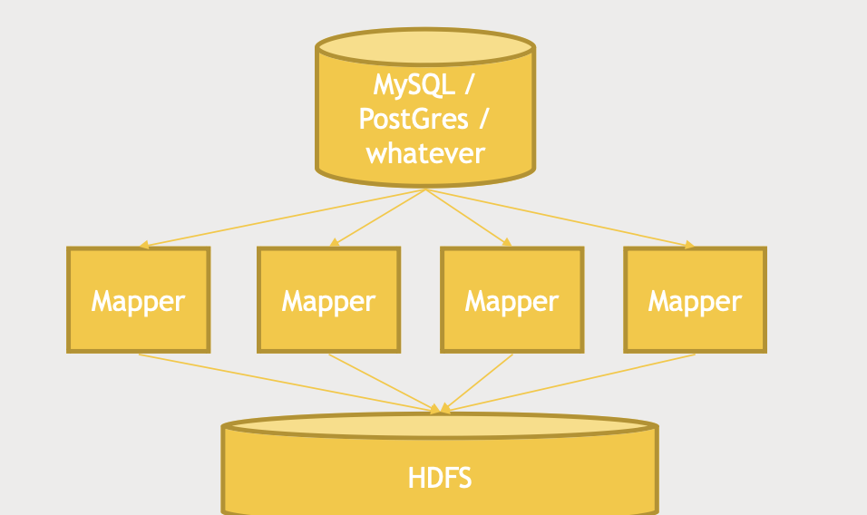
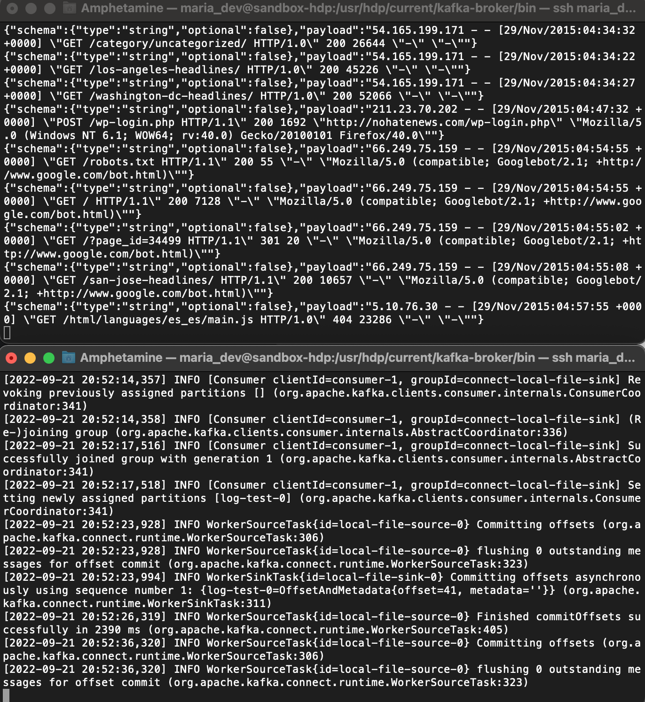

# Udemy Big Data

## Section 1: Learn all the buzzwords! And install the Hortonworks Data Platform Sandbox.

|NAME ID(S)|HDFS AUTHORIZATION|AMBARI AUTHORIZATION|RANGER AUTHORIZATION|
| ---------------------| -------------------------------------------------------------------------------------| -----------------------| ----------------------|
|Sam Admin|Max Ops|Ambari Admin|Admin access|
|Raj (raj_ops)|Access to Hive, Hbase, Atlas, Falcon, Ranger, Knox, Sqoop, Oozie, Flume, Operations|Cluster Administrator|Admin Access|
|Maria (maria_dev)|Access to Hive, Hbase, Falcon, Oozie and Spark|Service Operator|Normal User Access|
|Amy (amy_ds)|Access to Hive, Spark and Zeppelin|Service Operator|Normal User Access|
|Holger (holger_gov)|Access to Atlas|Service Administrator|Normal User Access|

https://indico.ictp.it/event/8170/session/10/contribution/21/material/0/1.pdf


​

​


```sql
select movie_id, count(movie_id) as rating_count
from ratings
group by movie_id
order by rating_count DESC;
```

|movie_id|rating_count|
| ----------| --------------|
|50|583|
|258|509|
|100|508|
|181|507|
|...|...|


visualization tab

​


```sql
select m.name, x.*
from
(select movie_id, count(movie_id) as rating_count
from ratings
group by movie_id
order by rating_count DESC) x,
movies m
where x.movie_id = m.movie_id;
```

|m.name|x.movie_id|x.rating_count|
| -----------------------------| ------------| ----------------|
|Star Wars (1977)|50|583|
|Contact (1997)|258|509|
|Fargo (1996)|100|508|
|Return of the Jedi (1983)|181|507|
|Liar Liar (1997)|294|485|
|English Patient, The (1996)|286|481|


* What is Hadoop?​

  "an open source **software platform** for **distributed storage** and **distributed processing** of **very large data sets** on **computer clusters** built from commodity hardware" - Hortonworks
* Hadoop History

  * Google published GFS and MapReduce papers in 2003-2004
  * Yahoo! was building "Nutch," an open source web search engine at the same time
  * Hadoop was primarily driven by Doug Cutting and Tom White in 2006
  * It's been evolving ever since...
* Comparison

  * GFS inspired Hadoop's distributed data storage
  * MapReduce inspired Hadoop's distributed data processing
* Why Hadoop

  * Data's too darn big - terabytes per day
  * Vertical scaling doesn't cut it

    * Disk seek times
    * Hardware failures
    * Processing times
  * Horizontal scaling is linear
  * Hadoop: It's not just for batch processing anymore
* Core Hadoop Ecosystem

  

  * Pink Items - Hadoop itself

    * HDFS, Hadoop Distributed File System (Data Storage)

      * Distribute the storage across clusters, across nodes
      * Make redundant copies of data
    * YARN, Yet Another Resource Negotiator (Data Processing)

      * resource manager, to distribute the data processing task
    * MapReduce, programming metaphor

      * Mapper, to transform
      * Reducer, to aggregate
  * Add-ons

    * Pig, high-level programming API that sits on, and talk to MapReduce

      * SQL-alike syntax, no need Python/Java
    * Hive, similar to Pig, making files on HDFS queried like relational database

      * SQL syntax
    * Apache Ambari, overview of everything, dashboard

      * execute Hive query
      * import database into Hive
      * execute Pig query
    * Mesos, alternative to YARN
    * Spark, same level as MapReduce

      * can sit on YARN/Mesos
      * Python/Java/Scala
      * SQL
      * Machine Learning
      * Streaming data
    * Tez, similar to Spark, using Directed Acyclic Graph (DAG)

      * Optimizing the query when executing
      * Usually used with Hive
    * Apache HBase, exposing the data on your cluster to trasactional platforms

      * NoSQL databse
      * Columnar data store
      * Built for large transaction rates
    * Apache Storm, a way of processing streaming data

      * Alternative, Spark Streaming
    * Oozie, a way of scheduling jobs on your cluster
    * Zookeeper, coordinator of everything on Hadoop

      * Maintain reliable and consistent performance
  * Data Ingestion

    * Sqoop, tying Hadoop database into relational database

      * ODBC/JDBC connection
      * Connector between Hadoop and legacy database
    * Flume, a way of trasnporting web logs at a very large scale and reliably
    * Kafka, can have any sorts of data broadcast to Hadoop Cluster
* External Data Storage

  

  * HBase can also be included here
  * MySQL
  * Cassandra, Columnar
  * MongoDB, Columnar
* Query Engines

  

  * Hive can also be included here
  * Apache Drill, SQL to query a wide range of NoSQL database

    * can talk to HBase, Cassandra, MongoDB
  * Hive, interactive SQL query

    * work well with Hive and HBase
    * **In Cloudera, Hue takes place of Ambari**
  * Apache Phoenix, similar to Drill

    * ACID gurantee and OLTP
  * Presto
  * Apache Zeppelin


## Section 2: Using Hadoop's Core: HDFS and MapReduce

* HDFS, built for handling large files

  * by breaking them into blocks (128MB by default)
  * stored across several commodity computers (cheap)
  * Redundant copies, auto failover, high availability
  * HDFS Architecture

    * Name Node, tracks where all blocks live
    * Data Node
  * Reading FIle Process

    ​

    ```plantuml
    @startuml
    :Client Node request to read;
    :Name Node inform the path;
    :Client Node goes to actual path to find the file;

    @enduml
    ```
  * Writing File Process

    ​

    ```plantuml
    @startuml
    :Client Node request to write on HDFS;
    :Name Node inform the path to create new entry;
    :Client Node talk to one data node to write;
    :Data Nodes talk among themselves to ensure redundancy is done;
    :Data Node inform Client Node actual path;
    :Client Node revert to Name Node on path of files;

    @enduml
    ```
  * Name Node HA

    * Back Up Metadata

      Namenode writes to local disk and NFS
    * Secondary Namenode

      Maintains merged copy of edit log you can restore from
    * HDFS Federation

      Each namenode manages a specifc namespace volume
    * HDFS High Availability

      * Hot standby namenode using shared edit log
      * Zookeeper tracks active namenode
      * Uses extreme measures to ensure only one namenode is used at a time

        * Cut off the power of dead node
  * Using HDFS

    * UI (Ambari)
    * Command-Line Interface
    * HTTP / HDFS Proxies
    * Java interface
    * NFS (Network File System) Gateway
  * Play with MovieLens Data

    ```bash
    ssh maria_dev@127.0.0.1 -p 2222
    ```

    ```bash
    (base) Amphe-2:~ Amphetamine$ ssh maria_dev@127.0.0.1 -p 2222
    The authenticity of host '[127.0.0.1]:2222 ([127.0.0.1]:2222)' can't be established.
    ECDSA key fingerprint is SHA256:MZNH/M/FtHhe7wiWlgEfK9YnFDXb7yV8aq6AcOmGq4k.
    Are you sure you want to continue connecting (yes/no/[fingerprint])? yes
    Warning: Permanently added '[127.0.0.1]:2222' (ECDSA) to the list of known hosts.
    maria_dev@127.0.0.1's password: 
    -bash: warning: setlocale: LC_CTYPE: cannot change locale (UTF-8): No such file or directory


    [maria_dev@sandbox-hdp ~]$ hadoop fs -ls
    Found 1 items
    drwxr-xr-x   - maria_dev hdfs          0 2022-09-11 16:18 hive
    [maria_dev@sandbox-hdp ~]$ hadoop fs -mkdir ml-100k
    [maria_dev@sandbox-hdp ~]$ hadoop fs -ls
    Found 2 items
    drwxr-xr-x   - maria_dev hdfs          0 2022-09-11 16:18 hive
    drwxr-xr-x   - maria_dev hdfs          0 2022-09-12 13:53 ml-100k


    [maria_dev@sandbox-hdp ~]$ wget http://media.sundog-soft.com/hadoop/ml-100k/u.data
    --2022-09-12 14:25:52--  http://media.sundog-soft.com/hadoop/ml-100k/u.data
    Resolving media.sundog-soft.com (media.sundog-soft.com)... 52.216.238.107
    Connecting to media.sundog-soft.com (media.sundog-soft.com)|52.216.238.107|:80... connected.
    HTTP request sent, awaiting response... 200 OK
    Length: 2079229 (2.0M) [application/octet-stream]
    Saving to: 'u.data'

    100%[======================================>] 2,079,229    496KB/s   in 4.1s   

    2022-09-12 14:25:57 (496 KB/s) - 'u.data' saved [2079229/2079229]

    [maria_dev@sandbox-hdp ~]$ ls
    u.data

    [maria_dev@sandbox-hdp ~]$ hadoop fs -copyFromLocal u.data ml-100k/u.data
    [maria_dev@sandbox-hdp ~]$ hadoop fs -ls ml-100k
    Found 1 items
    -rw-r--r--   1 maria_dev hdfs    2079229 2022-09-12 14:27 ml-100k/u.data
    [maria_dev@sandbox-hdp ~]$ hadoop fs -rm ml-100k/u.data
    22/09/12 14:28:40 INFO fs.TrashPolicyDefault: Moved: 'hdfs://sandbox-hdp.hortonworks.com:8020/user/maria_dev/ml-100k/u.data' to trash at: hdfs://sandbox-hdp.hortonworks.com:8020/user/maria_dev/.Trash/Current/user/maria_dev/ml-100k/u.data
    [maria_dev@sandbox-hdp ~]$ hadoop fs -rmdir ml-100k
    [maria_dev@sandbox-hdp ~]$ hadoop fs -ls
    Found 2 items
    drwx------   - maria_dev hdfs          0 2022-09-12 14:28 .Trash
    drwxr-xr-x   - maria_dev hdfs          0 2022-09-11 16:18 hive


    [maria_dev@sandbox-hdp ~]$ hadoop fs
    Usage: hadoop fs [generic options]
    	[-appendToFile <localsrc> ... <dst>]
    	[-cat [-ignoreCrc] <src> ...]
    	[-checksum <src> ...]
    	[-chgrp [-R] GROUP PATH...]
    	[-chmod [-R] <MODE[,MODE]... | OCTALMODE> PATH...]
    	[-chown [-R] [OWNER][:[GROUP]] PATH...]
    	[-copyFromLocal [-f] [-p] [-l] <localsrc> ... <dst>]
    	[-copyToLocal [-p] [-ignoreCrc] [-crc] <src> ... <localdst>]
    	[-count [-q] [-h] [-v] [-t [<storage type>]] [-u] <path> ...]
    	[-cp [-f] [-p | -p[topax]] <src> ... <dst>]
    	[-createSnapshot <snapshotDir> [<snapshotName>]]
    	[-deleteSnapshot <snapshotDir> <snapshotName>]
    	[-df [-h] [<path> ...]]
    	[-du [-s] [-h] <path> ...]
    	[-expunge]
    	[-find <path> ... <expression> ...]
    	[-get [-p] [-ignoreCrc] [-crc] <src> ... <localdst>]
    	[-getfacl [-R] <path>]
    	[-getfattr [-R] {-n name | -d} [-e en] <path>]
    	[-getmerge [-nl] <src> <localdst>]
    	[-help [cmd ...]]
    	[-ls [-C] [-d] [-h] [-q] [-R] [-t] [-S] [-r] [-u] [<path> ...]]
    	[-mkdir [-p] <path> ...]
    	[-moveFromLocal <localsrc> ... <dst>]
    	[-moveToLocal <src> <localdst>]
    	[-mv <src> ... <dst>]
    	[-put [-f] [-p] [-l] <localsrc> ... <dst>]
    	[-renameSnapshot <snapshotDir> <oldName> <newName>]
    	[-rm [-f] [-r|-R] [-skipTrash] [-safely] <src> ...]
    	[-rmdir [--ignore-fail-on-non-empty] <dir> ...]
    	[-setfacl [-R] [{-b|-k} {-m|-x <acl_spec>} <path>]|[--set <acl_spec> <path>]]
    	[-setfattr {-n name [-v value] | -x name} <path>]
    	[-setrep [-R] [-w] <rep> <path> ...]
    	[-stat [format] <path> ...]
    	[-tail [-f] <file>]
    	[-test -[defsz] <path>]
    	[-text [-ignoreCrc] <src> ...]
    	[-touchz <path> ...]
    	[-truncate [-w] <length> <path> ...]
    	[-usage [cmd ...]]

    Generic options supported are
    -conf <configuration file>     specify an application configuration file
    -D <property=value>            use value for given property
    -fs <local|namenode:port>      specify a namenode
    -jt <local|resourcemanager:port>    specify a ResourceManager
    -files <comma separated list of files>    specify comma separated files to be copied to the map reduce cluster
    -libjars <comma separated list of jars>    specify comma separated jar files to include in the classpath.
    -archives <comma separated list of archives>    specify comma separated archives to be unarchived on the compute machines.

    The general command line syntax is
    bin/hadoop command [genericOptions] [commandOptions]

    ```
  * MapReduce

    * Why MapReduce?

      * Distributes the processing of data on your cluster
      * Divides your data up into partitions that are MAPPED (transformed) and REDUCED (aggregated) by mapper and reducer functions you define
      * Resilient to failure - an application master monitors your mappers and reducers on each partition
    * Example: How many movies did each user rate inthe movielens dataset

      ​

      * The MAPPER converts raw data into key/value pair
      * MapReduce sorts and groups the mapped data (shuffle and sort)
      * The REDUCER processes each key's values
    * Underlying

      ​

      * YARN will keep the map/reduce task as close as possible to the data
    * Writing Mapper and Reducer

      * MapReduce is natively Java
      * STREAMING allows interfacing to other languages (ie Python)

        ​
    * Handling Failure

      * Application master monitors worker tasks for errors or hanging

        * *Restarts as needed*
        * *Preferably on a different node*

      * What if the application master goes down?

        * *YARN can try to restart it*
      * What if an entire Node goes down?

        * *This could be the application master*
        * *The resource manager will try to restart it*
      * What if the resource manager goes down?

        * *Can set up "high availability" (HA) using Zookeeper to have a hot standby*
    * Example: How many of each movie rating exist?

      * Making it a MapReduce problem

        ​

        * MAP each input line to (rating, 1)

        * REDUCE each rating with the sum of all the 1's
      * Writing the mapper

        ```python
        def mapper_get_ratings(self, _, line):
            (userID, movieID, rating, timestamp) = line.split('\t')
            yield rating, 1
        ```
      * Writing the reducer

        ```python
        def reducer_count_ratings(self, key, values):
            yield key, sum(values)
        ```
      * Putting it all together

        ```python
        from mrjob.job import MRJob
        from mrjob.step import MRStep

        class RatingsBreakdown(MRJob):
            def steps(self):
                return [
        		MRStep(mapper = self.mapper_get_ratings,
        		       reducer = self.reducer_count_ratings)
        ]

            def mapper_get_ratings(self, _, line):
                (userID, movieID, rating, timestamp) = line.split('\t')
                yield rating, 1

            def reducer_count_ratings(self, key, values):
                yield key, sum(values)

        if __name__ == '__main__':
            RatingsBreakdown.run()
        ```
  * Installing mrjob on HDP 2.65

    The following video will walk you through these steps, but you may find it helpful to have the commands in writing so you can just copy and paste them as you go (be sure to "su root" first, as shown in the video.)

    ```bash
    yum-config-manager --save --setopt=HDP-SOLR-2.6-100.skip_if_unavailable=true
    yum install https://repo.ius.io/ius-release-el7.rpm https://dl.fedoraproject.org/pub/epel/epel-release-latest-7.noarch.rpm
    yum install python-pip
    pip install pathlib
    pip install mrjob==0.7.4
    pip install PyYAML==5.4.1
    yum install nano
    wget http://media.sundog-soft.com/hadoop/RatingsBreakdown.py
    wget http://media.sundog-soft.com/hadoop/ml-100k/u.data

    [root@sandbox-hdp maria_dev]# cat RatingsBreakdown.py 
    from mrjob.job import MRJob
    from mrjob.step import MRStep

    class RatingsBreakdown(MRJob):
        def steps(self):
            return [
                MRStep(mapper=self.mapper_get_ratings,
                       reducer=self.reducer_count_ratings)
            ]

        def mapper_get_ratings(self, _, line):
            (userID, movieID, rating, timestamp) = line.split('\t')
            yield rating, 1

        def reducer_count_ratings(self, key, values):
            yield key, sum(values)

    if __name__ == '__main__':
        RatingsBreakdown.run()
    ```

    * [credentials]

      * Amphe3578 for root pwd
    * running on local

      ```bash
      [maria_dev@sandbox-hdp ~]$ python RatingsBreakdown.py u.data
      No configs found; falling back on auto-configuration
      No configs specified for inline runner
      Creating temp directory /tmp/RatingsBreakdown.maria_dev.20220912.170037.376616
      Running step 1 of 1...
      job output is in /tmp/RatingsBreakdown.maria_dev.20220912.170037.376616/output
      Streaming final output from /tmp/RatingsBreakdown.maria_dev.20220912.170037.376616/output...
      "4"	34174
      "5"	21203
      "1"	6111
      "2"	11370
      "3"	27145
      Removing temp directory /tmp/RatingsBreakdown.maria_dev.20220912.170037.376616...
      ```
    * running on Hadoop

      ```bash
      [maria_dev@sandbox-hdp ~]$ python RatingsBreakdown.py -r hadoop --hadoop-streaming-jar /usr/hdp/current/hadoop-mapreduce-client/hadoop-streaming.jar u.data
      No configs found; falling back on auto-configuration
      No configs specified for hadoop runner
      Looking for hadoop binary in $PATH...
      Found hadoop binary: /usr/bin/hadoop
      Using Hadoop version 2.7.3.2.6.5.0
      Creating temp directory /tmp/RatingsBreakdown.maria_dev.20220912.170420.347175
      uploading working dir files to hdfs:///user/maria_dev/tmp/mrjob/RatingsBreakdown.maria_dev.20220912.170420.347175/files/wd...
      Copying other local files to hdfs:///user/maria_dev/tmp/mrjob/RatingsBreakdown.maria_dev.20220912.170420.347175/files/
      Running step 1 of 1...
        packageJobJar: [] [/usr/hdp/2.6.5.0-292/hadoop-mapreduce/hadoop-streaming-2.7.3.2.6.5.0-292.jar] /tmp/streamjob530204118478638207.jar tmpDir=null
        Connecting to ResourceManager at sandbox-hdp.hortonworks.com/172.18.0.2:8032
        Connecting to Application History server at sandbox-hdp.hortonworks.com/172.18.0.2:10200
        Connecting to ResourceManager at sandbox-hdp.hortonworks.com/172.18.0.2:8032
        Connecting to Application History server at sandbox-hdp.hortonworks.com/172.18.0.2:10200
        Total input paths to process : 1
        number of splits:2
        Submitting tokens for job: job_1662992704302_0001
        Submitted application application_1662992704302_0001
        The url to track the job: http://sandbox-hdp.hortonworks.com:8088/proxy/application_1662992704302_0001/
        Running job: job_1662992704302_0001
        Job job_1662992704302_0001 running in uber mode : false
         map 0% reduce 0%
         map 100% reduce 0%
         map 100% reduce 100%
        Job job_1662992704302_0001 completed successfully
        Output directory: hdfs:///user/maria_dev/tmp/mrjob/RatingsBreakdown.maria_dev.20220912.170420.347175/output
      Counters: 49
      	File Input Format Counters 
      		Bytes Read=2088191
      	File Output Format Counters 
      		Bytes Written=49
      	File System Counters
      		FILE: Number of bytes read=800030
      		FILE: Number of bytes written=2073009
      		FILE: Number of large read operations=0
      		FILE: Number of read operations=0
      		FILE: Number of write operations=0
      		HDFS: Number of bytes read=2088549
      		HDFS: Number of bytes written=49
      		HDFS: Number of large read operations=0
      		HDFS: Number of read operations=9
      		HDFS: Number of write operations=2
      	Job Counters 
      		Data-local map tasks=2
      		Launched map tasks=2
      		Launched reduce tasks=1
      		Total megabyte-milliseconds taken by all map tasks=5042500
      		Total megabyte-milliseconds taken by all reduce tasks=1184250
      		Total time spent by all map tasks (ms)=20170
      		Total time spent by all maps in occupied slots (ms)=20170
      		Total time spent by all reduce tasks (ms)=4737
      		Total time spent by all reduces in occupied slots (ms)=4737
      		Total vcore-milliseconds taken by all map tasks=20170
      		Total vcore-milliseconds taken by all reduce tasks=4737
      	Map-Reduce Framework
      		CPU time spent (ms)=4750
      		Combine input records=0
      		Combine output records=0
      		Failed Shuffles=0
      		GC time elapsed (ms)=382
      		Input split bytes=358
      		Map input records=100003
      		Map output bytes=600018
      		Map output materialized bytes=800036
      		Map output records=100003
      		Merged Map outputs=2
      		Physical memory (bytes) snapshot=513785856
      		Reduce input groups=5
      		Reduce input records=100003
      		Reduce output records=5
      		Reduce shuffle bytes=800036
      		Shuffled Maps =2
      		Spilled Records=200006
      		Total committed heap usage (bytes)=263192576
      		Virtual memory (bytes) snapshot=5840756736
      	Shuffle Errors
      		BAD_ID=0
      		CONNECTION=0
      		IO_ERROR=0
      		WRONG_LENGTH=0
      		WRONG_MAP=0
      		WRONG_REDUCE=0
      job output is in hdfs:///user/maria_dev/tmp/mrjob/RatingsBreakdown.maria_dev.20220912.170420.347175/output
      Streaming final output from hdfs:///user/maria_dev/tmp/mrjob/RatingsBreakdown.maria_dev.20220912.170420.347175/output...
      "1"	6111
      "2"	11370
      "3"	27145
      "4"	34174
      "5"	21203
      Removing HDFS temp directory hdfs:///user/maria_dev/tmp/mrjob/RatingsBreakdown.maria_dev.20220912.170420.347175...
      Removing temp directory /tmp/RatingsBreakdown.maria_dev.20220912.170420.347175...
      ```
  * Exercise: Count up ratings given for each movie

    * All you need is to change one thing in the mapper – we don’t care about ratings now, we care about movie ID’s!

    * Start with this and make sure you can do it.
    * You can use nano to just edit the existing RatingsBreakdown.py script
    * Strategy

      * Map to (movieID, 1) key/value pairs
      * Reduce with output of (rating count, movieID)
      * Send this to a second reducer so we end up with things sorted by rating  
        count!
    * Gotchas:

      * How do we set up more than one MapReduce step?
      * How do we ensure the rating counts are sorted properly?
    * Code

      ```bash
      [maria_dev@sandbox-hdp ~]$ cat MovieCount.py 
      from mrjob.job import MRJob
      from mrjob.step import MRStep

      class RatingsBreakdown(MRJob):
          def steps(self):
              return [
                  MRStep(mapper=self.mapper_get_movies,
                         reducer=self.reducer_count_ratings)
              ]

          def mapper_get_movies(self, _, line):
              (userID, movieID, rating, timestamp) = line.split('\t')
              yield movieID, 1

          def reducer_count_ratings(self, key, values):
              yield key, sum(values)

      if __name__ == '__main__':
          RatingsBreakdown.run()

      [maria_dev@sandbox-hdp ~]$ python MovieCount.py u.data
      No configs found; falling back on auto-configuration
      No configs specified for inline runner
      Creating temp directory /tmp/MovieCount.maria_dev.20220912.171115.715505
      Running step 1 of 1...
      job output is in /tmp/MovieCount.maria_dev.20220912.171115.715505/output
      Streaming final output from /tmp/MovieCount.maria_dev.20220912.171115.715505/output...
      "194"	241
      "195"	301
      "196"	251
      "197"	239
      "198"	127
      "199"	165
      "2"	131
      "20"	72
      ...


      [maria_dev@sandbox-hdp ~]$ cat TopMovies.py 
      from mrjob.job import MRJob
      from mrjob.step import MRStep

      class RatingsBreakdown(MRJob):
          def steps(self):
              return [
                  MRStep(mapper=self.mapper_get_ratings,
                         reducer=self.reducer_count_ratings),
                  MRStep(reducer=self.reducer_sorted_output)
              ]

          def mapper_get_ratings(self, _, line):
              (userID, movieID, rating, timestamp) = line.split('\t')
              yield movieID, 1

          def reducer_count_ratings(self, key, values):
              yield str(sum(values)).zfill(5), key

          def reducer_sorted_output(self, count, movies):
              for movie in movies:
                  yield movie, count


      if __name__ == '__main__':
          RatingsBreakdown.run()

      ## You may notice that your results aren't sorted the same way mine are. 
      ## Depending on how MapReduce split up the processing of your work, 
      ## you may be getting results back from each CPU core or from multiple threads 
      ## reducing the data in parallel. Only data from the same process can be 
      ## sorted by an individual reducer, so that's expected.

      ## It would be possible to re-sort your final results via some other process 
      ## once it is all received, but as you'll see in later lectures, 
      ## more modern technologies such as Spark will handle things like this for you.
      ## output
      "443"	"00162"
      "66"	"00162"
      "411"	"00163"
      "523"	"00164"
      "692"	"00164"
      "739"	"00164"
      ```


## Section 3: Programming Hadoop with Pig

* Prep

  * getting admin account for hadoop

    ```bash
    [root@sandbox-hdp maria_dev]# ambari-admin-password-reset
    Please set the password for admin: 
    Please retype the password for admin: 

    The admin password has been set.
    Restarting ambari-server to make the password change effective...

    Using python  /usr/bin/python
    Restarting ambari-server
    Waiting for server stop...
    Ambari Server stopped
    Ambari Server running with administrator privileges.
    Organizing resource files at /var/lib/ambari-server/resources...
    Ambari database consistency check started...
    Server PID at: /var/run/ambari-server/ambari-server.pid
    Server out at: /var/log/ambari-server/ambari-server.out
    Server log at: /var/log/ambari-server/ambari-server.log
    Waiting for server start..........................................
    Server started listening on 8080

    DB configs consistency check: no errors and warnings were found.
    ```

* Pig

  ​

  * Features

    * built on Hadoop and MapReduce, to not necessary writing mapper and reducer

      * also on Tez, offering accelaration compared to MapReduce
      * Multi sets of (mapper, reducer) forms a DAG, where Tez can observe the interdenpendecies between steps and compute the optimal path
    * Writing mappers and reducers by hand takes a long time.
    * Pig introduces **Pig Latin**, a scripting language that lets you use **SQL-like** syntax to define your map and reduce steps.
    * Highly extensible with user-defined functions (UDF’s)
  * Running Pig

    * Grunt

      * MasterNode CLI
    * Script
    * Ambari / Hue
  * Hands-on: Find the oldest good-rates(avg ratings > 4.0) movie

    ```pig
    -- load files
    ratings = LOAD '/user/maria_dev/ml-100k/u.data' AS (userID:int, movieID:int, rating:int, ratingTime:int);

    metadata = LOAD '/user/maria_dev/ml-100k/u.item' USING PigStorage('|')
    	AS (movieID:int, movieTitle:chararray, releaseDate:chararray, videoRealese:chararray, imdblink:chararray);

    -- convert date
    nameLookup = FOREACH metadata GENERATE movieID, movieTitle,
    	ToUnixTime(ToDate(releaseDate, 'dd-MMM-yyyy')) AS releaseTime;

    -- group by movieID
    ratingsByMovie = GROUP ratings BY movieID;

    -- generate the avgRatings
    avgRatings = FOREACH ratingsByMovie GENERATE group as movieID, AVG(ratings.rating) as avgRating;

    fiveStarMovies = FILTER avgRatings BY avgRating > 4.0;

    -- join fiveStarMovies and nameLookup by movieID
    fiveStarsWithData = JOIN fiveStarMovies BY movieID, nameLookup BY movieID;

    -- sort by releaseTime
    oldestFiveStarMovies = ORDER fiveStarsWithData BY nameLookup::releaseTime;

    DUMP oldestFiveStarMovies;
    ```

    

    * MapReduce Version -- 3 min, 29 sec

      ```accesslog
      2022-09-13 17:42:51,749 [main] INFO  org.apache.pig.Main - Pig script completed in 1 minute, 42 seconds and 833 milliseconds (102833 ms) 
      ```

    * Tez Version (faster) -- 2 min, 35 sec

      ```accesslog
      2022-09-13 17:49:46,931 [main] INFO  org.apache.pig.Main - Pig script completed in 1 minute, 23 seconds and 573 milliseconds (83573 ms) 
      ```
  * Pig Latin

    * Syntax

      * LOAD STORE DUMP

        – STORE ratings INTO 'outRatings' USING PigStorage(':');
      * FILTER DISTINCT FOREACH/GENERATE MAPREDUCE STREAM SAMPLE
      * JOIN COGROUP GROUP CROSS CUBE
      * ORDER RANK LIMIT
      * UNION SPLIT
    * Diagnostics

      * DESCRIBE (describe the schema of a given relation)
      * EXPLAIN (SQL explain plan, insight on how Pig execute the query)
      * ILLUSTRATE (taking sample to explain)
    * UDFs (Java)

      * REGISTER (jar file containg UDF imported to Pig)
      * DEFINE (name the function)
      * IMPORT (import macros for Pig file)
    * Some other functions and loaders

      * AVG CONCAT COUNT MAX MIN SIZE SUM

      * PigStorage
      * TextLoader
      * JsonLoader
      * AvroStorage
      * ParquetLoader
      * OrcStorage
      * HdBaseStorage
  * Exercise: find the mostly rated bad rating movie

    ```pig
    -- load files
    ratings = LOAD '/user/maria_dev/ml-100k/u.data' AS (userID:int, movieID:int, rating:int, ratingTime:int);

    metadata = LOAD '/user/maria_dev/ml-100k/u.item' USING PigStorage('|')
    	AS (movieID:int, movieTitle:chararray, releaseDate:chararray, videoRealese:chararray, imdblink:chararray);

    -- convert date
    nameLookup = FOREACH metadata GENERATE movieID, movieTitle;

    -- group by movieID
    groupedRatings = GROUP ratings BY movieID;

    -- generate the avgRatings
    avgRatings = FOREACH groupedRatings GENERATE group as movieID, 
    	AVG(ratings.rating) as avgRating, 
        COUNT(ratings.rating) as numRatings;

    badMovies = FILTER avgRatings BY avgRating < 2.0;

    -- join badMovies and nameLookup by movieID
    namedBadMovies = JOIN badMovies BY movieID, nameLookup BY movieID;

    -- sort by releaseTime
    MostRatedBadRatingMovie = ORDER namedBadMovies BY badMovies::numRatings DESC;

    DUMP MostRatedBadRatingMovie;

    ```

    ​


## Section 4: Programming Hadoop with Spark

* Spark

  * Scalable

    ​
  * fast: save in RAM and using DAG

    * "Run programs up to 100x faster than Hadoop MapReduce in memory, or 10x faster on disk."
    * DAG Engine (directed acyclic graph) optimizes workflows
  * hot

    * Amazon
    * Ebay: log analysis and aggregation
    * NASA JPL: Deep Space Network
    * Groupon
    * TripAdviser
    * Yahoo
    * Many others: https://cwiki.apache.org/confluence/display/SPARK/Powered+By+Spark
  * easy

    * Code in Python, Java, or Scala
    * Built around one main concept: the Resilient Distributed Dataset (RDD)
  * Components

    ```plantuml
    @startuml
    [Spark Streaming]
    [Spark SQL]
    [MLLib]
    [GraphX]
    @enduml
    ```
* RDD (Resilient Distributed Dataset)

  * SparkContext

    * Created by your driver program
    * Is responsible for making RDD's resilient and distributed!
    * Creates RDD's
    * The Spark shell creates a "sc" object for you
  * Creating RDDs

    * nums = parallelize([1, 2, 3, 4])

    * sc.textFile("file:///c:/users/frank/gobs-o-text.txt")

      * or s3n:// , hdfs://
    * hiveCtx = HiveContext(sc)

      rows = hiveCtx.sql("SELECT name, age FROM users")

    * Can also create from:

      * JDBC

      * Cassandra
      * HBase
      * Elastisearch
      * JSON, CSV, sequence files, object files, various compressed formats
    * Transforming RDDs

      * map

        ```python
        rdd = sc.parallelize([1, 2, 3, 4])
        squaredRDD = rdd.map(lambda x: x*x)

        ## This yields 1, 4, 9, 16
        ```
      * flatmap
      * filter
      * distinct
      * sample
      * union, intersection, subtract, cartesian
    * RDD actions

      * collect
      * count
      * countByValue
      * take
      * top
      * reduce
      * ... and more ...
    * Lazy evaluation

      * Nothing actually happens in your driver program until an action is called!
  * Hands-on: find the bottom 10 movie with the lowest average ratings - with RDD

    ```python
    from pyspark import SparkConf, SparkContext

    # This function just creates a Python "dictionary" we can later
    # use to convert movie ID's to movie names while printing out
    # the final results.
    def loadMovieNames():
        movieNames = {}
        with open("ml-100k/u.item") as f:
            for line in f:
                fields = line.split('|')
                movieNames[int(fields[0])] = fields[1]
        return movieNames

    # Take each line of u.data and convert it to (movieID, (rating, 1.0))
    # This way we can then add up all the ratings for each movie, and
    # the total number of ratings for each movie (which lets us compute the average)
    def parseInput(line):
        fields = line.split()
        return (int(fields[1]), (float(fields[2]), 1.0))

    if __name__ == "__main__":
        # The main script - create our SparkContext
        conf = SparkConf().setAppName("WorstMovies")
        sc = SparkContext(conf = conf)

        # Load up our movie ID -> movie name lookup table
        movieNames = loadMovieNames()

        # Load up the raw u.data file
        lines = sc.textFile("hdfs:///user/maria_dev/ml-100k/u.data")

        # Convert to (movieID, (rating, 1.0))
        movieRatings = lines.map(parseInput)

        # Reduce to (movieID, (sumOfRatings, totalRatings))
        # this addition is actually doing the sum
        ratingTotalsAndCount = movieRatings.reduceByKey(lambda movie1, movie2: ( movie1[0] + movie2[0], movie1[1] + movie2[1] ) )

        # Map to (movieID, averageRating)
        averageRatings = ratingTotalsAndCount.mapValues(lambda totalAndCount : totalAndCount[0] / totalAndCount[1])

        # Sort by average rating
        sortedMovies = averageRatings.sortBy(lambda x: x[1])

        # Take the top 10 results
        results = sortedMovies.take(10)

        # Print them out:
        for result in results:
            print(movieNames[result[0]], result[1])

    ```

    * Spark-submit

      ```bash
      [maria_dev@sandbox-hdp ~]$ spark-submit LowestRatedMovieSpark.py 
      SPARK_MAJOR_VERSION is set to 2, using Spark2
      22/09/13 19:27:07 INFO SparkContext: Running Spark version 2.3.0.2.6.5.0-292
      22/09/13 19:27:07 INFO SparkContext: Submitted application: WorstMovies
      22/09/13 19:27:08 INFO SecurityManager: Changing view acls to: maria_dev
      ....

      22/09/13 19:27:18 INFO DAGScheduler: Job 2 finished: runJob at PythonRDD.scala:141, took 0.328263 s

      ('3 Ninjas: High Noon At Mega Mountain (1998)', 1.0)
      ('Beyond Bedlam (1993)', 1.0)
      ('Power 98 (1995)', 1.0)
      ('Bloody Child, The (1996)', 1.0)
      ('Amityville: Dollhouse (1996)', 1.0)
      ('Babyfever (1994)', 1.0)
      ('Homage (1995)', 1.0)
      ('Somebody to Love (1994)', 1.0)
      ('Crude Oasis, The (1995)', 1.0)
      ('Every Other Weekend (1990)', 1.0)
      ```
  * Spark SQL -- DataFrame and DataSets

    * Feature

      * Extends RDD to a "DataFrame" object

      * DataFrames:

        * Contain Row objects
        * –  Can run SQL queries
        * –  Has a schema (leading to more efficient storage)
        * –  Read and write to JSON, Hive, parquet
        * –  Communicates with JDBC/ODBC, Tableau
    * Using SparkSQL in Python

      ```python
      from pyspark.sql import SQLContext, Row
      hiveContext = HiveContext(sc)
      inputData = spark.read.json(dataFile)
      inputData.createOrReplaceTempView("myStructuredStuff")
      myResultDataFrame = hiveContext.sql("""SELECT foo FROM bar ORDER BY foobar""")
      ```

      ```python
      myResultDataFrame.show()
      myResultDataFrame.select("someFieldName")
      myResultDataFrame.filter(myResultDataFrame("someFieldName" > 200)
      myResultDataFrame.groupBy(myResultDataFrame("someFieldName")).mean()
      myResultDataFrame.rdd().map(mapperFunction)
      ```
    * DataSet

      * In Spark 2.0, a **DataFrame is really a DataSet of Row objects**
      * DataSets can wrap known, typed data too. But this is mostly transparent to you in Python, since Python is dynamically typed.
      * So – don’t sweat this too much with Python. But the Spark 2.0 way is to use DataSets instead of DataFrames when you can.
    * Shell Access

      * Spark SQL exposes a JDBC/ODBC server (if you built Spark with Hive support)
      * Start it with sbin/start-thriftserver.sh
      * Listens on port 10000 by default
      * Connect using bin/beeline -u jdbc:hive2://localhost:10000
      * Viola, you have a SQL shell to Spark SQL
      * You can create new tables, or query existing ones that were cached using hiveCtx.cacheTable("tableName")
    * User-defined functions (UDF's)

      ```python
      from pyspark.sql.types import IntegerType
      hiveCtx.registerFunction("square", lambda x: x*x, IntegerType())
      df = hiveCtx.sql("SELECT square('someNumericFiled') FROM tableName)
      ```
    * Hands-on: find the bottom 10 movie with the lowest average ratings - with DataFrame

      ```python
      # LowestRatedPopularMovieDataFrame.py 
      from pyspark.sql import SparkSession
      from pyspark.sql import Row
      from pyspark.sql import functions

      def loadMovieNames():
          movieNames = {}
          with open("ml-100k/u.item") as f:
              for line in f:
                  fields = line.split('|')
                  movieNames[int(fields[0])] = fields[1]
          return movieNames

      def parseInput(line):
          fields = line.split()
          return Row(movieID = int(fields[1]), rating = float(fields[2]))

      if __name__ == "__main__":
          # Create a SparkSession
          spark = SparkSession.builder.appName("PopularMovies").getOrCreate()

          # Load up our movie ID -> name dictionary
          movieNames = loadMovieNames()

          # Get the raw data
          lines = spark.sparkContext.textFile("hdfs:///user/maria_dev/ml-100k/u.data")
          # Convert it to a RDD of Row objects with (movieID, rating)
          movies = lines.map(parseInput)
          # Convert that to a DataFrame
          movieDataset = spark.createDataFrame(movies)

          # Compute average rating for each movieID
          averageRatings = movieDataset.groupBy("movieID").avg("rating")

          # Compute count of ratings for each movieID
          counts = movieDataset.groupBy("movieID").count()

          # Join the two together (We now have movieID, avg(rating), and count columns)
          averagesAndCounts = counts.join(averageRatings, "movieID")

          # Pull the top 10 results
          topTen = averagesAndCounts.orderBy("avg(rating)").take(10)

          # Print them out, converting movie ID's to names as we go.
          for movie in topTen:
              print (movieNames[movie[0]], movie[1], movie[2])

          # Stop the session
          spark.stop()

      ```

      ```bash
      [maria_dev@sandbox-hdp ~]$ export SPARK_MAJOR_VERSION=2
      [maria_dev@sandbox-hdp ~]$ spark-submit LowestRatedMovieDataFrame.py 
      SPARK_MAJOR_VERSION is set to 2, using Spark2

      ...
      22/09/14 14:48:21 INFO DAGScheduler: Job 1 finished: take at /home/maria_dev/LowestRatedMovieDataFrame.py:41, took 31.479431 s
      ('Amityville: A New Generation (1993)', 5, 1.0)
      ('Hostile Intentions (1994)', 1, 1.0)
      ('Lotto Land (1995)', 1, 1.0)
      ('Low Life, The (1994)', 1, 1.0)
      ('Amityville: Dollhouse (1996)', 3, 1.0)
      ('Careful (1992)', 1, 1.0)
      ('Falling in Love Again (1980)', 2, 1.0)
      ('Power 98 (1995)', 1, 1.0)
      ('Further Gesture, A (1996)', 1, 1.0)
      ('Touki Bouki (Journey of the Hyena) (1973)', 1, 1.0)
      ```
    * Hands-on: Movie Recommendations with MLLib

      ```python
      # MovieRecommendationsALS.py

      from pyspark.sql import SparkSession
      from pyspark.ml.recommendation import ALS
      from pyspark.sql import Row
      from pyspark.sql.functions import lit

      # Load up movie ID -> movie name dictionary
      def loadMovieNames():
          movieNames = {}
          with open("ml-100k/u.item") as f:
              for line in f:
                  fields = line.split('|')
                  movieNames[int(fields[0])] = fields[1].decode('ascii', 'ignore')
          return movieNames

      # Convert u.data lines into (userID, movieID, rating) rows
      def parseInput(line):
          fields = line.value.split()
          return Row(userID = int(fields[0]), movieID = int(fields[1]), rating = float(fields[2]))


      if __name__ == "__main__":
          # Create a SparkSession
          spark = SparkSession.builder.appName("MovieRecs").getOrCreate()

          spark.conf.set("spark.sql.crossJoin.enabled", "true")

          # Load up our movie ID -> name dictionary
          movieNames = loadMovieNames()

          # Get the raw data
          lines = spark.read.text("hdfs:///user/maria_dev/ml-100k/u.data").rdd

          # Convert it to a RDD of Row objects with (userID, movieID, rating)
          ratingsRDD = lines.map(parseInput)

          # Convert to a DataFrame and cache it
          ratings = spark.createDataFrame(ratingsRDD).cache()

          # Create an ALS collaborative filtering model from the complete data set
          als = ALS(maxIter=5, regParam=0.01, userCol="userID", itemCol="movieID", ratingCol="rating")
          model = als.fit(ratings)

          # Print out ratings from user 0:
          print("\nRatings for user ID 0:")
          userRatings = ratings.filter("userID = 0")
          for rating in userRatings.collect():
              print movieNames[rating['movieID']], rating['rating']

          print("\nTop 20 recommendations:")
          # Find movies rated more than 100 times
          ratingCounts = ratings.groupBy("movieID").count().filter("count > 100")
          # Construct a "test" dataframe for user 0 with every movie rated more than 100 times
          popularMovies = ratingCounts.select("movieID").withColumn('userID', lit(0))

          # Run our model on that list of popular movies for user ID 0
          recommendations = model.transform(popularMovies)

          # Get the top 20 movies with the highest predicted rating for this user
          topRecommendations = recommendations.sort(recommendations.prediction.desc()).take(20)

          for recommendation in topRecommendations:
              print (movieNames[recommendation['movieID']], recommendation['prediction'])

          spark.stop()

      ```

      ```bash
      [maria_dev@sandbox-hdp ~]$ spark-submit MovieRecommendationsALS.py 
      SPARK_MAJOR_VERSION is set to 2, using Spark2
      ...
      Ratings for user ID 0:
      Star Wars (1977) 5.0
      Empire Strikes Back, The (1980) 5.0
      Gone with the Wind (1939) 1.0

      Top 20 recommendations:
      (u'Wrong Trousers, The (1993)', 5.749821662902832)
      (u'Fifth Element, The (1997)', 5.232528209686279)
      (u'Close Shave, A (1995)', 5.050625324249268)
      (u'Monty Python and the Holy Grail (1974)', 4.99659538269043)
      (u'Star Wars (1977)', 4.98954963684082)
      (u'Army of Darkness (1993)', 4.980320930480957)
      (u'Empire Strikes Back, The (1980)', 4.972929954528809)
      (u'Princess Bride, The (1987)', 4.957705497741699)
      (u'Blade Runner (1982)', 4.910674571990967)
      (u'Return of the Jedi (1983)', 4.77808141708374)
      (u'Rumble in the Bronx (1995)', 4.69175910949707)
      (u'Raiders of the Lost Ark (1981)', 4.636718273162842)
      (u"Jackie Chan's First Strike (1996)", 4.632108211517334)
      (u'Twelve Monkeys (1995)', 4.614840507507324)
      (u'Spawn (1997)', 4.57417106628418)
      (u'Terminator, The (1984)', 4.561151027679443)
      (u'Alien (1979)', 4.54151725769043)
      (u'Terminator 2: Judgment Day (1991)', 4.529487133026123)
      (u'Usual Suspects, The (1995)', 4.517911911010742)
      (u'Mystery Science Theater 3000: The Movie (1996)', 4.5095906257629395)
      ```
    * Hands-on: change lowest-rated only valid when 10 or more peple rate that movie in both RDD and Dataframe version

      * RDD

        ```python
        # Reduce to (movieID, (sumOfRatings, totalRatings))

        # Filter out movies rated 10 or fewer times
        popularTotalsAndCount = ratingTotalsAndCount.filter(lambda x: x[1][1] > 10)
        ```

      * DataFrame

        ```python
        # Filter movies rated 10 or fewer times
        popularAveragesAndCounts = averagesAndCounts.filter("count > 10")
        ```

      * Result

        ```python
        ('Children of the Corn: The Gathering (1996)', 19, 1.3157894736842106)
        ('Body Parts (1991)', 13, 1.6153846153846154)
        ('Amityville II: The Possession (1982)', 14, 1.6428571428571428)
        ('Lawnmower Man 2: Beyond Cyberspace (1996)', 21, 1.7142857142857142)
        ('Robocop 3 (1993)', 11, 1.7272727272727273)
        ('Free Willy 3: The Rescue (1997)', 27, 1.7407407407407407)
        ("Gone Fishin' (1997)", 11, 1.8181818181818181)
        ('Solo (1996)', 12, 1.8333333333333333)
        ('Vampire in Brooklyn (1995)', 12, 1.8333333333333333)
        ('Ready to Wear (Pret-A-Porter) (1994)', 18, 1.8333333333333333)
        ```


## Section 5: Using relational data stores with Hadoop

* Hive

  ​

  * Features

    * Make Hadoop Cluster look like Relational Database
    * Translates SQL queries to MapReduce or Tez jobs on your cluster!
  * Why Hive

    * Uses familiar SQL syntax (HiveQL)
    * Interactive
    * Scalable – works with “big data” on a cluster

      * Really most appropriate for data warehouse applications
    * Easy OLAP queries – WAY easier than writing MapReduce in Java
    * Highly optimized
    * Highly extensible

      * User defined functions
      * Thrift server
      * JDBC / ODBC driver
  * Why not Hive

    * High latency – not appropriate for OLTP (no latency situations)
    * Stores data de-normalized
    * SQL is limited in what it can do

      * Pig, Spark allows more complex stuff
    * No transactions
    * No record-level updates, inserts, deletes
  * HiveQL

    * Pretty much MySQL with some extensions
    * For example: views (logical view)

      * Can store results of a query into a “view”, which subsequent queries can use as a table
    * Allows you to specify how structured data is stored and partitioned
  * Hands-on: find the most rated movie

    ```sql
    CREATE VIEW topMovieIDs AS
    SELECT movie_id, count(movie_id) AS ratingCount
    FROM ratings
    GROUP BY movie_id
    ORDER BY ratingCount DESC;

    SELECT n.title, t.ratingCount
    FROM topMovieIDs t
    JOIN names n
    ON t.movie_id = n.movie_id;
    ```

    |n.title|t.ratingcount|
    | ---------------------------| ---------------|
    |Star Wars (1977)|583|
    |Contact (1997)|509|
    |Fargo (1996)|508|
    |Return of the Jedi (1983)|507|
    |Liar Liar (1997)|485|
  * Mechanism

    * Schema on read

      * Hive maintains a “metastore” that imparts a structure you define on the unstructured data that is stored on HDFS etc.

        ```sql
        CREATE TABLE ratings (
        	userID INT,
        	movieID INT, 
        	rating INT, 
        	time INT)
        ROW FORMAT DELIMTED 
        FIELDS TERMINATED BY '\t' 
        STORED AS TEXTFILE;

        LOAD DATA LOCAL INPATH '${env:HOME}/ml-100k/u.data'
        OVERWRITE INTO TABLE ratings;
        ```

    * Where is the data?

      * LOAD DATA

        * MOVES data from a distributed filesystem into Hive (only one copy on HDFS, just where Hive expects the data to be)
      * LOAD DATA LOCAL

        * COPIES data from your local filesystem into Hive (two copies on HDFS)
      * Managed vs. External tables

        ```sql
        -- Data resides in origin path, no moving/copying
        CREATE EXTERNAL TABLE IF NOT EXISTS ratings (
        	userID INT,
        	movieID INT, 
        	rating INT, 
        	time INT)
        ROW FORMAT DELIMITED 
        FIELDS TERMINATED BY '\t' 
        LOCATION '/data/ml-100k/u.data';
        ```

    * Partitioning

      * You can store your data in partitioned subdirectories

        * Huge optimization if your queries are only on certain partitions

        ```sql
        CREATE TABLE customers ( 
        	name STRING,
        	address STRUCT<street:STRING, city:STRING, state:STRING, zip:INT> 
        )
        PARTITIONED BY (country STRING);

        -- result
        .../customers/country=CA/ 
        .../customers/country=GB/
        ```

    * Ways to use Hive

      * Interactive via hive> prompt / Command line interface (CLI)
      * Saved query files

        * hive –f /somepath/queries.hql
      * Through Ambari / Hue
      * Through JDBC/ODBC server
      * Through Thrift service

        * But remember, Hive is not suitable for OLTP
      * Via Oozie

    * Hands-on: Find the movie with the highest average rating

      ```sql
      SELECT r.movie_id, n.title, AVG(r.rating) as avgrating, COUNT(r.rating) as countrating
      FROM ratings r, names n
      WHERE r.movie_id = n.movie_id
      GROUP BY r.movie_id, n.title
      HAVING countrating > 10
      ORDER BY avgrating DESC
      ```

      |r.movie_id|n.title|avgrating|countrating|
      | ------------| --------------------------------------------------------| -------------------| -------------|
      |408|Close Shave, A (1995)|4.491071428571429|112|
      |318|Schindler's List (1993)|4.466442953020135|298|
      |169|Wrong Trousers, The (1993)|4.466101694915254|118|
      |483|Casablanca (1942)|4.45679012345679|243|
      |114|Wallace & Gromit: The Best of Aardman Animation (1996)|4.447761194029851|67|
      |64|Shawshank Redemption, The (1994)|4.445229681978798|283|

    * Integrating MySQL & Hadoop

      * MySQL

        * Popular, free relational database
        * Generally monolithic in nature
        * But, can be used for OLTP – so exporting data into MySQL can be useful
        * Existing data may exist in MySQL that you want to import to Hadoop
      * Sqoop

        * Actually kicks off MapReduce jobs to handle importing or exporting your data!

        

        * Sqoop: Import data from MySQL to HDFS

          * export from DB, import to HDFS
          * efficient on giant dataset, but not on lots of small datasets

          ```bash
          ## import to HDFS
          sqoop import --connect jdbc:mysql://localhost/movielens \
          --driver com.mysql.jdbc.Driver \
          --table movies\

          ## import to Hive
          sqoop import --connect jdbc:mysql://localhost/movielens \
          --driver com.mysql.jdbc.Driver \
          --table movies \
          --hive-import
          ```

          * Incremental imports

            * You can keep your relational database and Hadoop in sync
            * --check-column and -–last-value

        * Sqoop: Export data from Hive to MySQL

          ```bash
          # -m how many mappers needed
          sqoop export --connect jdbc:mysql://localhost/movielens -m 1 \
          --driver com.mysql.jdbc.Driver \
          --table exported_movies \
          --export-dir /apps/hive/warehouse/movies \
          --input-fields-terminated-by '\0001'
          ```

          * Target table must already exist in MySQL, with columns in expected order

        * Hands-on: Let’s play with MySQL and Sqoop

          ```bash
          ## cheatsheet
          ## On new HDP sandbixes, mysql's root account has no defualt password.
          ## Need to set one up the hard way first
          su root
          systemctl stop mysqld
          systemctl set-environment MYSQLD_OPTS="--skip-grant-tables --skip-networking"
          systemctl start mysqld
          mysql -u root
          ------- Mysql cmd 
          FLUSH PRIVILEGES;
          alter user 'root'@'localhost' IDENTIFIED BY 'hadoop';
          FLUSH PRIVILEGES;
          QUIT;
          ------ CMD
          systemctl unset-environment MYSQLD_OPTS
          systemctl restart mysqld
          ```

          * Prep

            ```bash
            [root@sandbox-hdp maria_dev]# systemctl stop mysqld
            [root@sandbox-hdp maria_dev]# systemctl set-environment MYSQLD_OPTS="--skip-grant-tables --skip-networking"
            [root@sandbox-hdp maria_dev]# systemctl start mysqld
            [root@sandbox-hdp maria_dev]# mysql -u root
            Welcome to the MySQL monitor.  Commands end with ; or \g.
            Your MySQL connection id is 2
            Server version: 5.7.22 MySQL Community Server (GPL)

            Copyright (c) 2000, 2018, Oracle and/or its affiliates. All rights reserved.

            Oracle is a registered trademark of Oracle Corporation and/or its
            affiliates. Other names may be trademarks of their respective
            owners.

            Type 'help;' or '\h' for help. Type '\c' to clear the current input statement.

            mysql> FLUSH PRIVILEGES;
            Query OK, 0 rows affected (0.08 sec)

            mysql> alter user 'root'@'localhost' IDENTIFIED BY 'hadoop';
            Query OK, 0 rows affected (0.02 sec)

            mysql> FLUSH PRIVILEGES;
            Query OK, 0 rows affected (0.00 sec)

            mysql> QUIT;
            Bye
            [root@sandbox-hdp maria_dev]# systemctl unset-environment MYSQLD_OPTS
            [root@sandbox-hdp maria_dev]# systemctl restart mysqld
            ```
          * Import MovieLens data into a MySQL database

            ```bash
            [maria_dev@sandbox-hdp ~]$ mysql -u root -p
            Enter password: 
            Welcome to the MySQL monitor.  Commands end with ; or \g.
            Your MySQL connection id is 35
            Server version: 5.7.22 MySQL Community Server (GPL)

            Copyright (c) 2000, 2018, Oracle and/or its affiliates. All rights reserved.

            Oracle is a registered trademark of Oracle Corporation and/or its
            affiliates. Other names may be trademarks of their respective
            owners.

            Type 'help;' or '\h' for help. Type '\c' to clear the current input statement.

            mysql> create database movielens;
            Query OK, 1 row affected (0.01 sec)

            mysql> show databases;
            +--------------------+
            | Database           |
            +--------------------+
            | information_schema |
            | druid              |
            | hive               |
            | movielens          |
            | mysql              |
            | performance_schema |
            | ranger             |
            | superset           |
            | sys                |
            +--------------------+
            9 rows in set (0.01 sec)

            mysql> exit
            Bye
            [maria_dev@sandbox-hdp ~]$ wget http://media.sundog-soft.com/hadoop/movielens.sql
            [maria_dev@sandbox-hdp ~]$ mysql -u root -p
            Enter password: 
            Welcome to the MySQL monitor.  Commands end with ; or \g.
            Your MySQL connection id is 44
            Server version: 5.7.22 MySQL Community Server (GPL)

            Copyright (c) 2000, 2018, Oracle and/or its affiliates. All rights reserved.

            Oracle is a registered trademark of Oracle Corporation and/or its
            affiliates. Other names may be trademarks of their respective
            owners.

            Type 'help;' or '\h' for help. Type '\c' to clear the current input statement.

            mysql> SET NAMES 'utf8';
            Query OK, 0 rows affected (0.02 sec)

            mysql> SET CHARACTER utf8;
            ERROR 1064 (42000): You have an error in your SQL syntax; check the manual that corresponds to your MySQL server version for the right syntax to use near 'utf8' at line 1
            mysql> SET CHARACTER SET utf8;
            Query OK, 0 rows affected (0.00 sec)

            mysql> use movielens;
            Database changed
            mysql> source movielens.sql;
            Query OK, 0 rows affected (0.00 sec)

            Query OK, 0 rows affected, 1 warning (0.00 sec)

            Query OK, 0 rows affected (0.02 sec)

            Query OK, 21 rows affected (0.00 sec)
            Records: 21  Duplicates: 0  Warnings: 0

            Query OK, 0 rows affected, 1 warning (0.00 sec)

            Query OK, 0 rows affected (0.02 sec)

            Query OK, 943 rows affected (0.01 sec)
            Records: 943  Duplicates: 0  Warnings: 0

            Query OK, 0 rows affected, 1 warning (0.00 sec)

            Query OK, 0 rows affected (0.01 sec)

            Query OK, 100000 rows affected (0.97 sec)
            Records: 100000  Duplicates: 0  Warnings: 0

            Query OK, 0 rows affected, 1 warning (0.05 sec)

            Query OK, 0 rows affected (0.05 sec)

            Query OK, 1682 rows affected, 9 warnings (0.04 sec)
            Records: 1682  Duplicates: 0  Warnings: 9

            Query OK, 0 rows affected, 1 warning (0.00 sec)

            Query OK, 0 rows affected (0.01 sec)

            Query OK, 18 rows affected (0.00 sec)
            Records: 18  Duplicates: 0  Warnings: 0

            Query OK, 0 rows affected, 1 warning (0.00 sec)

            Query OK, 0 rows affected (0.01 sec)

            Query OK, 2891 rows affected (0.02 sec)
            Records: 2891  Duplicates: 0  Warnings: 0

            Query OK, 0 rows affected (0.00 sec)

            mysql> show tables;
            +---------------------+
            | Tables_in_movielens |
            +---------------------+
            | genres              |
            | genres_movies       |
            | movies              |
            | occupations         |
            | ratings             |
            | users               |
            +---------------------+
            6 rows in set (0.00 sec)

            mysql> select * from movies limit 10;
            +----+------------------------------------------------------+--------------+
            | id | title                                                | release_date |
            +----+------------------------------------------------------+--------------+
            |  1 | Toy Story (1995)                                     | 1995-01-01   |
            |  2 | GoldenEye (1995)                                     | 1995-01-01   |
            |  3 | Four Rooms (1995)                                    | 1995-01-01   |
            |  4 | Get Shorty (1995)                                    | 1995-01-01   |
            |  5 | Copycat (1995)                                       | 1995-01-01   |
            |  6 | Shanghai Triad (Yao a yao yao dao waipo qiao) (1995) | 1995-01-01   |
            |  7 | Twelve Monkeys (1995)                                | 1995-01-01   |
            |  8 | Babe (1995)                                          | 1995-01-01   |
            |  9 | Dead Man Walking (1995)                              | 1995-01-01   |
            | 10 | Richard III (1995)                                   | 1996-01-22   |
            +----+------------------------------------------------------+--------------+
            10 rows in set (0.00 sec)

            mysql> describe ratings;
            +----------+-----------+------+-----+-------------------+-----------------------------+
            | Field    | Type      | Null | Key | Default           | Extra                       |
            +----------+-----------+------+-----+-------------------+-----------------------------+
            | id       | int(11)   | NO   | PRI | NULL              |                             |
            | user_id  | int(11)   | YES  |     | NULL              |                             |
            | movie_id | int(11)   | YES  |     | NULL              |                             |
            | rating   | int(11)   | YES  |     | NULL              |                             |
            | rated_at | timestamp | NO   |     | CURRENT_TIMESTAMP | on update CURRENT_TIMESTAMP |
            +----------+-----------+------+-----+-------------------+-----------------------------+
            5 rows in set (0.01 sec)

            mysql> SELECT r.movie_id, m.title, AVG(r.rating) as avgrating, COUNT(r.rating) as countrating
                -> FROM ratings r, movies m
                -> WHERE r.movie_id = m.id
                -> GROUP BY r.movie_id, m.title
                -> HAVING countrating > 10
                -> ORDER BY avgrating DESC;
            +----------+---------------------------------------------------------------------------------+-----------+-------------+
            | movie_id | title                                                                           | avgrating | countrating |
            +----------+---------------------------------------------------------------------------------+-----------+-------------+
            |      408 | Close Shave, A (1995)                                                           |    4.4911 |         112 |
            |      318 | Schindler's List (1993)                                                         |    4.4664 |         298 |
            |      169 | Wrong Trousers, The (1993)                                                      |    4.4661 |         118 |
            |      483 | Casablanca (1942)                                                               |    4.4568 |         243 |
            |      114 | Wallace & Gromit: The Best of Aardman Animation (1996)                          |    4.4478 |          67 |
            |       64 | Shawshank Redemption, The (1994)                                                |    4.4452 |         283 |
            ....
            ```

          * Import the movies to HDFS

            ```bash
            [maria_dev@sandbox-hdp ~]$ sqoop import --connect jdbc:mysql://localhost/movielens --driver com.mysql.jdbc.Driver --table movies -m 1 --username root --password hadoop
            Warning: /usr/hdp/2.6.5.0-292/accumulo does not exist! Accumulo imports will fail.
            Please set $ACCUMULO_HOME to the root of your Accumulo installation.
            22/09/15 15:18:30 INFO sqoop.Sqoop: Running Sqoop version: 1.4.6.2.6.5.0-292
            22/09/15 15:18:31 WARN tool.BaseSqoopTool: Setting your password on the command-line is insecure. Consider using -P instead.
            22/09/15 15:18:31 WARN sqoop.ConnFactory: Parameter --driver is set to an explicit driver however appropriate connection manager is not being set (via --connection-manager). Sqoop is going to fall back to org.apache.sqoop.manager.GenericJdbcManager. Please specify explicitly which connection manager should be used next time.
            22/09/15 15:18:31 INFO manager.SqlManager: Using default fetchSize of 1000
            22/09/15 15:18:31 INFO tool.CodeGenTool: Beginning code generation
            Thu Sep 15 15:18:31 UTC 2022 WARN: Establishing SSL connection without server's identity verification is not recommended. According to MySQL 5.5.45+, 5.6.26+ and 5.7.6+ requirements SSL connection must be established by default if explicit option isn't set. For compliance with existing applications not using SSL the verifyServerCertificate property is set to 'false'. You need either to explicitly disable SSL by setting useSSL=false, or set useSSL=true and provide truststore for server certificate verification.
            22/09/15 15:18:32 INFO manager.SqlManager: Executing SQL statement: SELECT t.* FROM movies AS t WHERE 1=0
            22/09/15 15:18:32 INFO manager.SqlManager: Executing SQL statement: SELECT t.* FROM movies AS t WHERE 1=0
            22/09/15 15:18:32 INFO orm.CompilationManager: HADOOP_MAPRED_HOME is /usr/hdp/2.6.5.0-292/hadoop-mapreduce
            Note: /tmp/sqoop-maria_dev/compile/cfd36910eae404a5461062068f189b6e/movies.java uses or overrides a deprecated API.
            Note: Recompile with -Xlint:deprecation for details.
            22/09/15 15:18:37 INFO orm.CompilationManager: Writing jar file: /tmp/sqoop-maria_dev/compile/cfd36910eae404a5461062068f189b6e/movies.jar
            22/09/15 15:18:37 INFO mapreduce.ImportJobBase: Beginning import of movies
            22/09/15 15:18:37 INFO manager.SqlManager: Executing SQL statement: SELECT t.* FROM movies AS t WHERE 1=0
            22/09/15 15:18:39 INFO client.RMProxy: Connecting to ResourceManager at sandbox-hdp.hortonworks.com/172.18.0.2:8032
            22/09/15 15:18:39 INFO client.AHSProxy: Connecting to Application History server at sandbox-hdp.hortonworks.com/172.18.0.2:10200
            Thu Sep 15 15:18:57 UTC 2022 WARN: Establishing SSL connection without server's identity verification is not recommended. According to MySQL 5.5.45+, 5.6.26+ and 5.7.6+ requirements SSL connection must be established by default if explicit option isn't set. For compliance with existing applications not using SSL the verifyServerCertificate property is set to 'false'. You need either to explicitly disable SSL by setting useSSL=false, or set useSSL=true and provide truststore for server certificate verification.
            22/09/15 15:18:58 INFO db.DBInputFormat: Using read commited transaction isolation
            22/09/15 15:18:58 INFO mapreduce.JobSubmitter: number of splits:1
            22/09/15 15:19:00 INFO mapreduce.JobSubmitter: Submitting tokens for job: job_1663252961477_0001
            22/09/15 15:19:03 INFO impl.YarnClientImpl: Submitted application application_1663252961477_0001
            22/09/15 15:19:03 INFO mapreduce.Job: The url to track the job: http://sandbox-hdp.hortonworks.com:8088/proxy/application_1663252961477_0001/
            22/09/15 15:19:03 INFO mapreduce.Job: Running job: job_1663252961477_0001
            22/09/15 15:19:43 INFO mapreduce.Job: Job job_1663252961477_0001 running in uber mode : false
            22/09/15 15:19:43 INFO mapreduce.Job:  map 0% reduce 0%
            22/09/15 15:19:55 INFO mapreduce.Job:  map 100% reduce 0%
            22/09/15 15:19:56 INFO mapreduce.Job: Job job_1663252961477_0001 completed successfully
            22/09/15 15:19:56 INFO mapreduce.Job: Counters: 30
            	File System Counters
            		FILE: Number of bytes read=0
            		FILE: Number of bytes written=171639
            		FILE: Number of read operations=0
            		FILE: Number of large read operations=0
            		FILE: Number of write operations=0
            		HDFS: Number of bytes read=87
            		HDFS: Number of bytes written=66940
            		HDFS: Number of read operations=4
            		HDFS: Number of large read operations=0
            		HDFS: Number of write operations=2
            	Job Counters 
            		Launched map tasks=1
            		Other local map tasks=1
            		Total time spent by all maps in occupied slots (ms)=7715
            		Total time spent by all reduces in occupied slots (ms)=0
            		Total time spent by all map tasks (ms)=7715
            		Total vcore-milliseconds taken by all map tasks=7715
            		Total megabyte-milliseconds taken by all map tasks=1928750
            	Map-Reduce Framework
            		Map input records=1682
            		Map output records=1682
            		Input split bytes=87
            		Spilled Records=0
            		Failed Shuffles=0
            		Merged Map outputs=0
            		GC time elapsed (ms)=116
            		CPU time spent (ms)=3350
            		Physical memory (bytes) snapshot=154779648
            		Virtual memory (bytes) snapshot=1951809536
            		Total committed heap usage (bytes)=37748736
            	File Input Format Counters 
            		Bytes Read=0
            	File Output Format Counters 
            		Bytes Written=66940
            22/09/15 15:19:56 INFO mapreduce.ImportJobBase: Transferred 65.3711 KB in 77.1852 seconds (867.2646 bytes/sec)
            22/09/15 15:19:56 INFO mapreduce.ImportJobBase: Retrieved 1682 records.
            ```

            

            ​
          * Import the movies into Hive

            ```bash
            [maria_dev@sandbox-hdp ~]$ sqoop import --connect jdbc:mysql://localhost/movielens --driver com.mysql.jdbc.Driver --table movies -m 1 --username root --password hadoop --hive-import
            Warning: /usr/hdp/2.6.5.0-292/accumulo does not exist! Accumulo imports will fail.
            ...
            22/09/15 15:45:43 INFO hive.HiveImport: Loading uploaded data into Hive

            Logging initialized using configuration in jar:file:/usr/hdp/2.6.5.0-292/hive/lib/hive-common-1.2.1000.2.6.5.0-292.jar!/hive-log4j.properties
            OK
            Time taken: 14.802 seconds
            Loading data to table default.movies
            Failed with exception org.apache.hadoop.security.AccessControlException: User null does not belong to hadoop
            	at org.apache.hadoop.hdfs.server.namenode.FSDirAttrOp.setOwner(FSDirAttrOp.java:89)
            	at org.apache.hadoop.hdfs.server.namenode.FSNamesystem.setOwner(FSNamesystem.java:1877)
            	at org.apache.hadoop.hdfs.server.namenode.NameNodeRpcServer.setOwner(NameNodeRpcServer.java:828)
            	at org.apache.hadoop.hdfs.protocolPB.ClientNamenodeProtocolServerSideTranslatorPB.setOwner(ClientNamenodeProtocolServerSideTranslatorPB.java:476)
            	at org.apache.hadoop.hdfs.protocol.proto.ClientNamenodeProtocolProtos$ClientNamenodeProtocol$2.callBlockingMethod(ClientNamenodeProtocolProtos.java)
            	at org.apache.hadoop.ipc.ProtobufRpcEngine$Server$ProtoBufRpcInvoker.call(ProtobufRpcEngine.java:640)
            	at org.apache.hadoop.ipc.RPC$Server.call(RPC.java:982)
            	at org.apache.hadoop.ipc.Server$Handler$1.run(Server.java:2351)
            	at org.apache.hadoop.ipc.Server$Handler$1.run(Server.java:2347)
            	at java.security.AccessController.doPrivileged(Native Method)
            	at javax.security.auth.Subject.doAs(Subject.java:422)
            	at org.apache.hadoop.security.UserGroupInformation.doAs(UserGroupInformation.java:1869)
            	at org.apache.hadoop.ipc.Server$Handler.run(Server.java:2347)

            FAILED: Execution Error, return code 1 from org.apache.hadoop.hive.ql.exec.MoveTask

            ## actually succeed
            ```
          * Export the movies back into MySQL

            * The movies file actually resides in `/apps/hive/warehouse/movies/`

            ```bash
            [maria_dev@sandbox-hdp ~]$ mysql -u root -p
            Enter password: 
            Welcome to the MySQL monitor.  Commands end with ; or \g.
            Your MySQL connection id is 99
            Server version: 5.7.22 MySQL Community Server (GPL)

            Copyright (c) 2000, 2018, Oracle and/or its affiliates. All rights reserved.

            Oracle is a registered trademark of Oracle Corporation and/or its
            affiliates. Other names may be trademarks of their respective
            owners.

            Type 'help;' or '\h' for help. Type '\c' to clear the current input statement.

            mysql> use movielens;
            Reading table information for completion of table and column names
            You can turn off this feature to get a quicker startup with -A

            Database changed
            mysql> CREATE TABLE exported_movies (id INTEGER, title VARCHAR(255), releaseDate DATE);
            Query OK, 0 rows affected (0.04 sec)

            mysql> exit
            Bye

            [maria_dev@sandbox-hdp ~]$ sqoop export --connect jdbc:mysql://localhost/movielens -m 1 --driver com.mysql.jdbc.Driver --table exported_movies --export-dir /apps/hive/warehouse/movies/ --input-fields-terminated-by '\001' --username root --password hadoop
            ...
            22/09/15 16:00:38 INFO mapreduce.ExportJobBase: Transferred 65.5303 KB in 46.2457 seconds (1.417 KB/sec)
            22/09/15 16:00:38 INFO mapreduce.ExportJobBase: Exported 1682 records.

            [maria_dev@sandbox-hdp ~]$ mysql -u root -p
            mysql> select * from movielens.exported_movies limit 10;
            +------+------------------------------------------------------+-------------+
            | id   | title                                                | releaseDate |
            +------+------------------------------------------------------+-------------+
            |    1 | Toy Story (1995)                                     | 1995-01-01  |
            |    2 | GoldenEye (1995)                                     | 1995-01-01  |
            |    3 | Four Rooms (1995)                                    | 1995-01-01  |
            |    4 | Get Shorty (1995)                                    | 1995-01-01  |
            |    5 | Copycat (1995)                                       | 1995-01-01  |
            |    6 | Shanghai Triad (Yao a yao yao dao waipo qiao) (1995) | 1995-01-01  |
            |    7 | Twelve Monkeys (1995)                                | 1995-01-01  |
            |    8 | Babe (1995)                                          | 1995-01-01  |
            |    9 | Dead Man Walking (1995)                              | 1995-01-01  |
            |   10 | Richard III (1995)                                   | 1996-01-22  |
            +------+------------------------------------------------------+-------------+
            10 rows in set (0.00 sec)
            ```


## Section 6: Using non-relational data stores with Hadoop

* NoSQL

  * Features

    * Random Access to Planet-Size Data
    * Speed up the answer on massive dataset under high transaction env
    * `Give me all the stuff of this key`
  * IF NOT -- Painful: Scaling up MySQL etc. to massive loads requires extreme measures

    * Denormalization
    * Caching layers (MemCached)
    * Master/slave setups
    * Sharding
    * Materialized views
    * Removing stored procedures
  * Sample Architecture

    ​
  * ​Use the right tool for the job

    * For analytic queries, Hive, Pig, Spark, etc. work great.

    * Exporting data to MySQL is plenty fast for most applications too.
    * But if you work at giant scale – export your data to a non-relational database for fast and scalable serving of that data to web applications, etc.
  * Sample Application Architecture

    Choose a database design that meets your usage patterns

    ​
  * HBase

    * Non-relational, scalable database built on HDFS
    * Based on Google’s BigTable
    * CRUD

      * Create

      * Read
      * Update
      * Delete
      * There is no query language, only CRUD API’s!
    * HBase Architecture

      Region: Range of keys (like sharding)

      ​
    * ​HBase data model

      * Fast access to any given ROW

      * A ROW is referenced by a unique KEY
      * Each ROW has some small number of COLUMN FAMILIES

        * not defining a fixed set of columns for each row
      * A COLUMN FAMILY may contain arbitrary COLUMNS
      * You can have a very large number of COLUMNS in a COLUMN FAMILY
      * Each CELL can have many VERSIONS with given timestamps
      * **Sparse data is A-OK** – missing columns in a row consume no storage.
    * Example: One row of a web table

      find out all pages linked to www.cnn.com

      ​
    * Some ways to access HBase

      * HBase shell

      * Java API

        * Wrappers for Python, Scala, etc.
      * Spark, Hive, Pig
      * REST service
      * Thrift service
      * Avro service
    * Hands-on

      * Create a HBase table for movie ratings by user
      * Then show we can quickly query it for individual users
      * Good example of sparse data

      ​

      * Add on port forwarding rule to virtualbox env -- HBase REST

        ​
      * operate on Python

        ```python
        from starbase import Connection

        c = Connection("127.0.0.1", "8000")

        # create table ratings
        ratings = c.table('ratings')

        if (ratings.exists()):
            print("Dropping existing ratings table\n")
            ratings.drop()

        # create column family named rating
        ratings.create('rating')

        print("Parsing the ml-100k ratings data...\n")
        ratingFile = open("/Users/Amphetamine/Downloads/Udemy-BigData/ml-100k/u.data", "r")

        batch = ratings.batch()

        for line in ratingFile:
            (userID, movieID, rating, timestamp) = line.split()
            batch.update(userID, {'rating': {movieID: rating}})

        ratingFile.close()

        print ("Committing ratings data to HBase via REST service\n")
        batch.commit(finalize=True)

        print ("Get back ratings for some users...\n")
        print ("Ratings for user ID 1:\n")
        print (ratings.fetch("1"))
        print ("Ratings for user ID 33:\n")
        print (ratings.fetch("33"))

        ratings.drop()

        ```

        ```bash
        # on hdp
        [root@sandbox-hdp maria_dev]# /usr/hdp/current/hbase-master/bin/hbase-daemon.sh start rest -p 8000 --infoport 8002
        starting rest, logging to /var/log/hbase/hbase-maria_dev-rest-sandbox-hdp.hortonworks.com.out


        (base) Amphe-2:HadoopMaterials Amphetamine$ python HBaseExamples.py 
        Parsing the ml-100k ratings data...

        Committing ratings data to HBase via REST service

        Get back ratings for some users...

        Ratings for user ID 1:

        {'rating': {'1': '5', '10': '3', '100': '5', '101': '2', .......,  '99': '3'}}
        Ratings for user ID 33:

        {'rating': {'245': '3', '258': '4', '260': '4', '271': '4', ......, '895': '3'}}


        # on hdp
        [root@sandbox-hdp maria_dev]# /usr/hdp/current/hbase-master/bin/hbase-daemon.sh stop rest
        ```
    * Hands-on: Integrating Pig with HBase

      * Must create HBase table ahead of time

      * Your relation must have a unique key as its first column, followed by  
        subsequent columns as you want them saved in Hbase
      * USING clause allows you to STORE into an HBase table
      * Can work at scale – Hbase is transactional on rowsdd

      ```bash
      [root@sandbox-hdp maria_dev]# hbase sehll
      Error: Could not find or load main class sehll
      [root@sandbox-hdp maria_dev]# hbase shell
      HBase Shell; enter 'help<RETURN>' for list of supported commands.
      Type "exit<RETURN>" to leave the HBase Shell
      Version 1.1.2.2.6.5.0-292, r897822d4dd5956ca186974c10382e9094683fa29, Fri May 11 08:00:59 UTC 2018

      hbase(main):001:0> list
      TABLE                                                                                                         
      ATLAS_ENTITY_AUDIT_EVENTS                                                                                     
      atlas_titan                                                                                                   
      2 row(s) in 0.6920 seconds

      => ["ATLAS_ENTITY_AUDIT_EVENTS", "atlas_titan"]
      hbase(main):002:0> create 'users', 'userinfo'
      0 row(s) in 2.3240 seconds

      => Hbase::Table - users
      hbase(main):003:0> list
      TABLE                                                                                                         
      ATLAS_ENTITY_AUDIT_EVENTS                                                                                     
      atlas_titan                                                                                                   
      users                                                                                                         
      3 row(s) in 0.0120 seconds

      => ["ATLAS_ENTITY_AUDIT_EVENTS", "atlas_titan", "users"]
      hbase(main):004:0> exit

      [root@sandbox-hdp maria_dev]# wget http://media.sundog-soft.com/hadoop/hbase.pig

      ## hbase.pig
      	users = LOAD '/user/maria_dev/ml-100k/u.user' 
      	USING PigStorage('|') 
      	AS (userID:int, age:int, gender:chararray, occupation:chararray, zip:int);

      	STORE users INTO 'hbase://users' 
      	USING org.apache.pig.backend.hadoop.hbase.HBaseStorage (
      	'userinfo:age,userinfo:gender,userinfo:occupation,userinfo:zip');

      [root@sandbox-hdp maria_dev]# pig hbase.pig 
      ...
      [root@sandbox-hdp maria_dev]# hbase shell
      HBase Shell; enter 'help<RETURN>' for list of supported commands.
      Type "exit<RETURN>" to leave the HBase Shell
      Version 1.1.2.2.6.5.0-292, r897822d4dd5956ca186974c10382e9094683fa29, Fri May 11 08:00:59 UTC 2018

      hbase(main):001:0> list
      TABLE                                                                                                         
      ATLAS_ENTITY_AUDIT_EVENTS                                                                                     
      atlas_titan                                                                                                   
      users                                                                                                         
      3 row(s) in 0.2680 seconds

      => ["ATLAS_ENTITY_AUDIT_EVENTS", "atlas_titan", "users"]
      hbase(main):002:0> scan 'users'
      ROW                           COLUMN+CELL                                                                     
       1                            column=userinfo:age, timestamp=1663271151696, value=24                          
       1                            column=userinfo:gender, timestamp=1663271151696, value=M                        
       1                            column=userinfo:occupation, timestamp=1663271151696, value=technician           
       1                            column=userinfo:zip, timestamp=1663271151696, value=85711                       
       10                           column=userinfo:age, timestamp=1663271151754, value=53                          
       10                           column=userinfo:gender, timestamp=1663271151754, value=M                        
       10                           column=userinfo:occupation, timestamp=1663271151754, value=lawyer               
       10                           column=userinfo:zip, timestamp=1663271151754, value=90703                       
       100                          column=userinfo:age, timestamp=1663271151852, value=36                          
       100                          column=userinfo:gender, timestamp=1663271151852, value=M     

      hbase(main):003:0> disable 'users'
      hbase(main):003:0> drop 'users'
      ```
  * Cassandra -- A distributed database with no single point of failure

    * NoSQL with a twist

      * Unlike HBase, there is no master node at all – every node runs exactly the same software and performs the same functions

      * Data model is similar to BigTable / Hbase
      * It’s non-relational, but has a limited CQL query language as its interface (like SQL, but limited to NoSQL)
    * Cassandra’s Design Choices

      * The CAP Theorem says you can only have 2 out of 3: 

        * **consistency**

          if writing new values, immediately expect the new values
        * **availability**

          reliable and always up and running, redundant
        * **partition-tolerance**

          easily split up and distributed across clusters

          * And partition-tolerance is a requirement with “big data,” so you really only get to choose between consistency and availability

      * Cassandra favors availability over consistency

        * It is “**eventually consistent**” (may delay a second or 2)
        * But you can specify your consistency requirements as part of your requests. So really it’s “tunable consistency”

        ​
    * Cassandra HA

      * Gossip protocol: every node in your cluster is communicating with each other every second to keep track. Every node is performing same operations and functions
      * Talk to a node, get to know where the requested data sit then retrieve

      ​
    * Cassandra and your cluster

      ​

      * Cassandra’s great for fast access to rows of information

      * Get the best of both worlds – **replicate Cassandra to a another ring that is used for analytics** and Spark integration
    * CQL (Wait, I thought this was NoSQL!)

      * Cassandra’s API is CQL, which makes it easy to look like existing database drivers to applications.

      * CQL is like SQL, but with some big limitations!

        * NO JOINS

          * Your data must be de-normalized
          * So, it’s still non-relational
        * All queries must be on some primary key

          * Secondary indices are supported, but...
      * CQLSH can be used on the command line to create tables, etc.
      * All tables must be in a keyspace – keyspaces are like databases
    * **Cassandra and Spark**

      * DataStax offers a Spark-Cassandra connector

      * Allows you to read and write Cassandra tables as DataFrames (Spark - CQL translation)
      * Is smart about passing queries on those DataFrames down to the appropriate level
      * Use cases:

        * Use Spark for analytics on data stored in Cassandra
        * Use Spark to transform data and store it into Cassandra for transactional use
    * Hands-on

      > In the next lecture, we'll install Cassandra into your sandbox. It's a complicated process, and a lot can go wrong. Really, if you're not pretty comfortable with Linux, you might want to just watch the exercises that involve Cassandra instead of running them yourself.
      >
      > One common issue is ending up in a state where your RPM database (which keeps track of what packages you have installed on your system) becomes corrupt. You'll experience this as seeing an error message like this:
      >
      > `rpmts_HdrFromFdno – error: rpmdbNextIterator – Header V3 RSA/SHA1 Signature, key ID BAD`
      >
      > If you encounter this, "yum" will no longer work at all. But, there is a way to fix it.
      >
      > Just enter the following commands (you can paste them into PuTTY by right-clicking in the PuTTY terminal window after copying them; and be sure you've already run "`su root`" to run the following as the root user:)
      >
      > ```bash
      > cd ~
      >  
      > wget http://mirror.centos.org/centos/6/os/x86_64/Packages/nss-softokn-freebl-3.14.3-23.3.el6_8.x86_64.rpm
      >  
      > rpm2cpio http://mirror.centos.org/centos/6/os/x86_64/Packages/nss-softokn-freebl-3.14.3-23.3.el6_8.x86_64.rpm | cpio -idmv
      >  
      > cp ./lib64/libfreeblpriv3.* /lib64
      > ```
      >
      > Now, yum should work again. Note that if you do a big "yum update" and the ssl library is updated, you may lose your connection via PuTTY. If you're disconnected, wait a couple of minutes to allow yum to finish what it's doing, issue an ACPI Shutdown command to the virtual machine (via the Machine menu,) restart the sandbox, and connect again.
      >
      > And if *that* didn't work, you can try following the similar instructions at [https://techjourney.net/centos-yum-rpm-error-rpmts_hdrfromfdno-rpmdbnextiterator-header-v3-rsasha1-signature-key-id-bad/](https://techjourney.net/centos-yum-rpm-error-rpmts_hdrfromfdno-rpmdbnextiterator-header-v3-rsasha1-signature-key-id-bad/) instead (follow the steps for x64 CentOS.)
      >

      * Install Cassandra on our virtual Hadoop node

        ```bash
        [maria_dev@sandbox-hdp ~]$ su root
        Password: 
        [root@sandbox-hdp maria_dev]# python --version
        Python 2.7.5
        [root@sandbox-hdp maria_dev]# cd /etc/yum.repos.d
        [root@sandbox-hdp yum.repos.d]# ls
        CentOS-Base.repo       CentOS-fasttrack.repo  ius-archive.repo
        CentOS-CR.repo         ambari-hdp-1.repo      ius-testing.repo
        CentOS-Debuginfo.repo  ambari.repo            ius.repo
        CentOS-Media.repo      epel-testing.repo      mysql.repo
        CentOS-Sources.repo    epel.repo
        CentOS-Vault.repo      hdp-solr.repo
        [root@sandbox-hdp yum.repos.d]# vi datastax.repo
        [root@sandbox-hdp yum.repos.d]# cat datastax.repo 
        [datastax]
        name = DataStax Repo for Apache Cassandra
        baseurl = http://rpm.datastax.com/community
        enabled = 1
        gpgcheck = 0


        [root@sandbox-hdp yum.repos.d]# yum install dsc30
        ... 
        Loading mirror speeds from cached hostfile
         * base: mirror.vodien.com
         * epel: download.nus.edu.sg
         * extras: mirror.vodien.com
         * updates: mirror.vodien.com
        Resolving Dependencies
        --> Running transaction check
        ---> Package dsc30.noarch 0:3.0.9-1 will be installed
        --> Processing Dependency: cassandra30 = 3.0.9 for package: dsc30-3.0.9-1.noarch
        --> Running transaction check
        ---> Package cassandra30.noarch 0:3.0.9-1 will be installed
        --> Finished Dependency Resolution

        Dependencies Resolved

        ================================================================================
         Package              Arch            Version           Repository         Size
        ================================================================================
        Installing:
         dsc30                noarch          3.0.9-1           datastax          1.9 k
        Installing for dependencies:
         cassandra30          noarch          3.0.9-1           datastax           24 M

        Transaction Summary
        ================================================================================
        Install  1 Package (+1 Dependent package)

        Total download size: 24 M
        Installed size: 31 M
        Is this ok [y/d/N]: y
        Downloading packages:
        (1/2): dsc30-3.0.9-1.noarch.rpm                            | 1.9 kB   00:01   
        (2/2): cassandra30-3.0.9-1.noarch.rpm                      |  24 MB   00:25   
        --------------------------------------------------------------------------------
        Total                                              969 kB/s |  24 MB  00:25   
        Running transaction check
        Running transaction test
        Transaction test succeeded
        Running transaction
          Installing : cassandra30-3.0.9-1.noarch                                   1/2 
          Installing : dsc30-3.0.9-1.noarch                                         2/2 
          Verifying  : cassandra30-3.0.9-1.noarch                                   1/2 
          Verifying  : dsc30-3.0.9-1.noarch                                         2/2 

        Installed:
          dsc30.noarch 0:3.0.9-1                                                      

        Dependency Installed:
          cassandra30.noarch 0:3.0.9-1                                                

        Complete!

        [root@sandbox-hdp yum.repos.d]# service cassandra start
        Reloading systemd:                                         [  OK  ]
        Starting cassandra (via systemctl):                        [  OK  ]
        ```
      * Set up a table for MovieLens users

        ```bash
        [root@sandbox-hdp yum.repos.d]# cqlsh --cqlversion="3.4.0"
        Connected to Test Cluster at 127.0.0.1:9042.
        [cqlsh 5.0.1 | Cassandra 3.0.9 | CQL spec 3.4.0 | Native protocol v4]
        Use HELP for help.

        cqlsh> CREATE KEYSPACE movielens WITH replication = {'class': 'SimpleStrategy', 'replication_factor': '1'} AND durable_writes = true;
        cqlsh> USE movielens;
        cqlsh:movielens> CREATE TABLE users (user_id int, age int, gender text, occupation text, zip text, PRIMARY KEY (user_id));
        cqlsh:movielens> DESCRIBE TABLE users;

        CREATE TABLE movielens.users (
            user_id int PRIMARY KEY,
            age int,
            gender text,
            occupation text,
            zip text
        ) WITH bloom_filter_fp_chance = 0.01
            AND caching = {'keys': 'ALL', 'rows_per_partition': 'NONE'}
            AND comment = ''
            AND compaction = {'class': 'org.apache.cassandra.db.compaction.SizeTieredCompactionStrategy', 'max_threshold': '32', 'min_threshold': '4'}
            AND compression = {'chunk_length_in_kb': '64', 'class': 'org.apache.cassandra.io.compress.LZ4Compressor'}
            AND crc_check_chance = 1.0
            AND dclocal_read_repair_chance = 0.1
            AND default_time_to_live = 0
            AND gc_grace_seconds = 864000
            AND max_index_interval = 2048
            AND memtable_flush_period_in_ms = 0
            AND min_index_interval = 128
            AND read_repair_chance = 0.0
            AND speculative_retry = '99PERCENTILE';

        cqlsh:movielens> SELECT * FROM users;

         user_id | age | gender | occupation | zip
        ---------+-----+--------+------------+-----

        (0 rows)

        ```
      * Write into that table and query it from Spark!

        ```python
        from pyspark.sql import SparkSession
        from pyspark.sql import Row
        from pyspark.sql import functions

        def parseInput(line):
            fields = line.split('|')
            return Row(user_id = int(fields[0]), age = int(fields[1]), gender = fields[2], occupation = fields[3], zip = fields[4])

        if __name__ == "__main__":
            # Create a SparkSession
            spark = SparkSession.builder.appName("CassandraIntegration").config("spark.cassandra.connection.host", "127.0.0.1").getOrCreate()

            # Get the raw data
            lines = spark.sparkContext.textFile("hdfs:///user/maria_dev/ml-100k/u.user")
            # Convert it to a RDD of Row objects with (userID, age, gender, occupation, zip)
            users = lines.map(parseInput)
            # Convert that to a DataFrame
            usersDataset = spark.createDataFrame(users)

            # Write it into Cassandra
            usersDataset.write\
                .format("org.apache.spark.sql.cassandra")\
                .mode('append')\
                .options(table="users", keyspace="movielens")\
                .save()

            # Read it back from Cassandra into a new Dataframe
            readUsers = spark.read\
            .format("org.apache.spark.sql.cassandra")\
            .options(table="users", keyspace="movielens")\
            .load()

            readUsers.createOrReplaceTempView("users")

            sqlDF = spark.sql("SELECT * FROM users WHERE age < 20")
            sqlDF.show()

            # Stop the session
            spark.stop()

        ```

        ```bash
        [root@sandbox-hdp yum.repos.d]# wget http://media.sundog-soft.com/hadoop/CassandraSpark.py
        [root@sandbox-hdp yum.repos.d]# export SPARK_MAJOR_VERSION=2
        [root@sandbox-hdp yum.repos.d]# spark-submit --packages com.datastax.spark:spark-cassandra-connector_2.11:2.3.0 CassandraSpark.py 
        SPARK_MAJOR_VERSION is set to 2, using Spark2
        Ivy Default Cache set to: /root/.ivy2/cache
        The jars for the packages stored in: /root/.ivy2/jars
        ...
        downloading https://repo1.maven.org/maven2/com/datastax/spark/spark-cassandra-connector_2.11/2.3.0/spark-cassandra-connector_2.11-2.3.0.jar ...
        	[SUCCESSFUL ] com.datastax.spark#spark-cassandra-connector_2.11;2.3.0!spark-cassandra-connector_2.11.jar (28303ms)
        downloading https://repo1.maven.org/maven2/com/twitter/jsr166e/1.1.0/jsr166e-1.1.0.jar ...
        	[SUCCESSFUL ] com.twitter#jsr166e;1.1.0!jsr166e.jar (445ms)
        downloading https://repo1.maven.org/maven2/commons-beanutils/commons-beanutils/1.9.3/commons-beanutils-1.9.3.jar ...
        	[SUCCESSFUL ] commons-beanutils#commons-beanutils;1.9.3!commons-beanutils.jar (635ms)
        downloading https://repo1.maven.org/maven2/joda-time/joda-time/2.3/joda-time-2.3.jar ...
        	[SUCCESSFUL ] joda-time#joda-time;2.3!joda-time.jar (1063ms)
        downloading https://repo1.maven.org/maven2/org/joda/joda-convert/1.2/joda-convert-1.2.jar ...
        	[SUCCESSFUL ] org.joda#joda-convert;1.2!joda-convert.jar (264ms)
        downloading https://repo1.maven.org/maven2/io/netty/netty-all/4.0.33.Final/netty-all-4.0.33.Final.jar ...
        	[SUCCESSFUL ] io.netty#netty-all;4.0.33.Final!netty-all.jar (3802ms)
        downloading https://repo1.maven.org/maven2/org/scala-lang/scala-reflect/2.11.8/scala-reflect-2.11.8.jar ...
        	[SUCCESSFUL ] org.scala-lang#scala-reflect;2.11.8!scala-reflect.jar (12473ms)
        downloading https://repo1.maven.org/maven2/commons-collections/commons-collections/3.2.2/commons-collections-3.2.2.jar ...
        	[SUCCESSFUL ] commons-collections#commons-collections;3.2.2!commons-collections.jar (1943ms)
        :: resolution report :: resolve 19432ms :: artifacts dl 48958ms
        	:: modules in use:
        	com.datastax.spark#spark-cassandra-connector_2.11;2.3.0 from central in [default]
        	com.twitter#jsr166e;1.1.0 from central in [default]
        	commons-beanutils#commons-beanutils;1.9.3 from central in [default]
        	commons-collections#commons-collections;3.2.2 from central in [default]
        	io.netty#netty-all;4.0.33.Final from central in [default]
        	joda-time#joda-time;2.3 from central in [default]
        	org.joda#joda-convert;1.2 from central in [default]
        	org.scala-lang#scala-reflect;2.11.8 from central in [default]
        	---------------------------------------------------------------------
        	|                  |            modules            ||   artifacts   |
        	|       conf       | number| search|dwnlded|evicted|| number|dwnlded|
        	---------------------------------------------------------------------
        	|      default     |   8   |   8   |   8   |   0   ||   8   |   8   |
        	---------------------------------------------------------------------
        22/09/16 18:16:03 INFO DAGScheduler: Job 3 finished: showString at NativeMethodAccessorImpl.java:0, took 0.346564 s
        +-------+---+------+-------------+-----+
        |user_id|age|gender|   occupation|  zip|
        +-------+---+------+-------------+-----+
        |    223| 19|     F|      student|47906|
        |    462| 19|     F|      student|02918|
        |    550| 16|     F|      student|95453|
        |    289| 11|     M|         none|94619|
        |    521| 19|     M|      student|02146|
        |    281| 15|     F|      student|06059|
        |     36| 19|     F|      student|93117|
        |    347| 18|     M|      student|90210|
        |     68| 19|     M|      student|22904|
        |    341| 17|     F|      student|44405|
        |    179| 15|     M|entertainment|20755|
        |    620| 18|     F|       writer|81648|
        |    863| 17|     M|      student|60089|
        |    904| 17|     F|      student|61073|
        |    588| 18|     F|      student|93063|
        |     30|  7|     M|      student|55436|
        |    528| 18|     M|      student|55104|
        |    674| 13|     F|      student|55337|
        |    375| 17|     M|entertainment|37777|
        |    851| 18|     M|        other|29646|
        +-------+---+------+-------------+-----+
        only showing top 20 rows


        [root@sandbox-hdp yum.repos.d]# cqlsh --cqlversion="3.4.0"
        Connected to Test Cluster at 127.0.0.1:9042.
        [cqlsh 5.0.1 | Cassandra 3.0.9 | CQL spec 3.4.0 | Native protocol v4]
        Use HELP for help.
        cqlsh> USE movielens;
        cqlsh:movielens> SELECT * FROM users LIMIT 10;

         user_id | age | gender | occupation | zip
        ---------+-----+--------+------------+-------
             769 |  39 |      M |  executive | 06927
              23 |  30 |      F |     artist | 48197
             114 |  27 |      M | programmer | 75013
             660 |  26 |      M |    student | 77380
             893 |  25 |      M |    student | 95823
              53 |  26 |      M | programmer | 55414
             878 |  50 |      F |   educator | 98027
             110 |  19 |      M |    student | 77840
              91 |  55 |      M |  marketing | 01913
             128 |  24 |      F |  marketing | 20009

        (10 rows)


        [root@sandbox-hdp yum.repos.d]# service cassandra stop
        Stopping cassandra (via systemctl):                        [  OK  ]
        ```
  * MongoDB

    ​

    * Example of MongoDB documet

      ```json
      ## Looks like JSON. Example: 
      {
      	"_id" : ObjectID("7b33e366ae32223aee34fd3"), 
      	"title" : "A blog post about MongoDB", 
      	"content" : "This is a blog post about MongoDB", 
      	"comments": [
      			{
      			"name" : "Frank",
      			"email" : "fkane@sundog-soft.com",
      			"content" : "This is the best article ever written!".
      			"rating" : 1
       			}
      		]
      }
      ```

    * No real schema is enforced. (if defined, MongoDB will adhere to it)

      * You can have different fields in every document if you want to (sacrifice speed querying)

      * No single “key” as in other databases (auto add on unique ID)

        * But you can create indices on any fields you want, or even combinations of fields.
        * If you want to “shard”, then you must do so on some index.
      * Results in a lot of flexibility

        * But with great power comes great responsibility
    * MongoDB terminology

      * Databases
      * Collections (same level as tables)
      * Documents (same level as rows)
    * MongoDB’s kinda corporate-y
    * Replication Sets (**Prefer consistency over availability**)

      * Single-master!

      * Maintains backup copies of your database instance

        ​

        * Secondaries can elect a new primary within seconds if your primary goes down
        * But make sure your operation log is long enough to give you time to recover the primary when it comes back...
    * Replica Set Quirks

      * A majority of the servers in your set must agree on the primary

        * Even numbers of servers (like 2) don’t work well
      * Don’t want to spend money on 3 servers? You can set up an ‘arbiter’ node

        * But only one

      * Apps must know about enough servers in the replica set to be able to reach one to learn who’s primary
      * Replicas only address durability, not your ability to scale

        * Well, unless you can take advantage of reading from secondaries – which generally isn’t recommended
        * And your DB will still go into read-only mode for a bit while a new primary is elected

      * Delayed secondaries can be set up as insurance against people doing dumb things
    * Sharding

      ​

      * Finally – “big data”

      * Ranges of some indexed value you specify are assigned to different replica sets
    * Sharding Quirks

      * Auto-sharding sometimes doesn’t work

        * Split storms, mongos processes restarted too often

      * You must have 3 config servers (MongoDB < 3.2)

        * And if any one goes down, your DB is down
        * This is on top of the single-master design of replica sets
        * In Current versions config servers are part of replica set, it just has to have a primary

      * MongoDB’s loose document model can be at odds with effective sharding
    * Neat Things About MongoDB

      * It’s not just a NoSQL database – very flexible document model

      * Shell is a full JavaScript interpreter
      * Supports many indices

        * But only one can be used for sharding
        * More than 2-3 are still discouraged
        * Full-text indices for text searches
        * Spatial indices (latitudes and longtitudes)
      * Built-in aggregation capabilities, MapReduce, GridFS

        * For some applications you might not need Hadoop at all
        * But MongoDB still integrates with Hadoop, Spark, and most languages
      * A SQL connector is available

        – But MongoDB still isn’t designed for joins and normalized data really.
    * Hands-on

      * integrate MongoDB with Spark

        ```bash
        [root@sandbox-hdp maria_dev]# cd /var/lib/ambari-server/resources/stacks
        [root@sandbox-hdp stacks]# ls
        BigInsights  service_advisor.py   service_advisor.pyo  stack_advisor.pyc
        HDP          service_advisor.pyc  stack_advisor.py     stack_advisor.pyo
        [root@sandbox-hdp stacks]# cd HDP/
        [root@sandbox-hdp HDP]# ls
        2.0  2.0.6  2.0.6.GlusterFS  2.1  2.1.GlusterFS  2.2  2.3  2.3.ECS  2.3.GlusterFS  2.4  2.5  2.6
        [root@sandbox-hdp HDP]# cd 2.6
        [root@sandbox-hdp 2.6]# cd services
        [root@sandbox-hdp services]# pwd
        /var/lib/ambari-server/resources/stacks/HDP/2.6/services
        [root@sandbox-hdp services]# git clone https://github.com/nikunjness/mongo-ambari.git
        Cloning into 'mongo-ambari'...
        remote: Enumerating objects: 121, done.
        remote: Total 121 (delta 0), reused 0 (delta 0), pack-reused 121
        Receiving objects: 100% (121/121), 615.88 KiB | 0 bytes/s, done.
        Resolving deltas: 100% (35/35), done.

        [root@sandbox-hdp services]# sudo service ambari-server restart
        Using python  /usr/bin/python
        Restarting ambari-server
        Waiting for server stop...
        Ambari Server stopped
        Ambari Server running with administrator privileges.
        Organizing resource files at /var/lib/ambari-server/resources...
        Ambari database consistency check started...
        Server PID at: /var/run/ambari-server/ambari-server.pid
        Server out at: /var/log/ambari-server/ambari-server.out
        Server log at: /var/log/ambari-server/ambari-server.log
        Waiting for server start............................................
        Server started listening on 8080

        DB configs consistency check: no errors and warnings were found.
        [root@sandbox-hdp services]# sudo service ambari-agent restart
        Restarting ambari-agent
        Verifying Python version compatibility...
        Using python  /usr/bin/python
        Found ambari-agent PID: 370
        Stopping ambari-agent
        Removing PID file at /run/ambari-agent/ambari-agent.pid
        ambari-agent successfully stopped
        Verifying Python version compatibility...
        Using python  /usr/bin/python
        Checking for previously running Ambari Agent...
        Checking ambari-common dir...
        Starting ambari-agent
        Verifying ambari-agent process status...
        Ambari Agent successfully started
        Agent PID at: /run/ambari-agent/ambari-agent.pid
        Agent out at: /var/log/ambari-agent/ambari-agent.out
        Agent log at: /var/log/ambari-agent/ambari-agent.log

        [root@sandbox-hdp services]# pip install pymongo==3.4.0
        ```

      * play around with the resulting database in the mongo shell

        ```python
        from pyspark.sql import SparkSession
        from pyspark.sql import Row
        from pyspark.sql import functions

        def parseInput(line):
            fields = line.split('|')
            return Row(user_id = int(fields[0]), age = int(fields[1]), gender = fields[2], occupation = fields[3], zip = fields[4])

        if __name__ == "__main__":
            # Create a SparkSession
            spark = SparkSession.builder.appName("MongoDBIntegration").getOrCreate()

            # Get the raw data
            lines = spark.sparkContext.textFile("hdfs:///user/maria_dev/ml-100k/u.user")
            # Convert it to a RDD of Row objects with (userID, age, gender, occupation, zip)
            users = lines.map(parseInput)
            # Convert that to a DataFrame
            usersDataset = spark.createDataFrame(users)

            # Write it into MongoDB
            usersDataset.write\
                .format("com.mongodb.spark.sql.DefaultSource")\
                .option("uri","mongodb://127.0.0.1/movielens.users")\
                .mode('append')\
                .save()

            # Read it back from MongoDB into a new Dataframe
            readUsers = spark.read\
            .format("com.mongodb.spark.sql.DefaultSource")\
            .option("uri","mongodb://127.0.0.1/movielens.users")\
            .load()

            readUsers.createOrReplaceTempView("users")

            sqlDF = spark.sql("SELECT * FROM users WHERE age < 20")
            sqlDF.show()

            # Stop the session
            spark.stop()

        ```

        ```bash
        [maria_dev@sandbox-hdp ~]$ wget http://media.sundog-soft.com/hadoop/MongoSpark.py
        [maria_dev@sandbox-hdp ~]$ export SPARK_MAJOR_VERSION=2
        [maria_dev@sandbox-hdp ~]$ spark-submit --packages org.mongodb.spark:mongo-spark-connector_2.11:2.3.3 MongoSpark.py 
        SPARK_MAJOR_VERSION is set to 2, using Spark2
        ...
        	:: modules in use:
        	org.mongodb#mongo-java-driver;3.10.2 from central in [default]
        	org.mongodb.spark#mongo-spark-connector_2.11;2.3.3 from central in [default]
        	---------------------------------------------------------------------
        	|                  |            modules            ||   artifacts   |
        	|       conf       | number| search|dwnlded|evicted|| number|dwnlded|
        	---------------------------------------------------------------------
        	|      default     |   2   |   2   |   2   |   0   ||   2   |   2   |
        	---------------------------------------------------------------------
        22/09/17 06:17:57 INFO DAGScheduler: Job 3 finished: showString at NativeMethodAccessorImpl.java:0, took 0.067224 s
        +--------------------+---+------+-------------+-------+-----+
        |                 _id|age|gender|   occupation|user_id|  zip|
        +--------------------+---+------+-------------+-------+-----+
        |[63256691a77df07d...|  7|     M|      student|     30|55436|
        |[63256691a77df07d...| 19|     F|      student|     36|93117|
        |[63256691a77df07d...| 18|     F|      student|     52|55105|
        |[63256691a77df07d...| 16|     M|         none|     57|84010|
        |[63256691a77df07d...| 17|     M|      student|     67|60402|
        |[63256691a77df07d...| 19|     M|      student|     68|22904|
        |[63256691a77df07d...| 15|     M|      student|    101|05146|
        |[63256691a77df07d...| 19|     M|      student|    110|77840|
        |[63256691a77df07d...| 13|     M|        other|    142|48118|
        |[63256691a77df07d...| 15|     M|entertainment|    179|20755|
        |[63256691a77df07d...| 14|     F|      student|    206|53115|
        |[63256691a77df07d...| 19|     M|      student|    221|20685|
        |[63256691a77df07d...| 19|     F|      student|    223|47906|
        |[63256691a77df07d...| 19|     M|      student|    246|28734|
        |[63256691a77df07d...| 17|     M|      student|    257|77005|
        |[63256691a77df07d...| 19|     F|      student|    258|77801|
        |[63256691a77df07d...| 19|     F|      student|    262|78264|
        |[63256691a77df07d...| 18|     F|      student|    270|63119|
        |[63256691a77df07d...| 15|     F|      student|    281|06059|
        |[63256691a77df07d...| 11|     M|         none|    289|94619|
        +--------------------+---+------+-------------+-------+-----+
        only showing top 20 rows


        # using MongoDB Shell

        [maria_dev@sandbox-hdp ~]$ export LC_ALL=C
        [maria_dev@sandbox-hdp ~]$ mongo
        MongoDB shell version: 3.2.22
        connecting to: test
        Welcome to the MongoDB shell.
        For interactive help, type "help".
        For more comprehensive documentation, see
        	http://docs.mongodb.org/
        Questions? Try the support group
        	http://groups.google.com/group/mongodb-user
        Server has startup warnings: 
        2022-09-17T06:05:25.905+0000 I CONTROL  [initandlisten] 
        2022-09-17T06:05:25.905+0000 I CONTROL  [initandlisten] ** WARNING: /sys/kernel/mm/transparent_hugepage/enabled is 'always'.
        2022-09-17T06:05:25.905+0000 I CONTROL  [initandlisten] **        We suggest setting it to 'never'
        2022-09-17T06:05:25.905+0000 I CONTROL  [initandlisten] 
        2022-09-17T06:05:25.905+0000 I CONTROL  [initandlisten] ** WARNING: soft rlimits too low. rlimits set to 4096 processes, 64000 files. Number of processes should be at least 32000 : 0.5 times number of files.
        2022-09-17T06:05:25.905+0000 I CONTROL  [initandlisten] 
        > use movielens
        switched to db movielens

        > db.users.find( {user_id: 100} )
        { "_id" : ObjectId("63256691a77df07de9446051"), "age" : NumberLong(36), "gender" : "M", "occupation" : "executive", "user_id" : NumberLong(100), "zip" : "90254" }

        ## to explain what is under the hood
        > db.users.find( {user_id: 100} )
        { "_id" : ObjectId("63256691a77df07de9446051"), "age" : NumberLong(36), "gender" : "M", "occupation" : "executive", "user_id" : NumberLong(100), "zip" : "90254" }

        # full scan on whole DB and find out user_id 100
        > db.users.explain().find( {user_id: 100} )
        {
        	"queryPlanner" : {
        		"plannerVersion" : 1,
        		"namespace" : "movielens.users",
        		"indexFilterSet" : false,
        		"parsedQuery" : {
        			"user_id" : {
        				"$eq" : 100
        			}
        		},
        		"winningPlan" : {
        			"stage" : "COLLSCAN",
        			"filter" : {
        				"user_id" : {
        					"$eq" : 100
        				}
        			},
        			"direction" : "forward"
        		},
        		"rejectedPlans" : [ ]
        	},
        	"serverInfo" : {
        		"host" : "sandbox-hdp.hortonworks.com",
        		"port" : 27017,
        		"version" : "3.2.22",
        		"gitVersion" : "105acca0d443f9a47c1a5bd608fd7133840a58dd"
        	},
        	"ok" : 1
        }


        # to add on index, 1 means ascending 
        > db.users.createIndex( {user_id: 1} )
        {
        	"createdCollectionAutomatically" : false,
        	"numIndexesBefore" : 1,
        	"numIndexesAfter" : 2,
        	"ok" : 1
        }

        # instead of COLLSCAN, it uses IXSCAN (index)
        > db.users.explain().find( {user_id: 100} )
        {
        	"queryPlanner" : {
        		"plannerVersion" : 1,
        		"namespace" : "movielens.users",
        		"indexFilterSet" : false,
        		"parsedQuery" : {
        			"user_id" : {
        				"$eq" : 100
        			}
        		},
        		"winningPlan" : {
        			"stage" : "FETCH",
        			"inputStage" : {
        				"stage" : "IXSCAN",
        				"keyPattern" : {
        					"user_id" : 1
        				},
        				"indexName" : "user_id_1",
        				"isMultiKey" : false,
        				"isUnique" : false,
        				"isSparse" : false,
        				"isPartial" : false,
        				"indexVersion" : 1,
        				"direction" : "forward",
        				"indexBounds" : {
        					"user_id" : [
        						"[100.0, 100.0]"
        					]
        				}
        			}
        		},
        		"rejectedPlans" : [ ]
        	},
        	"serverInfo" : {
        		"host" : "sandbox-hdp.hortonworks.com",
        		"port" : 27017,
        		"version" : "3.2.22",
        		"gitVersion" : "105acca0d443f9a47c1a5bd608fd7133840a58dd"
        	},
        	"ok" : 1
        }


        > db.users.aggregate( [
        ... { $group: { _id: { occupation: "$occupation"}, avgAge: { $avg: "$age" } } }
        ... ] )
        { "_id" : { "occupation" : "doctor" }, "avgAge" : 43.57142857142857 }
        { "_id" : { "occupation" : "healthcare" }, "avgAge" : 41.5625 }
        { "_id" : { "occupation" : "none" }, "avgAge" : 26.555555555555557 }
        { "_id" : { "occupation" : "engineer" }, "avgAge" : 36.38805970149254 }
        { "_id" : { "occupation" : "homemaker" }, "avgAge" : 32.57142857142857 }
        { "_id" : { "occupation" : "marketing" }, "avgAge" : 37.61538461538461 }
        { "_id" : { "occupation" : "artist" }, "avgAge" : 31.392857142857142 }
        { "_id" : { "occupation" : "librarian" }, "avgAge" : 40 }
        { "_id" : { "occupation" : "entertainment" }, "avgAge" : 29.22222222222222 }
        { "_id" : { "occupation" : "scientist" }, "avgAge" : 35.54838709677419 }
        { "_id" : { "occupation" : "salesman" }, "avgAge" : 35.666666666666664 }
        { "_id" : { "occupation" : "educator" }, "avgAge" : 42.01052631578948 }
        { "_id" : { "occupation" : "lawyer" }, "avgAge" : 36.75 }
        { "_id" : { "occupation" : "student" }, "avgAge" : 22.081632653061224 }
        { "_id" : { "occupation" : "programmer" }, "avgAge" : 33.121212121212125 }
        { "_id" : { "occupation" : "administrator" }, "avgAge" : 38.74683544303797 }
        { "_id" : { "occupation" : "writer" }, "avgAge" : 36.31111111111111 }
        { "_id" : { "occupation" : "retired" }, "avgAge" : 63.07142857142857 }
        { "_id" : { "occupation" : "executive" }, "avgAge" : 38.71875 }
        { "_id" : { "occupation" : "other" }, "avgAge" : 34.523809523809526 }
        Type "it" for more

        > db.users.count()
        943
        > db.getCollectionInfos()
        [ { "name" : "users", "options" : { } } ]
        > db.users.drop()

        ```
  * Choosing a database technology

    ​

    * Factors

      * Integration considerations
      * Scaling requirements
      * Support considerations
      * Budget considerations
      * CAP considerations
    * Examples

      * You’re building an internal phone directory app

        * Scale: limited

        * Consistency: Eventual is fine
        * Availability requirements: not mission critical
        * MySQL is probably already installed on your web server...
        * **MySQL**
      * You want to mine web server logs for interesting patterns

        * What are the most popular times of day? What’s the average session length? Etc.
        * **None of the above, can just use Hive/Spark on Hadoop**
      * You have a big Spark job that produces movie recommendations for end users nightly

        * Something needs to vend this data to your web applications
        * You work for some huge company with massive scale
        * Downtime is not tolerated (availability)
        * Must be fast
        * Eventual consistency OK – it’s just reads
        * **Cassandra**
      * You’re building a massive stock trading system

        * Consistency is more important than anything
        * “Big data” is present
        * It’s really, really important – so having access to professional support might be a good idea. And you have enough budget to pay for it.
        * **MongoDB**


## Section 7: Querying your Data Interactively

* Where we stand

  ​
* Query Engines

  

  * Apache Drill

    * Features

      * A SQL query engine for a variety of non-relational databases and data files

        * Hive, MongoDB, HBase
        * Even flat JSON or Parquet files on HDFS, S3, Azure, Google cloud, local file system
      * Based on Google’s Dremel
      * It’s real SQL (somehow can replace Hive)

        * Not SQL-Like

        * And it has a ODBC / JDBC driver so other tools can connect to it just like any relational database
      * It’s fast and pretty easy to set up.

        * But remember, these are still non-relational databases under the hood!

        * Allows SQL analysis of disparate data source without having to transform and load it first

          * Internally data is represented as JSON and so has no fixed schema
      * You can even do joins across different database technologies

        * Or with flat JSON files that are just sitting around
    * Hands-on: 

      * import data into Hive and MongoDB

        * prep: drop from mongodb

          ```bash
          > db.getCollectionInfos()
          [ ]
          > use movielens
          switched to db movielens
          > db.getCollectionInfos()
          [ { "name" : "users", "options" : { } } ]
          > db.users.drop()
          true
          ```

        * Hive

          ```bash
          CREATE DATABASE movielens;

          ## upload u.data as movielens.ratings
          ```

        * MongoDB

          ```bash
          [maria_dev@sandbox-hdp ~]$ su root
          Password: 
          [root@sandbox-hdp maria_dev]# ls
          LowestRatedMovieDataFrame.py         TopMovies.py
          LowestRatedMovieSpark.py             exported_movies.java
          LowestRatedPopularMovieDataFrame.py  hbase.pig
          LowestRatedPopularMovieSpark.py      ml-100k
          MongoSpark.py                        movielens.sql
          MovieCount.py                        movies.java
          MovieRecommendationsALS.py           spark-warehouse
          RatingsBreakdown.py                  u.data
          Spark.zip
          [root@sandbox-hdp maria_dev]# export SPARK_MAJOR_VERSION=2
          [root@sandbox-hdp maria_dev]# spark-submit --packages org.mongodb.spark:mongo-spark-connector_2.11:2.3.3 MongoSpark.py 
          22/09/18 08:53:06 INFO DAGScheduler: Job 3 finished: showString at NativeMethodAccessorImpl.java:0, took 0.073679 s
          +--------------------+---+------+----------+-------+-----+
          |                 _id|age|gender|occupation|user_id|  zip|
          +--------------------+---+------+----------+-------+-----+
          |[6326dc7028f0a136...| 18|     F|   student|    482|40256|
          |[6326dc7028f0a136...| 18|     F|    writer|    507|28450|
          |[6326dc7028f0a136...| 19|     M|   student|    521|02146|
          |[6326dc7028f0a136...| 18|     M|   student|    528|55104|
          |[6326dc7028f0a136...| 19|     F|   student|    541|84302|
          |[6326dc7028f0a136...| 16|     F|   student|    550|95453|
          |[6326dc7028f0a136...| 16|     M|   student|    580|17961|
          |[6326dc7028f0a136...| 17|     M|   student|    582|93003|
          |[6326dc7028f0a136...| 18|     F|   student|    588|93063|
          |[6326dc7028f0a136...| 18|     M|   student|    592|97520|
          |[6326dc7028f0a136...| 19|     F|    artist|    601|99687|
          |[6326dc7028f0a136...| 13|     F|   student|    609|55106|
          |[6326dc7028f0a136...| 15|     F|   student|    618|44212|
          |[6326dc7028f0a136...| 17|     M|   student|    619|44134|
          |[6326dc7028f0a136...| 18|     F|    writer|    620|81648|
          |[6326dc7028f0a136...| 17|     M|   student|    621|60402|
          |[6326dc7028f0a136...| 19|     M|   student|    624|30067|
          |[6326dc7028f0a136...| 13|     M|      none|    628|94306|
          |[6326dc7028f0a136...| 18|     F|   student|    631|38866|
          |[6326dc7028f0a136...| 18|     M|   student|    632|55454|
          +--------------------+---+------+----------+-------+-----+
          only showing top 20 rows
          ```
      * Set up Drill on top of both

        * Drill

          ```bash
          [root@sandbox-hdp maria_dev]# wget http://archive.apache.org/dist/drill/drill-1.12.0/apache-drill-1.12.0.tar.gz
          [root@sandbox-hdp maria_dev]# tar -xvf apache-drill-1.12.0.tar.gz
          ...
          [root@sandbox-hdp maria_dev]# cd apache-drill-1.12.0

          [root@sandbox-hdp apache-drill-1.12.0]# bin/drillbit.sh stop -Ddrill.exec.http.port=8765
          Stopping drillbit
          .
          [root@sandbox-hdp apache-drill-1.12.0]# bin/drillbit.sh start -Ddrill.exec.http.port=8086
          Starting drillbit, logging to /home/maria_dev/apache-drill-1.12.0/log/drillbit.out


          ```

        * Turn on storage

          
        * Config Hive

          ```json
          {
            "type": "hive",
            "enabled": true,
            "configProps": {
              "hive.metastore.uris": "thrift://localhost:9083",
              "javax.jdo.option.ConnectionURL": "jdbc:derby:;databaseName=../sample-data/drill_hive_db;create=true",
              "hive.metastore.warehouse.dir": "/tmp/drill_hive_wh",
              "fs.default.name": "file:///",
              "hive.metastore.sasl.enabled": "false"
            }
          }
          ```
      * And do some queries!

        ```sql
        SHOW DATABASES;
        ```

        |SCHEMA_NAME|
        | --------------------|
        |INFORMATION_SCHEMA|
        |cp.default|
        |dfs.default|
        |dfs.root|
        |dfs.tmp|
        |hive.default|
        |hive.foodmart|
        |hive.movielens|
        |mongo.local|
        |mongo.movielens|
        |sys|

        ```sql
        SELECT * FROM hive.movielens.ratings LIMIT 10;
        ```

        |user_id|movie_id|rating|epoch_seconds|
        | ---------| ----------| --------| ---------------|
        |0|50|5|881250949|
        |0|172|5|881250949|
        |0|133|1|881250949|
        |196|242|3|881250949|
        |186|302|3|891717742|
        |22|377|1|878887116|
        |244|51|2|880606923|
        |166|346|1|886397596|
        |298|474|4|884182806|
        |115|265|2|881171488|

        ```sql
        SELECT * FROM mongo.movielens.users LIMIT 10;
        ```

        |_id|age|gender|occupation|user_id|zip|
        | -------------| -----| --------| ------------| ---------| -------|
        |[B@5a96209f|24|M|student|472|87544|
        |[B@64d66e20|29|M|student|473|94708|
        |[B@41e482ac|51|M|executive|474|93711|
        |[B@1d49f645|30|M|programmer|475|75230|
        |[B@76b0bfab|28|M|student|476|60440|
        |[B@21407833|23|F|student|477|02125|
        |[B@44546f55|29|M|other|478|10019|
        |[B@16fd5244|30|M|educator|479|55409|
        |[B@6543ead7|57|M|retired|480|98257|
        |[B@47e087ac|73|M|retired|481|37771|

        ```sql
        -- how many ratings were provided by each occupation

        SELECT u.occupation, COUNT(*)
        FROM hive.movielens.ratings r 
        JOIN mongo.movielens.users u
        ON r.user_id = u.user_id
        GROUP BY u.occupation;
        ```

        |occupation|EXPR$1|
        | ------------| --------|
        |none|901|
        |technician|3506|
        |retired|1609|
        |doctor|540|
        |other|10663|
        |healthcare|2804|
        |scientist|2058|
        |educator|9442|
        |artist|2308|
        |lawyer|1345|

        ```bash
        [root@sandbox-hdp maria_dev]# cd apache-drill-1.12.0
        [root@sandbox-hdp apache-drill-1.12.0]# bin/drillbit.sh stop
        Stopping drillbit
        ..
        ```

  * Apache Phoenix​

    * What is Phoenix?

      * A SQL driver for **HBase** that supports transactions

      * Fast, low-latency – OLTP support
      * Originally developed by **Salesforce**, then open-sourced
      * Exposes a **JDBC** connector for HBase
      * Supports secondary indices and user-defined functions
      * Integrates with **MapReduce, Spark, Hive, Pig, and Flume**
    * Why Phoenix?

      * It’s really fast. You probably won’t pay a performance cost from having this extra layer on top of Hbase.

      * Why Phoenix and not Drill?

        * Phoenix exclusively for HBase (more optimized), but Drill is comprehensive
      * Why Phoenix and not HBase’s native clients?

        * Your apps, and analysts, may find SQL easier to work with.
        * Phoenix can do the work of optimizing more complex queries for you

          * But remember HBase is still fundamentally non-relational!
    * Phoneix Architecture

      
    * ​Using Phoenix

      * Command-Line Interface (CLI)

      * Phoenix API for Java
      * JDBC Driver (thick client)
      * Phoenix Query Server (PQS) (thin client)

        * Intended to eventually enable non-JVM access
      * JAR’s for MapReduce, Hive, Pig, Flume, Spark
    * Hands-on

      * Install Phoenix on our Hortonworks Sandbox
      * Mess around with the CLI

        ```bash
        [root@sandbox-hdp maria_dev]# cd /usr/hdp/current/phoenix-client/bin
        [root@sandbox-hdp bin]# ls
        daemon.py         performance.py       phoenix_utils.py  sqlline-thin.py
        end2endTest.py    pherf-cluster.py     psql.py           sqlline.py
        log4j.properties  pherf-standalone.py  queryserver.py    traceserver.py
        [root@sandbox-hdp bin]# python sqlline.py 
        Setting property: [incremental, false]
        Setting property: [isolation, TRANSACTION_READ_COMMITTED]
        issuing: !connect jdbc:phoenix: none none org.apache.phoenix.jdbc.PhoenixDriver
        Connecting to jdbc:phoenix:
        SLF4J: Class path contains multiple SLF4J bindings.
        SLF4J: Found binding in [jar:file:/usr/hdp/2.6.5.0-292/phoenix/phoenix-4.7.0.2.6.5.0-292-client.jar!/org/slf4j/impl/StaticLoggerBinder.class]
        SLF4J: Found binding in [jar:file:/usr/hdp/2.6.5.0-292/hadoop/lib/slf4j-log4j12-1.7.10.jar!/org/slf4j/impl/StaticLoggerBinder.class]
        SLF4J: See http://www.slf4j.org/codes.html#multiple_bindings for an explanation.
        22/09/18 18:33:08 WARN util.NativeCodeLoader: Unable to load native-hadoop library for your platform... using builtin-java classes where applicable
        22/09/18 18:33:10 WARN shortcircuit.DomainSocketFactory: The short-circuit local reads feature cannot be used because libhadoop cannot be loaded.
        Connected to: Phoenix (version 4.7)
        Driver: PhoenixEmbeddedDriver (version 4.7)
        Autocommit status: true
        Transaction isolation: TRANSACTION_READ_COMMITTED
        Building list of tables and columns for tab-completion (set fastconnect to true to skip)...
        84/84 (100%) Done
        Done
        sqlline version 1.1.8

        0: jdbc:phoenix:> CREATE TABLE IF NOT EXISTS us_population(
        . . . . . . . . > state CHAR(2) NOT NULL,
        . . . . . . . . > city VARCHAR NOT NULL,
        . . . . . . . . > population BIGINT
        . . . . . . . . > CONSTRAINT my_pk PRIMARY KEY (state, city));
        No rows affected (2.309 seconds)
        0: jdbc:phoenix:>  !tables
        +------------+--------------+----------------+---------------+----------+------+
        | TABLE_CAT  | TABLE_SCHEM  |   TABLE_NAME   |  TABLE_TYPE   | REMARKS  | TYPE |
        +------------+--------------+----------------+---------------+----------+------+
        |            | SYSTEM       | CATALOG        | SYSTEM TABLE  |          |      |
        |            | SYSTEM       | FUNCTION       | SYSTEM TABLE  |          |      |
        |            | SYSTEM       | SEQUENCE       | SYSTEM TABLE  |          |      |
        |            | SYSTEM       | STATS          | SYSTEM TABLE  |          |      |
        |            |              | US_POPULATION  | TABLE         |          |      |
        +------------+--------------+----------------+---------------+----------+------+

        ## no insert keyword, only upsert available
        0: jdbc:phoenix:> UPSERT INTO US_POPULATION VALUES ('NY', 'New York', 8143197);
        1 row affected (0.113 seconds)
        0: jdbc:phoenix:> UPSERT INTO US_POPULATION VALUES ('CA', 'Los Angeles', 3844829);
        1 row affected (0.007 seconds)
        0: jdbc:phoenix:> SELECT * FROM US_POPULATION
        . . . . . . . . > ;
        +--------+--------------+-------------+
        | STATE  |     CITY     | POPULATION  |
        +--------+--------------+-------------+
        | CA     | Los Angeles  | 3844829     |
        | NY     | New York     | 8143197     |
        +--------+--------------+-------------+
        2 rows selected (0.084 seconds)
        0: jdbc:phoenix:> SELECT * FROM US_POPULATION WHERE STATE = 'CA';
        +--------+--------------+-------------+
        | STATE  |     CITY     | POPULATION  |
        +--------+--------------+-------------+
        | CA     | Los Angeles  | 3844829     |
        +--------+--------------+-------------+
        1 row selected (0.047 seconds)
        0: jdbc:phoenix:> !quit
        Closing: org.apache.phoenix.jdbc.PhoenixConnection
        ```
      * Set up a users table for MovieLens
      * Store and load data to it through the Pig integration

        ```bash
        [root@sandbox-hdp bin]# python sqlline.py 
        ...

        0: jdbc:phoenix:> CREATE TABLE users( USERID INTEGER NOT NULL, AGE INTEGER, GENDER CHAR(1), OCCUPATION VARCHAR, ZIP VARCHAR CONSTRAINT pk PRIMARY KEY(USERID));
        No rows affected (3.277 seconds)


        [root@sandbox-hdp maria_dev]# wget http://media.sundof-soft.com/hadoop/phoenix.pig
        [root@sandbox-hdp maria_dev]# cat phoenix.pig 

        set zookeeper.znode.parent '/hbase-unsecure'
        REGISTER /usr/hdp/current/phoenix-client/phoenix-client.jar

        users = LOAD '/user/maria_dev/ml-100k/u.user' 
        USING PigStorage('|') 
        AS (USERID:int, AGE:int, GENDER:chararray, OCCUPATION:chararray, ZIP:chararray);

        STORE users into 'hbase://users' using
            org.apache.phoenix.pig.PhoenixHBaseStorage('localhost','-batchSize 5000');

        ## tweak a bit, just retrieve USERID,OCCUPATION
        occupations = load 'hbase://table/users/USERID,OCCUPATION' using org.apache.phoenix.pig.PhoenixHBaseLoader('localhost');

        grpd = GROUP occupations BY OCCUPATION; 
        cnt = FOREACH grpd GENERATE group AS OCCUPATION,COUNT(occupations);
        DUMP cnt;  

        [root@sandbox-hdp maria_dev]# pig phoenix.pig 

        ...
        (none,9)
        (other,105)
        (artist,28)
        (doctor,7)
        (lawyer,12)
        (writer,45)
        (retired,14)
        (student,196)
        (educator,95)
        (engineer,67)
        (salesman,12)
        (executive,32)
        (homemaker,7)
        (librarian,51)
        (marketing,26)
        (scientist,31)
        (healthcare,16)
        (programmer,66)
        (technician,27)
        (administrator,79)
        (entertainment,18)
        ...

        [root@sandbox-hdp maria_dev]# cd /usr/hdp/current/phoenix-client/bin
        [root@sandbox-hdp bin]# python sqlline.py

        0: jdbc:phoenix:> SELECT * FROM USERS LIMIT 10;
        +---------+------+---------+----------------+--------+
        | USERID  | AGE  | GENDER  |   OCCUPATION   |  ZIP   |
        +---------+------+---------+----------------+--------+
        | 1       | 24   | M       | technician     | 85711  |
        | 2       | 53   | F       | other          | 94043  |
        | 3       | 23   | M       | writer         | 32067  |
        | 4       | 24   | M       | technician     | 43537  |
        | 5       | 33   | F       | other          | 15213  |
        | 6       | 42   | M       | executive      | 98101  |
        | 7       | 57   | M       | administrator  | 91344  |
        | 8       | 36   | M       | administrator  | 05201  |
        | 9       | 29   | M       | student        | 01002  |
        | 10      | 53   | M       | lawyer         | 90703  |
        +---------+------+---------+----------------+--------+
        10 rows selected (0.408 seconds)
        ```

  * Presto​

    * What is Presto

      * It’s a lot like Drill

        * It can connect to many different “big data” databases and data stores at once, and query across them
        * Familiar SQL syntax
        * Optimized for OLAP – analytical queries, data warehousing

      * Developed, and still partially maintained by Facebook
      * Exposes JDBC, Command-Line, and Tableau interfaces
    * Why Presto

      * Vs. Drill? Well, it has a Cassandra connector for one thing.

      * If it’s good enough for Facebook...

        * “Facebook uses Presto for interactive queries against several internal data stores, including their 300PB data warehouse. Over 1,000 Facebook employees use Presto daily to run more than 30,000 queries that in total scan over a petabyte each per day.”
        * Also used by DropBox and AirBNB
      * “A single Presto query can combine data from multiple sources, allowing for analytics across your entire organization.”
      * “Presto breaks the false choice between having fast analytics using an expensive commercial solution or using a slow "free" solution that requires excessive hardware.”
    * What can Presto connect to?

      * Cassandra (It’s Facebook, after all)

      * Hive
      * MongoDB
      * MySQL
      * Local files
      * And stuff we haven’t talked about just yet:

        * Kafka, JMX, PostgreSQL, Redis, Accumulo
    * Hands-on

      * Set up Presto

        ```bash
        [root@sandbox-hdp maria_dev]# wget https://repo1.maven.org/maven2/com/facebook/presto/presto-server/0.165/presto-server-0.165.tar.gz
        [root@sandbox-hdp maria_dev]# tar -xvf presto-server-0.165.tar.gz 
        [root@sandbox-hdp maria_dev]# cd presto-server-0.165
        [root@sandbox-hdp presto-server-0.165]# ls
        NOTICE  README.txt  bin  lib  plugin


        ## create etc folder and setup the config files

        [root@sandbox-hdp presto-server-0.165]# wget http://media.sundog-soft.com/hadoop/presto-hdp-config.tgz
        ...  
        2022-09-19 03:05:16 (81.0 MB/s) - 'presto-hdp-config.tgz' saved [734/734]

        [root@sandbox-hdp presto-server-0.165]# tar -xvf presto-hdp-config.tgz 
        etc/
        etc/log.properties
        etc/jvm.config
        etc/config.properties
        etc/catalog/
        etc/catalog/jmx.properties
        etc/catalog/hive.properties
        etc/node.properties
        [root@sandbox-hdp presto-server-0.165]# cd etc
        [root@sandbox-hdp etc]# cat config.properties 
        coordinator=true
        node-scheduler.include-coordinator=true
        http-server.http.port=8090
        query.max-memory=10GB
        query.max-memory-per-node=1GB
        discovery-server.enabled=true
        discovery.uri=http://127.0.0.1:8090

        [root@sandbox-hdp etc]# cat node.properties 
        node.environment=production
        node.id=f7c4bf3c-dbb4-4807-baae-9b7e41807bc8
        node.data-dir=/var/presto/data

        [root@sandbox-hdp etc]# cat catalog/hive.properties 
        connector.name=hive-hadoop2
        hive.metastore.uri=thrift://127.0.0.1:9083
        hive.config.resources=/etc/hadoop/conf/core-site.xml,/etc/hadoop/conf/hdfs-site.xml

        [root@sandbox-hdp presto-server-0.165]# pwd
        /home/maria_dev/presto-server-0.165
        [root@sandbox-hdp presto-server-0.165]# cd bin
        [root@sandbox-hdp bin]# wget https://repo1.maven.org/maven2/com/facebook/presto/presto-cli/0.165/presto-cli-0.165-executable.jar

        [root@sandbox-hdp bin]# mv presto-cli-0.165-executable.jar presto
        [root@sandbox-hdp bin]# chmod +x presto 
        [root@sandbox-hdp bin]# cd ..
        [root@sandbox-hdp presto-server-0.165]# pwd
        /home/maria_dev/presto-server-0.165
        [root@sandbox-hdp presto-server-0.165]# bin/launcher start
        Started as 3811

        [root@sandbox-hdp presto-server-0.165]# bin/presto --server 127.0.0.1:8090 --catalog hive
        ```
      * Query our Hive ratings table using Presto

        ```bash
        [root@sandbox-hdp presto-server-0.165]# bin/presto --server 127.0.0.1:8090 --catalog hive

        presto> show tables from default;
            Table  
        -------------
         movies    
         names     
         ratings   
         topmovieids 
        (4 rows)

        Query 20220919_154332_00001_wznaq, FINISHED, 1 node
        Splits: 18 total, 18 done (100.00%)
        0:04 [4 rows, 97B] [1 rows/s, 24B/s]

        presto> select * from default.ratings limit 10;
         user_id | movie_id | rating | rating_time 
        ---------+----------+--------+-------------
             196 |      242 |      3 |   881250949 
             186 |      302 |      3 |   891717742 
              22 |      377 |      1 |   878887116 
             244 |       51 |      2 |   880606923 
             166 |      346 |      1 |   886397596 
             298 |      474 |      4 |   884182806 
             115 |      265 |      2 |   881171488 
             253 |      465 |      5 |   891628467 
             305 |      451 |      3 |   886324817 
               6 |       86 |      3 |   883603013 
        (10 rows)

        Query 20220919_154422_00002_wznaq, FINISHED, 1 node
        Splits: 18 total, 18 done (100.00%)
        0:06 [1.02K rows, 647KB] [177 rows/s, 112KB/s]

        presto> select count(*) from default.ratings where rating = 1;
         _col0 
        -------
          6110 
        (1 row)

        Query 20220919_172121_00005_wznaq, FINISHED, 1 node
        Splits: 18 total, 18 done (100.00%)
        0:01 [100K rows, 647KB] [79.7K rows/s, 515KB/s]

        [root@sandbox-hdp presto-server-0.165]# bin/launcher stop
        Stopped 3811
        ```

        

        ​
      * Spin Cassandra back up, and query our users table in Cassandra with Presto

        ```bash
        [root@sandbox-hdp presto-server-0.165]# python --version
        Python 2.7.5
        [root@sandbox-hdp presto-server-0.165]# service cassandra start
        Starting cassandra (via systemctl):                        [  OK  ]

        ## to get thrift spun, so presto can talk to cassandra
        [root@sandbox-hdp presto-server-0.165]# nodetool enablethrift
        [root@sandbox-hdp presto-server-0.165]# cqlsh --cqlversion="3.4.0"
        Connected to Test Cluster at 127.0.0.1:9042.
        [cqlsh 5.0.1 | Cassandra 3.0.9 | CQL spec 3.4.0 | Native protocol v4]
        Use HELP for help.
        cqlsh> describe keyspaces;

        system_schema  system_auth  system  movielens  system_distributed  system_traces

        cqlsh> use movielens;
        cqlsh:movielens> describe tables;

        users
        cqlsh:movielens> select * from users limit 10;  

         user_id | age | gender | occupation | zip
        ---------+-----+--------+------------+-------
             769 |  39 |      M |  executive | 06927
              23 |  30 |      F |     artist | 48197
             114 |  27 |      M | programmer | 75013
             660 |  26 |      M |    student | 77380
             893 |  25 |      M |    student | 95823
              53 |  26 |      M | programmer | 55414
             878 |  50 |      F |   educator | 98027
             110 |  19 |      M |    student | 77840
              91 |  55 |      M |  marketing | 01913
             128 |  24 |      F |  marketing | 20009

        (10 rows)
        ```
      * Execute a query that joins users in Cassandra with ratings in Hive!

        ```bash
        [root@sandbox-hdp presto-server-0.165]# cd etc/catalog
        [root@sandbox-hdp catalog]# ls
        hive.properties  jmx.properties
        [root@sandbox-hdp catalog]# vi cassandra.properties
        [root@sandbox-hdp catalog]# cat cassandra.properties 
        connector.name=cassandra
        cassandra.contact-points=127.0.0.1
        [root@sandbox-hdp catalog]# cd ../..
        [root@sandbox-hdp presto-server-0.165]# bin/launcher start
        Started as 20630


        [root@sandbox-hdp presto-server-0.165]# bin/presto --server 127.0.0.1:8090 --catalog hive,cassandra
        presto> show tables from cassandra.movielens;
         Table 
        -------
         users 
        (1 row)

        Query 20220919_173356_00000_qd7fc, FINISHED, 1 node
        Splits: 18 total, 18 done (100.00%)
        0:03 [1 rows, 24B] [0 rows/s, 7B/s]

        presto> describe cassandra.movielens.users;
           Column   |  Type   | Extra | Comment 
        ------------+---------+-------+---------
         user_id    | integer |       |       
         age        | integer |       |       
         gender     | varchar |       |       
         occupation | varchar |       |       
         zip        | varchar |       |       
        (5 rows)

        Query 20220919_173425_00001_qd7fc, FINISHED, 1 node
        Splits: 18 total, 18 done (100.00%)
        0:01 [5 rows, 329B] [8 rows/s, 550B/s]

        presto> select * from cassandra.movielens.users limit 10;
         user_id | age | gender |  occupation   |  zip  
        ---------+-----+--------+---------------+-------
             268 |  24 | M      | engineer      | 19422 
             572 |  51 | M      | educator      | 20003 
             754 |  59 | F      | librarian     | 62901 
             314 |  20 | F      | student       | 08043 
             523 |  50 | F      | administrator | 04102 
             730 |  31 | F      | scientist     | 32114 
             279 |  33 | M      | programmer    | 85251 
             173 |  56 | M      | other         | 22306 
             183 |  33 | M      | scientist     | 27708 
             386 |  36 | M      | salesman      | 43221 
        (10 rows)

        Query 20220919_173453_00002_qd7fc, FINISHED, 1 node
        Splits: 117 total, 58 done (49.57%)
        0:01 [115 rows, 115B] [88 rows/s, 88B/s]

        presto> select * from hive.default.ratings limit 10;
         user_id | movie_id | rating | rating_time 
        ---------+----------+--------+-------------
             196 |      242 |      3 |   881250949 
             186 |      302 |      3 |   891717742 
              22 |      377 |      1 |   878887116 
             244 |       51 |      2 |   880606923 
             166 |      346 |      1 |   886397596 
             298 |      474 |      4 |   884182806 
             115 |      265 |      2 |   881171488 
             253 |      465 |      5 |   891628467 
             305 |      451 |      3 |   886324817 
               6 |       86 |      3 |   883603013 
        (10 rows)

        Query 20220919_173523_00003_qd7fc, FINISHED, 1 node
        Splits: 18 total, 18 done (100.00%)
        0:05 [1.02K rows, 647KB] [217 rows/s, 137KB/s]

        presto> select u.occupation, count(*) from hive.default.ratings r join cassandra.movielens.users u on r.user_id = u.user_id group by u.occupation;
          occupation   | _col1 
        ---------------+-------
         entertainment |  2095 
         artist        |  2308 
         student       | 21957 
         retired       |  1609 
         educator      |  9442 
         engineer      |  8175 
         technician    |  3506 
         other         | 10663 
         librarian     |  5273 
         lawyer        |  1345 
         marketing     |  1950 
         doctor        |   540 
         administrator |  7479 
         writer        |  5536 
         scientist     |  2058 
         none          |   901 
         homemaker     |   299 
         salesman      |   856 
         healthcare    |  2804 
         programmer    |  7801 
         executive     |  3403 
        (21 rows)

        Query 20220919_173701_00004_qd7fc, FINISHED, 1 node
        Splits: 354 total, 354 done (100.00%)
        0:55 [101K rows, 648KB] [1.85K rows/s, 11.9KB/s]

        presto> exit
        [root@sandbox-hdp presto-server-0.165]# bin/launcher stop
        Stopped 20630
        [root@sandbox-hdp presto-server-0.165]# service cassandra stop
        Stopping cassandra (via systemctl):                        [  OK  ]
        ```


## Section 8: Managing your Cluster

* YARN

  * What is YARN?

    * **Yet Another Resource Negotiator**

      * Introduced in Hadoop 2
      * Separates the problem of managing resources on your cluster from MapReduce
      * Enabled development of MapReduce alternatives (Spark, Tez) built on top of YARN

    * It’s just there, under the hood, managing the usage of your cluster

      * I can’t think of a reason why you’d need to actually write code against it yourself in this day and age. But you can.
  * Where YARN fits in

    * YARN manages the computing resources
    * HDFS manages the storage resources

    ​
  * YARN workflow

    ​
  * ​How YARN works

    * Your application talks to the Resource Manager to distribute work to your cluster

    * You can specify data locality – which HDFS block(s) do you want to process?

      * YARN will try to get your process on the same node that has your HDFS blocks
    * You can specify different scheduling options for applications

      * So you can run more than one application at once on your cluster
      * FIFO, Capacity, and Fair schedulers

        * FIFO runs jobs in sequence, first in first out
        * Capacity may run jobs in parallel if there’s enough spare capacity
        * Fair may cut into a larger running job if you just want to squeeze in a small one
  * Building new YARN applications

    * Why? There are so many existing projects you can just use

      * Need a DAG*-based application? Build it on Spark or Tez

        * (*Directed Acyclic Graph)

    * But if you really really need to

      * There are frameworks: Apache Slider, Apache Twill
      * And there are some books on the topic.
  * That's pretty much

    * Want to practice “using YARN?” Well, we already did that with MapReduce and Spark!
    * You just need to know it’s there, under the hood, managing your cluster’s resources for you
* Tez​

  * What is Tez?

    * Another bit of infrastructure you can just use

      * Makes your Hive, Pig, or MapReduce jobs faster!
      * It’s an application framework clients can code against **as a replacement for MapReduce**

    * Constructs Directed Acyclic Graphs (DAGs) for more efficient processing of distributed jobs

      * Relies on a more holistic view of your job; **eliminates unnecessary steps and dependencies.**
    * **Optimizes physical data flow and resource usage**
  * Directed Acyclic Graphs

    ​

    ​
  * Where Tez sits

    ​
  * Just tell Hive or Pig to use it.

    ​

    * It probably does by default anyhow.

    * It really is a lot faster!
  * Hands-on: Compare performance of a Hive query using Tez vs. MapReduce

    ```sql
    DROP VIEW IF EXISTS topMovieIDs;

    CREATE VIEW topMovieIDs AS
    SELECT movie_id, count(movie_id) AS ratingCount
    FROM movielens.ratings
    GROUP BY movie_id
    ORDER BY ratingCount DESC;

    SELECT n.name, t.ratingCount
    FROM topMovieIDs t
    JOIN movielens.names n
    ON t.movie_id = n.movie_id;
    ```

    ​

    |Start Time|20 Sep 2022 02:31:50|
    | ------------| ----------------------|
    |End Time|20 Sep 2022 02:33:50|
    |Duration|1m 59s 687ms|

    ​

    ​

    Duration around 2min 27s

    * Tez 20s, MR 71s  (in udemy course)
* Apache Mesos​

  * What is Mesos?

    * Came out of Twitter – it’s a system that manages resources across your data center(s)

      * YARN is confined to Hadoop system, but Mesos is generic to all systems

    * Not just for big data stuff – it can allocate resources for web servers, small scripts, whatever.
    * Meant to solve a more general problem than YARN – it’s really a general container management system
  * We’re kind of going off the reservation

    * **Mesos isn’t really part of the Hadoop ecosystem** per se, but it can play nice with it

      * **Spark and Storm may both run on Mesos instead of YARN**

        * Spark originally written on mesos
      * Hadoop YARN may be integrated with Mesos using Myriad

        * So you don’t necessarily need to partition your data center between your Hadoop cluster and everything else!
  * Differences between Mesos and YARN

    * YARN is a monolithic scheduler – you give it a job, and YARN figures out where to run

    * Mesos is a two-tiered system

      * Mesos just **makes offers of resources to your application** (“framework”)
      * **Your framework decides whether to accept or reject them**
      * You also decide your own scheduling algorithm
    * YARN is optimized for long, analytical jobs like you see in Hadoop
    * Mesos is built to handle that, as well as long-lived processes (servers) and short-lived processes as well.
  * How Mesos fits in

    * If you’re looking for an architecture you can **code all of your organization’s cluster applications against** – **not just Hadoop** stuff – Mesos can be really useful

      * You should also look at Kuberentes / Docker
    * If all you are about is Spark and Storm from the Hadoop-y world, Mesos is an option

      * But YARN’s probably better, especially if your data is on HDFS
      * Spark on Mesos is limited to one executor per slave (node)

        * YARN-operated spark will be efficient
  * Siloed vs resource sharing

    * Myriad -- to integrate Hadoop YARN with Mesos
    * p1, Hadoop managed by YARN, other reources managed by Mesos
    * p2, using Myriad, more integration, less waste on resources

    ​
  * When to use Mesos?

    * If your organization as a whole has chosen to use Mesos to manage its computing resources in general

      * Then you can avoid partitioning off a Hadoop cluster by using Myriad
      * There is also a “Hadoop on Mesos” package for Cloudera that bypasses YARN entirely

    * Otherwise – probably not. I just want you know what Mesos is and how it’s different from YARN.​
* ZooKeeper ​

  * What is ZooKeeper?

    * It basically keeps track of information that must be synchronized across your cluster

      * **​Which node is the master?**
      * **What tasks are assigned to which workers?**
      * **Which workers are currently available?**

    * It’s a tool that applications can use to recover from partial failures in your cluster.
    * An integral part of HBase, High-Availability (HA) MapReduce, Drill, Storm, Solr, and much more
  * Failure modes

    ​

    * Master crashes, needs to fail over to a backup

    * Worker crashes – its work needs to be redistributed
    * Network trouble – part of your cluster can’t see the rest of it
  * “Primitive” operations in a distributed system

    * Master election

      * **One node registers itself as a master, and holds a “lock” on that data**
      * Other nodes cannot become master until that lock is released
      * Only one node allowed to hold the lock at a time

    * Crash detection

      * “Ephemeral” data on a node’s availability automatically goes away if the node disconnects, or fails to refresh itself after some time-out period.
    * Group management
    * Metadata

      * List of outstanding tasks, task assignments
  * But ZooKeeper’s API is not about these primitives.

    * Instead they have built a more general purpose system that makes it easy for applications to implement them.
  * Zookeeper’s API

    * Really a little distributed file system

      * With strong consistency guarantees
      * **Replace the concept of “file” with “znode” and you’ve pretty much got it**

    * Here’s the ZooKeeper API:

      * Create, delete, exists, setData, getData, getChildren

      ```bash
      ./
      ├── /master "master1.foobar.com:2223"
      └── /workers
          ├── worker-1 "worker-2.foobar.com:2225"
          └──  worker-2 "worker-5.foobar.com:2225"
      ```
  * Notifications

    * A client can register for notifications on a znode

      * Avoids continuous polling
      * Example: register for notification on /master – if it goes away, try to take over as the new master.
  * Persistent and ephemeral znodes

    * Persistent znodes remain stored until explicitly deleted

      * i.e., assignment of tasks to workers must persist even if master crashes
      * when new master picks up, it knows where to pick up from where the previous master left off
    * Ephemeral znodes go away if the client that created it crashes or loses its connection to ZooKeeper

      * i.e., if the master crashes, it should release its lock on the znode that indicates which node is the master!
  * ZooKeeper Architecture

    ​

    * ZK ensemble has replicated data among themselves
  * ZooKeeper quorums 法定人数 (voting to decide)

    ​

    ​

    * quorum = 2, accept the result if at least 2 servers agree on that
    * p2, when network stops between upper 2 and lower 3, 2 sides will give different answer
    * solution: have quorum = 3 or more
  * Hands-on

    ```bash
    [root@sandbox-hdp maria_dev]# cd /usr/hdp/current/zookeeper-client/
    [root@sandbox-hdp zookeeper-client]# ls
    bin   doc  lib  usr                              zookeeper.jar
    conf  etc  man  zookeeper-3.4.6.2.6.5.0-292.jar
    [root@sandbox-hdp zookeeper-client]# cd bin
    [root@sandbox-hdp bin]# ls
    zkCleanup.sh  zkServer-initialize.sh  zookeeper-server
    zkCli.sh      zkServer.sh             zookeeper-server-cleanup
    zkEnv.sh      zookeeper-client        zookeeper-server-initialize
    [root@sandbox-hdp bin]# ./zkCli.sh 


    [zk: localhost:2181(CONNECTED) 2] ls /
    [registry, cluster, controller, brokers, storm, zookeeper, infra-solr, 
    hbase-unsecure, admin, isr_change_notification, log_dir_event_notification, 
    drill, templeton-hadoop, hiveserver2, controller_epoch, druid, consumers, 
    latest_producer_id_block, config]

    ## create an ephemeral znode
    [zk: localhost:2181(CONNECTED) 3] create -e /testmaster "127.0.0.1:2233"
    Created /testmaster
    [zk: localhost:2181(CONNECTED) 4] get /testmaster
    "127.0.0.1:2233"
    cZxid = 0x194d
    ctime = Wed Sep 21 03:25:09 UTC 2022
    mZxid = 0x194d
    mtime = Wed Sep 21 03:25:09 UTC 2022
    pZxid = 0x194d
    cversion = 0
    dataVersion = 0
    aclVersion = 0
    ephemeralOwner = 0x1835dbd82d70004
    dataLength = 16
    numChildren = 0

    # quit, to kill the ephemeral
    [zk: localhost:2181(CONNECTED) 3] quit
    Quitting...
    2022-09-21 03:43:11,545 - INFO  [main:ZooKeeper@684] - Session: 0x1835dbd82d70005 closed
    2022-09-21 03:43:11,545 - INFO  [main-EventThread:ClientCnxn$EventThread@524] - EventThread shut down

    [root@sandbox-hdp bin]# ./zkCli.sh 
    [zk: localhost:2181(CONNECTED) 1] ls /
    [registry, cluster, controller, brokers, storm, zookeeper, infra-solr, hbase-unsecure, admin, isr_change_notification, log_dir_event_notification, drill, templeton-hadoop, hiveserver2, controller_epoch, druid, consumers, latest_producer_id_block, config]
    ## so ephemeral disappear
    [zk: localhost:2181(CONNECTED) 2] get /testmaster
    Node does not exist: /testmaster


    # only one allowed to be master
    [zk: localhost:2181(CONNECTED) 3] create -e /testmaster "127.0.0.1:2225"
    Created /testmaster
    [zk: localhost:2181(CONNECTED) 5] create -e /testmaster "127.0.0.1:2225"
    Node already exists: /testmaster
    ```
* Apache Oozie​

  * What is Oozie?

    * Burmese for “elephant keeper”
    * A system for running and scheduling Hadoop tasks
  * Workflows

    * A multi-stage Hadoop job

      * Might chain together MapReduce, Hive, Pig, sqoop, and distcp tasks
      * Other systems available via add-ons (like Spark)
    * A workflow is a Directed Acyclic Graph of actions

      * Specified via XML
      * So, you can run actions that don’t depend on each other in parallel.
  * Workflow example

    ​

    ```xml
    <?xml version="1.0" encoding="UTF-8"?>
    <workflow-app xmlns="uri:oozie:workflow:0.2" name="top-movies">
        <start to="fork-node"/>

        <fork name="fork-node">
            <path start="sqoop-node" />
            <path start="pig-node" />
        </fork>

        <action name="sqoop-node">
            <sqoop xmlns="uri:oozie:sqoop-action:0.2"> 

                ... sqoop configuration here ...

            </sqoop>
            <ok to="joining"/>
            <error to="fail"/>
        </action>

        <action name="pig-node">
            <pig>

                ... pig configuration here ...

            </pig>
            <ok to="joining"/>
            <error to="fail"/>
        </action>

        <join name="joining" to="hive-node"/>
        <action name="hive-node">
            <hive xmlns="uri:oozie:hive-action:0.2">

                ... hive configuration here ...

            </hive>
            <ok to="end"/>
            <error to="fail"/>
        </action>

        <kill name="fail">
            <message>Sqoop failed, error
            message[${wf:errorMessage(wf:lastErrorNode())}]</message>
        </kill>
        <end name="end"/>
    </workflow-app>
    ```
  * Steps to set up a workflow in Oozie

    * Make sure each action works on its own

    * Make a directory in HDFS for your job
    * Create your workflow.xml file and put it in your HDFS folder
    * Create job.properties defining any variables your workflow.xml needs

      * This goes on your local filesystem where you’ll launch the job from
      * You could also set these properties within your XML.

        ```xml
        nameNode=hdfs://sandbox.hortonworks.com:8020 
        jobTracker=http://sandbox.hortonworks.com:8050 
        queueName=default
        oozie.use.system.libpath=true 
        oozie.wf.application.path=${nameNode}/user/maria_dev
        ```
  * Running a workflow with Oozie

    * oozie job --oozie http://localhost:11000/oozie -config /home/maria_dev/job.properties –run
    * Monitor progress at http://127.0.0.1:11000/oozie
  * Oozie Coordinators

    ```xml
    <coordinator-app xmlns = "uri:oozie:coordinator:0.2" name = "sample coordinator" 
        frequency = "5 * * * *" start = "2016-00-18T01:00Z" end = "2025-12-31T00:00Z" 
        timezone = "America/Los_Angeles">
        <controls>
            <timeout>1</timeout>
            <concurrency>1</concurrency>
            <execution>FIFO</execution>
            <throttle>1</throttle>
        </controls>
        <action>
            <workflow>
                <app-path>pathof_workflow_xml/workflow.xml</app-path>
            </workflow>
        </action>
    </coordinator-app>
    ```

    * Schedules workflow execution

    * Launches workflows based on a given start time and frequency
    * Will also wait for required input data to become available
    * Run in exactly the same way as a workflow
  * Oozie bundles

    * New in Oozie 3.0

    * A bundle is a collection of coordinators that can be managed together
    * Example: you may have a bunch of coordinators for processing log data in various ways

      * By grouping them in a bundle, you could suspend them all if there were some problem with log collection
  * Hands-on:  set up a simple workflow in Oozie.

    * We’ll get movielens back into MySQL if it’s not still there

      ```bash
      [maria_dev@sandbox-hdp ~]$ mysql -u root -p
      Enter password: 
      Welcome to the MySQL monitor.  Commands end with ; or \g.
      Your MySQL connection id is 154
      Server version: 5.7.22 MySQL Community Server (GPL)

      Copyright (c) 2000, 2018, Oracle and/or its affiliates. All rights reserved.

      Oracle is a registered trademark of Oracle Corporation and/or its
      affiliates. Other names may be trademarks of their respective
      owners.

      Type 'help;' or '\h' for help. Type '\c' to clear the current input statement.

      mysql> show databases;
      +--------------------+
      | Database           |
      +--------------------+
      | information_schema |
      | druid              |
      | hive               |
      | movielens          |
      | mysql              |
      | performance_schema |
      | ranger             |
      | superset           |
      | sys                |
      +--------------------+
      9 rows in set (0.02 sec)

      mysql> use movielens;
      Reading table information for completion of table and column names
      You can turn off this feature to get a quicker startup with -A

      Database changed
      mysql> show tables;
      +---------------------+
      | Tables_in_movielens |
      +---------------------+
      | exported_movies     |
      | genres              |
      | genres_movies       |
      | movies              |
      | occupations         |
      | ratings             |
      | users               |
      +---------------------+
      7 rows in set (0.01 sec)

      mysql> select * from movies limit 10;
      +----+------------------------------------------------------+--------------+
      | id | title                                                | release_date |
      +----+------------------------------------------------------+--------------+
      |  1 | Toy Story (1995)                                     | 1995-01-01   |
      |  2 | GoldenEye (1995)                                     | 1995-01-01   |
      |  3 | Four Rooms (1995)                                    | 1995-01-01   |
      |  4 | Get Shorty (1995)                                    | 1995-01-01   |
      |  5 | Copycat (1995)                                       | 1995-01-01   |
      |  6 | Shanghai Triad (Yao a yao yao dao waipo qiao) (1995) | 1995-01-01   |
      |  7 | Twelve Monkeys (1995)                                | 1995-01-01   |
      |  8 | Babe (1995)                                          | 1995-01-01   |
      |  9 | Dead Man Walking (1995)                              | 1995-01-01   |
      | 10 | Richard III (1995)                                   | 1996-01-22   |
      +----+------------------------------------------------------+--------------+
      10 rows in set (0.01 sec)

      mysql> grant all on movielens.* to 'root'@'localhost' identified by 'hadoop';
      Query OK, 0 rows affected, 1 warning (0.02 sec)
      ```
    * Write a Hive script to find all movies released before 1940

      ```bash
      [maria_dev@sandbox-hdp ~]$ wget http://media.sundog-soft.com/hadoop/oldmovies.sql
      [maria_dev@sandbox-hdp ~]$ cat oldmovies.sql 
      DROP TABLE movies;
      CREATE EXTERNAL TABLE movies (movie_id INT, title STRING, release DATE) 
      ROW FORMAT DELIMITED FIELDS TERMINATED BY ',' 
      LOCATION '/user/maria_dev/movies/';
      INSERT OVERWRITE DIRECTORY '${OUTPUT}' 
      SELECT * FROM movies WHERE release < '1940-01-01' ORDER BY release;

      [maria_dev@sandbox-hdp ~]$ wget http://media.sundog-soft.com/hadoop/workflow.xml
      ```
    * Set up an Oozie workflow that uses sqoop to extract movie information from MySQL, then analyze it with Hive

      ```xml
      <?xml version="1.0" encoding="UTF-8"?>
      <workflow-app xmlns="uri:oozie:workflow:0.2" name="old-movies">
          <start to="sqoop-node"/>
       
          <action name="sqoop-node">
              <sqoop xmlns="uri:oozie:sqoop-action:0.2">
                  <job-tracker>${jobTracker}</job-tracker>
                  <name-node>${nameNode}</name-node>
      	
      	    <!-- prepare node will run before actually running sqoop node -->
                  <prepare>
                      <delete path="${nameNode}/user/maria_dev/movies"/>
                  </prepare>
       
                  <configuration>
                      <property>
                          <name>mapred.job.queue.name</name>
                          <value>${queueName}</value>
                      </property>
                  </configuration>
                  <command>import --connect jdbc:mysql://localhost/movielens --driver com.mysql.jdbc.Driver --table movies -m 1</command>
              </sqoop>
              <ok to="hive-node"/>
              <error to="fail"/>
          </action>
        
          <action name="hive-node">
              <hive xmlns="uri:oozie:hive-action:0.2">
                  <job-tracker>${jobTracker}</job-tracker>
                  <name-node>${nameNode}</name-node>

                  <!-- prepare node will run before actually running hive node -->
      	    <prepare>
                      <delete path="${nameNode}/user/maria_dev/oldmovies"/>
                  </prepare>
                  <configuration>
                      <property>
                          <name>mapred.job.queue.name</name>
                          <value>${queueName}</value>
                      </property>
                  </configuration>
                  <script>oldmovies.sql</script>
                  <param>OUTPUT=/user/maria_dev/oldmovies</param>
              </hive>
              <ok to="end"/>
              <error to="fail"/>
          </action>
       
          <kill name="fail">
              <message>Sqoop failed, error message[${wf:errorMessage(wf:lastErrorNode())}]</message>
          </kill>
          <end name="end"/>
      </workflow-app>

      ```

      ```bash
      [root@sandbox-hdp maria_dev]# wget http://media.sundog-soft.com/hadoop/job.properties
      [root@sandbox-hdp maria_dev]# cat job.properties 
      nameNode=hdfs://sandbox-hdp.hortonworks.com:8020
      jobTracker=http://sandbox-hdp.hortonworks.com:8032
      queueName=default 
      oozie.use.system.libpath=true
      oozie.wf.application.path=${nameNode}/user/maria_dev

      [maria_dev@sandbox-hdp ~]$ hadoop fs -put workflow.xml /user/maria_dev
      [maria_dev@sandbox-hdp ~]$ hadoop fs -put oldmovies.sql /user/maria_dev
      ## copy over the mysql connector so oozie will be able to connect
      [maria_dev@sandbox-hdp ~]$ hadoop fs -put /usr/share/java/mysql-connector-java.jar /user/oozie/share/lib/lib_20180618160835/sqoop


      [maria_dev@sandbox-hdp ~]$ oozie job -oozie http://localhost:11000/oozie -config /home/maria_dev/job.properties -run
      job: 0000000-220921104028722-oozie-oozi-W

      ##to fix the ext js dependency of oozie
      [maria_dev@sandbox-hdp ~]$ wget http://archive.cloudera.com/gplextras/misc/ext-2.2.zip
      [maria_dev@sandbox-hdp ~]$ sudo cp ext-2.2.zip /usr/hdp/current/oozie-client/libext/
      [maria_dev@sandbox-hdp ~]$ sudo chown oozie:hadoop /usr/hdp/current/oozie-client/libext/ext-2.2.zip 
      [maria_dev@sandbox-hdp ~]$ sudo -u oozie /usr/hdp/current/oozie-server/bin/oozie-setup.sh prepare-war
      INFO: Adding extension: /usr/hdp/current/oozie-server/libext/falcon-oozie-el-extension-0.10.0.2.6.5.0-292.jar
      /usr/hdp/current/oozie-server/bin/oozie-setup.sh: line 301: cd: /home/maria_dev: Permission denied

      New Oozie WAR file with added 'ExtJS library, JARs' at /usr/hdp/current/oozie-server/oozie-server/webapps/oozie.war

      INFO: Oozie is ready to be started
      ## start oozie server in ambari

      [maria_dev@sandbox-hdp ~]$ oozie job -oozie http://localhost:11000/oozie -config /home/maria_dev/job.properties -run
      job: 0000000-220921110227342-oozie-oozi-W
      ```

      http://localhost:11000/oozie/

      ​

      

      ​

      ​

      ​
* Apache Zeppelin​

  * What is Zeppelin?

    * If you’re familiar with iPython notebooks – it’s like that

      * Lets you interactively run scripts / code against your data
      * Can interleave with nicely formatted notes
      * Can share notebooks with others on your cluster
  * Apache Spark integration

    * Can run Spark code interactively (like you can in the Spark shell)

      * This speeds up your development cycle
      * And allows easy experimentation and exploration of your big data
    * Can execute SQL queries directly against SparkSQL
    * Query results may be visualized in charts and graphs
    * Makes Spark feel more like a data science tool!
  * Zeppelin can do much more than Spark

    
  * Hands-on: http://localhost:9995/

    ```spark
    sc.version
    res0: String = 2.3.0.2.6.5.0-292

    %sh
    wget http://media.sundog-soft.com/hadoop/ml-100k/u.data -O /tmp/u.data
    wget http://media.sundog-soft.com/hadoop/ml-100k/u.item -O /tmp/u.item
    echo "complete"


    %sh
    hadoop fs -rm -r -f /tmp/ml-100k
    hadoop fs -mkdir /tmp/ml-100k
    hadoop fs -put /tmp/u.data  /tmp/ml-100k/
    hadoop fs -put /tmp/u.item  /tmp/ml-100k/
    ```

    ```scala
    final case class Rating(movieID: Int, Rating: Int)

    val lines = sc.textFile("hdfs:///tmp/ml-100k/u.data").map(x => {val fields = x.split("\t"); Rating(fields(1).toInt, fields(2).toInt)})

    ###
    warning: there was one unchecked warning; re-run with -unchecked for details
    defined class Rating
    lines: org.apache.spark.rdd.RDD[Rating] = MapPartitionsRDD[2] at map at <console>:28

    import sqlContext.implicits._
    val ratingsDF = lines.toDF()
    ratingsDF.printSchema()

    ###
    import sqlContext.implicits._
    ratingsDF: org.apache.spark.sql.DataFrame = [movieID: int, Rating: int]
    root
     |-- movieID: integer (nullable = false)
     |-- Rating: integer (nullable = false)


    val topMovieIDs = ratingsDF.groupBy("movieID").count().orderBy(desc("count")).cache()
    topMovieIDs.show()

    ###
    topMovieIDs: org.apache.spark.sql.Dataset[org.apache.spark.sql.Row] = [movieID: int, count: bigint]
    +-------+-----+
    |movieID|count|
    +-------+-----+
    |     50|  584|
    |    258|  509|
    |    100|  508|
    |    181|  507|
    |    294|  485|
    |    286|  481|
    ...


    ratingsDF.registerTempTable("ratings")

    %sql
    SELECT * FROM ratings LIMIT 10


    %sql
    SELECT rating,COUNT(*) AS count FROM ratings GROUP BY rating
    ```

    

    ​

    ```scala
    final case class Movie(movieID: Int, title: String)
    val lines = sc.textFile("hdfs:///tmp/ml-100k/u.item").map(x => {val fields = x.split('|'); Movie(fields(0).toInt, fields(1))})
    ###
    warning: there was one unchecked warning; re-run with -unchecked for details
    defined class Movie
    lines: org.apache.spark.rdd.RDD[Movie] = MapPartitionsRDD[36] at map at <console>:33


    import sqlContext.implicits._
    val moviesDF = lines.toDF()
    moviesDF.printSchema()

    ###
    import sqlContext.implicits._
    moviesDF: org.apache.spark.sql.DataFrame = [movieID: int, title: string]
    root
     |-- movieID: integer (nullable = false)
     |-- title: string (nullable = true)

    moviesDF.show()

    moviesDF: org.apache.spark.sql.DataFrame = [movieID: int, title: string]
    +-------+--------------------+
    |movieID|               title|
    +-------+--------------------+
    |      1|    Toy Story (1995)|
    |      2|    GoldenEye (1995)|
    |      3|   Four Rooms (1995)|
    |      4|   Get Shorty (1995)|
    |      5|      Copycat (1995)|


    moviesDF.registerTempTable("titles")

    %sql

    SELECT t.title, COUNT(*) cnt FROM ratings r JOIN titles t ON r.movieID = t.movieID GROUP BY t.title ORDER BY cnt DESC LIMIT 20
    ```

    ​

    ​
* Hue (Not Apache, open source, developed by Cloudera)

  * A Tale of Two Distros

    * Hortonworks

      * Ambari used for management and query / files UI
      * Zeppelin used for notebook
    * Cloudera

      * Hue used for query / files UI and notebook
      * Cloudera Manager used for management

    * Hue is Cloudera’s Ambari – sort of.
  * Cool things about Hue

    * Oozie editor

      * Also Spark, Pig, Hive, HBase, HDFS, Sqoop
    * Built-in notebooks
  * It is open source

    * Not an Apache project; maintained by Cloudera
    * It can be installed on a Hortonworks distribution if you try hard enough!
  * Hands-on: gethue.com
* Other Admin Technologies

  * Ganglia​

    * Distributed monitoring system

      * Developed by UC Berkeley
      * Originally widely used by universities
      * Wikimedia / Wikipedia used to use it.
    * Largely supplanted by Ambari / Cloudera Manager / Grafana
    * Old UI

      ​
    * Competitor: Grafana/Ambari/Hue

      
  * Chukwa​

    * System for collecting and analyzing logs from your Hadoop cluster\

    * Initially adopted by NetFlix
    * Largely supplanted by Flume and Kafka

      * Both are more general purpose
      * Faster
      * Easier to set up
      * More reliable


## Section 9: Feeding Data to your Cluster

* Streaming with Kafka

  * What is streaming?

    * So far we've really just talked about processing historical, existing big data

      * Sitting on HDFS
      * Sitting in a database

    * But how does new data get into your cluster? Especially if it's "Big data"?

      * New log entries from your web servers
      * New sensor data from your IoT system
      * New stock trades
    * Streaming lets you publish this data, in real time, to your cluster.

      * And you can even process it in real time as it comes in!
  * Two problems

    * How to get data from many different sources flowing into your cluster

    * Processing it when it gets there
    * First, let’s focus on the first problem
  * Enter Kafka

    * Kafka is a general-purpose **publish/subscribe messaging system**

    * Kafka servers **store all incoming messages from publishers** for some period of time, and publishes them to a stream of data called a topic.
    * Kafka consumers subscribe to one or more topics, and receive data as it’s published
    * A stream / topic can have many different consumers, all with their own position in the stream maintained
    * It’s not just for Hadoop
  * Kafka architecture

    
  * ​How Kafka scales

    ​

    * Kafka itself may be distributed among many processes on many servers

      * Will distribute the storage of stream data as well
    * Consumers may also be distributed

      * Consumers of the same group will have messages distributed amongst them
      * Consumers of different groups will get their own copy of each message
  * Hands-on

    * Start Kafka on our sandbox

      ```scala
      [maria_dev@sandbox-hdp ~]$ cd /usr/hdp/current/kafka-broker/
      [maria_dev@sandbox-hdp kafka-broker]$ ls
      LICENSE  NOTICE  bin  conf  config  doc  examples  libs  logs  pids
      [maria_dev@sandbox-hdp kafka-broker]$ cd bin
      [maria_dev@sandbox-hdp bin]$ ls
      connect-distributed.sh               kafka-replica-verification.sh
      connect-standalone.sh                kafka-run-class.sh
      kafka                                kafka-server-start.sh
      kafka-acls.sh                        kafka-server-stop.sh
      kafka-broker-api-versions.sh         kafka-simple-consumer-shell.sh
      kafka-configs.sh                     kafka-streams-application-reset.sh
      kafka-console-consumer.sh            kafka-topics.sh
      kafka-console-producer.sh            kafka-verifiable-consumer.sh
      kafka-consumer-groups.sh             kafka-verifiable-producer.sh
      kafka-consumer-perf-test.sh          kafka-zookeeper-run-class.sh
      kafka-delete-records.sh              trogdor.sh
      kafka-log-dirs.sh                    windows
      kafka-mirror-maker.sh                zookeeper-security-migration.sh
      kafka-preferred-replica-election.sh  zookeeper-server-start.sh
      kafka-producer-perf-test.sh          zookeeper-server-stop.sh
      kafka-reassign-partitions.sh         zookeeper-shell.sh
      kafka-replay-log-producer.sh
      ```
    * Set up a topic

      ```scala
      [maria_dev@sandbox-hdp bin]$ ./kafka-topics.sh --create --zookeeper sandbox-hdp.hortonworks.com:2181 --replication-factor=1 --partitions 1 --topic fred
      Created topic "fred".

      [maria_dev@sandbox-hdp bin]$ ./kafka-topics.sh --list  --zookeeper sandbox-hdp.hortonworks.com:2181
      ATLAS_ENTITIES
      ATLAS_HOOK
      __consumer_offsets
      fred

      # listen to standard input, broadcast any line on 'fred' topic
      [maria_dev@sandbox-hdp bin]$ ./kafka-console-producer.sh --broker-list sandbox-hdp.hortonworks.com:6667 --topic fred

      ```
    * Publish some data to it, and watch it get consumed

      ```scala
      >This is a line of data
      >I am just sending this on the fred topic


      [maria_dev@sandbox-hdp bin]$ ./kafka-console-consumer.sh --zookeeper localhost:2181 --topic fred --from-beginning
      Using the ConsoleConsumer with old consumer is deprecated and will be removed in a future major release. Consider using the new consumer by passing [bootstrap-server] instead of [zookeeper].
      This is a line of data
      I am just sending this on the fred topic


      ```

      ​
    * Set up a file connector
    * Monitor a log file and publish additions to it

      ```bash
      [maria_dev@sandbox-hdp ~]$ cd /usr/hdp/current/kafka-broker
      [maria_dev@sandbox-hdp kafka-broker]$ ls
      LICENSE  NOTICE  bin  conf  config  doc  examples  libs  logs  pids
      [maria_dev@sandbox-hdp kafka-broker]$ cd conf
      [maria_dev@sandbox-hdp conf]$ ls
      connect-console-sink.properties    connect-standalone.properties  server.properties
      connect-console-source.properties  consumer.properties            test-log4j.properties
      connect-distributed.properties     kafka-env.sh                   tools-log4j.properties
      connect-file-sink.properties       kafka_client_jaas.conf         zookeeper.properties
      connect-file-source.properties     log4j.properties
      connect-log4j.properties           producer.properties


      ## connect-standalone.properties
      ## that's what we're going to use to set up the network environment 
      ## for our standalone connector server here 
      ## because we're just running on one computer.

      ## connect-file-sink.properties
      ## that describes the properties of how we're going to store the contents 
      ## of that stream as it comes in.
      ## So the sync is what's going to be the consumer of that stream 
      ## and dumping the output into a file of our choice.

      ## connect-file-source.properties
      ## that can be set up to listen to changes on a given file 
      ## that we specify and publish that as a producer on a topic on a stream as well.

      [maria_dev@sandbox-hdp conf]$ cp connect-standalone.properties ~/
      [maria_dev@sandbox-hdp conf]$ cp connect-file-sink.properties ~/
      [maria_dev@sandbox-hdp conf]$ cp connect-file-source.properties ~/

      [maria_dev@sandbox-hdp conf]$ cd ~
      [maria_dev@sandbox-hdp ~]$ vi connect-standalone.properties 
      ## Changed to
      ## # These are defaults. This file just demonstrates how to override some settings.
      ## bootstrap.servers=sandbox-hdp.hortonworks.com:6667

      [maria_dev@sandbox-hdp ~]$ vi connect-file-sink.properties 
      ## Changed to
      ## file=/home/maria_dev/logout.txt
      ## topics=log-test

      [maria_dev@sandbox-hdp ~]$ vi connect-file-source.properties 
      ## Changed to
      ## file=/home/maria_dev/access_log_small.txt
      ## topic=log-test


      [maria_dev@sandbox-hdp ~]$ wget http://media.sundog-soft.com/hadoop/access_log_small.txt
      [maria_dev@sandbox-hdp ~]$ tail -n 5 access_log_small.txt 
      66.249.75.159 - - [29/Nov/2015:04:54:55 +0000] "GET /robots.txt HTTP/1.1" 200 55 "-" "Mozilla/5.0 (compatible; Googlebot/2.1; +http://www.google.com/bot.html)"
      66.249.75.159 - - [29/Nov/2015:04:54:55 +0000] "GET / HTTP/1.1" 200 7128 "-" "Mozilla/5.0 (compatible; Googlebot/2.1; +http://www.google.com/bot.html)"
      66.249.75.159 - - [29/Nov/2015:04:55:02 +0000] "GET /?page_id=34499 HTTP/1.1" 301 20 "-" "Mozilla/5.0 (compatible; Googlebot/2.1; +http://www.google.com/bot.html)"
      66.249.75.159 - - [29/Nov/2015:04:55:08 +0000] "GET /san-jose-headlines/ HTTP/1.1" 200 10657 "-" "Mozilla/5.0 (compatible; Googlebot/2.1; +http://www.google.com/bot.html)"
      5.10.76.30 - - [29/Nov/2015:04:57:55 +0000] "GET /html/languages/es_es/main.js HTTP/1.0" 404 23286 "-" "-"


      [maria_dev@sandbox-hdp ~]$ cd /usr/hdp/current/kafka-broker/bin
      [maria_dev@sandbox-hdp bin]$ ./kafka-topics.sh --list  --zookeeper sandbox-hdp.hortonworks.com:2181
      ATLAS_ENTITIES
      ATLAS_HOOK
      __consumer_offsets
      fred
      [maria_dev@sandbox-hdp bin]$ ./kafka-topics.sh --create --zookeeper sandbox-hdp.hortonworks.com:2181 --replication-factor=1 --partitions 1 --topic log-test
      Created topic "log-test".


      [maria_dev@sandbox-hdp ~]$ cd /usr/hdp/current/kafka-broker/bin
      [maria_dev@sandbox-hdp bin]$ ./connect-standalone.sh ~/connect-standalone.properties ~/connect-file-source.properties ~/connect-file-sink.properties 
      [2022-09-21 20:51:56,894] INFO Kafka Connect standalone worker initializing ... (org.apache.kafka.connect.cli.ConnectStandalone:65)


      now listening on the log file and will display at consumer side
      ```

      

      ```bash
      [maria_dev@sandbox-hdp ~]$ cd ~

      ## connector consumer automatically publish the data to a file to logout.txt 
      [maria_dev@sandbox-hdp ~]$ tail -n 5 logout.txt 
      66.249.75.159 - - [29/Nov/2015:04:54:55 +0000] "GET /robots.txt HTTP/1.1" 200 55 "-" "Mozilla/5.0 (compatible; Googlebot/2.1; +http://www.google.com/bot.html)"
      66.249.75.159 - - [29/Nov/2015:04:54:55 +0000] "GET / HTTP/1.1" 200 7128 "-" "Mozilla/5.0 (compatible; Googlebot/2.1; +http://www.google.com/bot.html)"
      66.249.75.159 - - [29/Nov/2015:04:55:02 +0000] "GET /?page_id=34499 HTTP/1.1" 301 20 "-" "Mozilla/5.0 (compatible; Googlebot/2.1; +http://www.google.com/bot.html)"
      66.249.75.159 - - [29/Nov/2015:04:55:08 +0000] "GET /san-jose-headlines/ HTTP/1.1" 200 10657 "-" "Mozilla/5.0 (compatible; Googlebot/2.1; +http://www.google.com/bot.html)"
      5.10.76.30 - - [29/Nov/2015:04:57:55 +0000] "GET /html/languages/es_es/main.js HTTP/1.0" 404 23286 "-" "-"

      [maria_dev@sandbox-hdp ~]$ echo "This is a new line" >> access_log_small.txt 
      ```

      ​

* Streaming with Flume

  * What is Flume? (Buffering layer of mocing files to HDFS)​

    * Another way to stream data into your cluster
    * Made from the start with Hadoop in mind

      * Built-in sinks for HDFS and Hbase
    * Originally made to handle log aggregation
  * Anatomy of a Flume Agent and Flow

    ​
  * ​Components of an agent

    * Source

      * Where data is coming from
      * Can optionally have Channel Selectors and Interceptors
    * Channel

      * How the data is transferred (via memory or files)
    * Sink

      * Where the data is going
      * Can be organized into Sink Groups
      * A sink can connect to only one channel

        * Channel is notified to delete a message once the sink processes it.
  * Built-in Source Types

    * Spooling directory

    * Avro
    * Kafka
    * Exec
    * Thrift
    * Netcat
    * HTTP
    * Custom
    * And more!
  * Built-in Sink Types

    * HDFS

    * Hive
    * HBase
    * Avro
    * Thrift
    * Elasticsearch
    * Kafka
    * Custom
    * And more!
  * Using Avro, agents can connect to other agents as well

    
  * Think of Flume as a buffer between your data and your cluster.
  * Hands-on

    * Simple flow

      

      ```bash
      [maria_dev@sandbox-hdp ~]$ wget http://media.sundog-soft.com/hadoop/example.conf
      [maria_dev@sandbox-hdp ~]$ cat example.conf 
      # example.conf: A single-node Flume configuration

      # Name the components on this agent
      a1.sources = r1
      a1.sinks = k1
      a1.channels = c1

      # Describe/configure the source
      # NetCat is a utility in Unix that can listen to an arbitrary port for traffic on TCP, like from Telnet
      a1.sources.r1.type = netcat
      a1.sources.r1.bind = localhost
      a1.sources.r1.port = 44444

      # Describe the sink
      a1.sinks.k1.type = logger

      # Use a channel which buffers events in memory
      a1.channels.c1.type = memory
      a1.channels.c1.capacity = 1000
      a1.channels.c1.transactionCapacity = 100

      # Bind the source and sink to the channel
      a1.sources.r1.channels = c1
      a1.sinks.k1.channel = c1


      ## another terminal
      [maria_dev@sandbox-hdp ~]$ cd /usr/hdp/current/flume-server/
      [maria_dev@sandbox-hdp flume-server]$ sudo bin/flume-ng agent --conf conf --conf-file ~/example.conf --name a1 -Dflume.root.logger=INFO,console


      [maria_dev@sandbox-hdp ~]$ telnet localhost 44444
      Trying 127.0.0.1...
      Connected to localhost.
      Escape character is '^]'.
      Hello, this is some text
      OK
      oh why breaking..
      OK


      ## third terminal
      [maria_dev@sandbox-hdp ~]$ tail -f /var/log/flume/flume.log
      23 Sep 2022 18:53:12,683 INFO  [lifecycleSupervisor-1-1] (org.apache.flume.source.NetcatSource.start:161)  - Created serverSocket:sun.nio.ch.ServerSocketChannelImpl[/127.0.0.1:44444]
      23 Sep 2022 18:56:54,770 INFO  [SinkRunner-PollingRunner-DefaultSinkProcessor] (org.apache.flume.sink.LoggerSink.process:70)  - Event: { headers:{} body: 48 65 6C 6C 6F 2C 20 74 68 69 73 20 69 73 20 73 Hello, this is s }
      23 Sep 2022 18:57:10,686 INFO  [SinkRunner-PollingRunner-DefaultSinkProcessor] (org.apache.flume.sink.LoggerSink.process:70)  - Event: { headers:{} body: 6F 68 20 77 68 74 20 62 72 65 61 6B 69 6E 67 2E oh why breaking. }
      ```
    * Log Spool to HDFS

      ​

      ```bash
      [maria_dev@sandbox-hdp ~]$ wget http://media.sundog-soft.com/hadoop/flumelogs.conf
      [maria_dev@sandbox-hdp ~]$ cat flumelogs.conf 
      # flumelogs.conf: A single-node Flume configuration

      # Name the components on this agent
      a1.sources = r1
      a1.sinks = k1
      a1.channels = c1

      # Describe/configure the source
      a1.sources.r1.type = spooldir
      a1.sources.r1.spoolDir = /home/maria_dev/spool
      a1.sources.r1.fileHeader = true
      a1.sources.r1.interceptors = timestampInterceptor
      a1.sources.r1.interceptors.timestampInterceptor.type = timestamp

      # Describe the sink
      a1.sinks.k1.type = hdfs
      a1.sinks.k1.hdfs.path = /user/maria_dev/flume/%y-%m-%d/%H%M/%S
      a1.sinks.k1.hdfs.filePrefix = events-
      a1.sinks.k1.hdfs.round = true
      a1.sinks.k1.hdfs.roundValue = 10
      a1.sinks.k1.hdfs.roundUnit = minute

      # Use a channel which buffers events in memory
      a1.channels.c1.type = memory
      a1.channels.c1.capacity = 1000
      a1.channels.c1.transactionCapacity = 100

      # Bind the source and sink to the channel
      a1.sources.r1.channels = c1
      a1.sinks.k1.channel = c1


      ## 1st get flume running
      [maria_dev@sandbox-hdp ~]$ cd /usr/hdp/current/flume-server/
      [maria_dev@sandbox-hdp flume-server]$ sudo bin/flume-ng agent --conf conf --conf-file ~/flumelogs.conf --name a1 -Dflume.root.logger=INFO,console
      ....
      SLF4J: Class path contains multiple SLF4J bindings.
      SLF4J: Found binding in [jar:file:/usr/hdp/2.6.5.0-292/flume/lib/slf4j-log4j12-1.7.10.jar!/org/slf4j/impl/StaticLoggerBinder.class]
      SLF4J: Found binding in [jar:file:/usr/hdp/2.6.5.0-292/flume/lib/log4j-slf4j-impl-2.10.0.jar!/org/slf4j/impl/StaticLoggerBinder.class]
      SLF4J: See http://www.slf4j.org/codes.html#multiple_bindings for an explanation.

      # 2nd put the log file into dir
      [maria_dev@sandbox-hdp ~]$ wget http://media.sundog-soft.com/hadoop/access_log_small.txt
      [maria_dev@sandbox-hdp ~]$ cp access_log_small.txt spool/fred.txt


      ## 3rd monitor the log file

      [maria_dev@sandbox-hdp ~]$ tail -f /var/log/flume/flume.log
      23 Sep 2022 20:14:29,287 INFO  [pool-6-thread-1] (org.apache.flume.source.SpoolDirectorySource$SpoolDirectoryRunnable.run:254)  - Spooling Directory Source runner has shutdown.
      23 Sep 2022 20:14:30,081 INFO  [pool-6-thread-1] (org.apache.flume.client.avro.ReliableSpoolingFileEventReader.rollCurrentFile:332)  - Preparing to move file /home/maria_dev/spool/fred.txt to /home/maria_dev/spool/fred.txt.COMPLETED
      23 Sep 2022 20:14:30,082 INFO  [pool-6-thread-1] (org.apache.flume.source.SpoolDirectorySource$SpoolDirectoryRunnable.run:254)  - Spooling Directory Source runner has shutdown.
      23 Sep 2022 20:14:30,583 INFO  [pool-6-thread-1] (org.apache.flume.source.SpoolDirectorySource$SpoolDirectoryRunnable.run:254)  - Spooling Directory Source runner has shutdown.
      23 Sep 2022 20:14:31,084 INFO  [pool-6-thread-1] (org.apache.flume.source.SpoolDirectorySource$SpoolDirectoryRunnable.run:254)  - Spooling Directory Source runner has shutdown.
      23 Sep 2022 20:14:31,585 INFO  [pool-6-thread-1] (org.apache.flume.source.SpoolDirectorySource$SpoolDirectoryRunnable.run:254)  - Spooling Directory Source runner has shutdown.
      23 Sep 2022 20:14:32,086 INFO  [pool-6-thread-1] (org.apache.flume.source.SpoolDirectorySource$SpoolDirectoryRunnable.run:254)  - Spooling Directory Source runner has shutdown.
      23 Sep 2022 20:14:32,587 INFO  [pool-6-thread-1] (org.apache.flume.source.SpoolDirectorySource$SpoolDirectoryRunnable.run:254)  - Spooling Directory Source runner has shutdown.
      23 Sep 2022 20:14:33,087 INFO  [pool-6-thread-1] (org.apache.flume.source.SpoolDirectorySource$SpoolDirectoryRunnable.run:254)  - Spooling Directory Source runner has shutdown.
      23 Sep 2022 20:14:33,588 INFO  [pool-6-thread-1] (org.apache.flume.source.SpoolDirectorySource$SpoolDirectoryRunnable.run:254)  - Spooling Directory Source runner has shutdown.
      23 Sep 2022 20:14:34,089 INFO  [pool-6-thread-1] (org.apache.flume.source.SpoolDirectorySource$SpoolDirectoryRunnable.run:254)  - Spooling Directory Source runner has shutdown.
      23 Sep 2022 20:14:34,589 INFO  [pool-6-thread-1] (org.apache.flume.source.SpoolDirectorySource$SpoolDirectoryRunnable.run:254)  - Spooling Directory Source runner has shutdown.
      23 Sep 2022 20:14:34,688 INFO  [SinkRunner-PollingRunner-DefaultSinkProcessor] (org.apache.flume.sink.hdfs.HDFSSequenceFile.configure:63)  - writeFormat = Writable, UseRawLocalFileSystem = false
      23 Sep 2022 20:14:34,716 INFO  [SinkRunner-PollingRunner-DefaultSinkProcessor] (org.apache.flume.sink.hdfs.BucketWriter.open:286)  - Creating /user/maria_dev/flume/22-09-23/2010/00/events-.1663964074687.tmp
      23 Sep 2022 20:14:35,090 INFO  [pool-6-thread-1] (org.apache.flume.source.SpoolDirectorySource$SpoolDirectoryRunnable.run:254)  - Spooling Directory Source runner has shutdown.
      23 Sep 2022 20:14:35,596 INFO  [pool-6-thread-1] (org.apache.flume.source.SpoolDirectorySource$SpoolDirectoryRunnable.run:254)  - Spooling Directory Source runner has shutdown.
      23 Sep 2022 20:14:35,621 INFO  [SinkRunner-PollingRunner-DefaultSinkProcessor] (org.apache.flume.sink.hdfs.BucketWriter.doClose:445)  - Closing /user/maria_dev/flume/22-09-23/2010/00/events-.1663964074687.tmp
      23 Sep 2022 20:14:35,640 INFO  [hdfs-k1-call-runner-1] (org.apache.flume.sink.hdfs.BucketWriter$8.call:708)  - Renaming /user/maria_dev/flume/22-09-23/2010/00/events-.1663964074687.tmp to /user/maria_dev/flume/22-09-23/2010/00/events-.1663964074687
      23 Sep 2022 20:14:35,684 INFO  [SinkRunner-PollingRunner-DefaultSinkProcessor] (org.apache.flume.sink.hdfs.BucketWriter.open:286)  - Creating /user/maria_dev/flume/22-09-23/2010/00/events-.1663964074688.tmp
      23 Sep 2022 20:14:35,744 INFO  [SinkRunner-PollingRunner-DefaultSinkProcessor] (org.apache.flume.sink.hdfs.BucketWriter.doClose:445)  - Closing /user/maria_dev/flume/22-09-23/2010/00/events-.1663964074688.tmp
      23 Sep 2022 20:14:36,097 INFO  [pool-6-thread-1] (org.apache.flume.source.SpoolDirectorySource$SpoolDirectoryRunnable.run:254)  - Spooling Directory Source runner has shutdown.
      23 Sep 2022 20:14:36,156 INFO  [hdfs-k1-call-runner-5] (org.apache.flume.sink.hdfs.BucketWriter$8.call:708)  - Renaming /user/maria_dev/flume/22-09-23/2010/00/events-.1663964074688.tmp to /user/maria_dev/flume/22-09-23/2010/00/events-.1663964074688
      23 Sep 2022 20:14:36,185 INFO  [SinkRunner-PollingRunner-DefaultSinkProcessor] (org.apache.flume.sink.hdfs.BucketWriter.open:286)  - Creating /user/maria_dev/flume/22-09-23/2010/00/events-.1663964074689.tmp
      23 Sep 2022 20:14:36,247 INFO  [SinkRunner-PollingRunner-DefaultSinkProcessor] (org.apache.flume.sink.hdfs.BucketWriter.doClose:445)  - Closing /user/maria_dev/flume/22-09-23/2010/00/events-.1663964074689.tmp
      23 Sep 2022 20:14:36,598 INFO  [pool-6-thread-1] (org.apache.flume.source.SpoolDirectorySource$SpoolDirectoryRunnable.run:254)  - Spooling Directory Source runner has shutdown.
      23 Sep 2022 20:14:36,655 INFO  [hdfs-k1-call-runner-9] (org.apache.flume.sink.hdfs.BucketWriter$8.call:708)  - Renaming /user/maria_dev/flume/22-09-23/2010/00/events-.1663964074689.tmp to /user/maria_dev/flume/22-09-23/2010/00/events-.1663964074689
      23 Sep 2022 20:14:36,683 INFO  [SinkRunner-PollingRunner-DefaultSinkProcessor] (org.apache.flume.sink.hdfs.BucketWriter.open:286)  - Creating /user/maria_dev/flume/22-09-23/2010/00/events-.1663964074690.tmp
      23 Sep 2022 20:14:36,732 INFO  [SinkRunner-PollingRunner-DefaultSinkProcessor] (org.apache.flume.sink.hdfs.BucketWriter.doClose:445)  - Closing /user/maria_dev/flume/22-09-23/2010/00/events-.1663964074690.tmp
      23 Sep 2022 20:14:36,738 INFO  [hdfs-k1-call-runner-2] (org.apache.flume.sink.hdfs.BucketWriter$8.call:708)  - Renaming /user/maria_dev/flume/22-09-23/2010/00/events-.1663964074690.tmp to /user/maria_dev/flume/22-09-23/2010/00/events-.1663964074690
      23 Sep 2022 20:14:36,765 INFO  [SinkRunner-PollingRunner-DefaultSinkProcessor] (org.apache.flume.sink.hdfs.BucketWriter.open:286)  - Creating /user/maria_dev/flume/22-09-23/2010/00/events-.1663964074691.tmp
      23 Sep 2022 20:14:37,100 INFO  [pool-6-thread-1] (org.apache.flume.source.SpoolDirectorySource$SpoolDirectoryRunnable.run:254)  - Spooling Directory Source runner has shutdown.
      23 Sep 2022 20:14:37,600 INFO  [pool-6-thread-1] (org.apache.flume.source.SpoolDirectorySource$SpoolDirectoryRunnable.run:254)  - Spooling Directory Source runner has shutdown.


      ## in local
      [maria_dev@sandbox-hdp ~]$ ls spool/
      fred.txt.COMPLETED

      ```

      * In HDFS, under `/user/maria_dev/flume/22-09-23/2010/00/`      (`/user/maria_dev/flume/%y-%m-%d/%H%M/%S`)

        ​

        ​


## Section 10: Analyzing Streams of Data

* SPARK STREAMING

  * Why Spark Streaming?

    * “Big data” never stops!

    * Analyze data streams in real time, instead of in huge batch jobs daily
    * Analyzing streams of web log data to react to user behavior
    * Analyze streams of real-time sensor data for “Internet of Things” stuff
  * Spark Streaming: High level

    

    * So each RDD within that stream of data will contain some discretized chunk of data received over a small time period.
    * Not really real-time, but doing micro-batches
  * This work can be distributed

    * Processing of RDD’s can happen in parallel on different worker nodes
  * DStreams (Discretized Streams)

    * Generates the RDD’s for each time step, and can produce output at each time step.

    * Can be transformed and acted on in much the same way as RDD’s
    * Or you can access their underlying RDD’s if you need them.
  * Common stateless transformations on DStreams

    * Map
    * Flatmap
    * Fliter
    * reduceByKey
  * Stateful data

    * You can also maintain a long-lived state on a Dstream

    * For example – running totals, broken down by keys
    * Another example: aggregating session data in web activity
  * **Windowing**

    * Windowed Transformations

      * Allow you to compute results across a longer time period than your batch interval

      * Example: top-sellers from the past hour

        * You might process data every one second (the batch interval)
        * But maintain a window of one hour
      * The window “slides” as time goes on, to represent batches within the window interval
    * Batch interval vs. slide interval vs. window interval

      * The batch interval is how often data is captured into a Dstream

      * The slide interval is how often a windowed transformation is computed
      * The window interval is how far back in time the windowed transformation goes
    * **Example: E-commerce, compute the GMV for the past hour**

      * batch interval: 1 second, every second the activity log is steamed into DStream
      * slide interval: maybe 30 min, every half hour, the GMV is recomputed
      * window interval: 1 hour
    * Example

      ​

      * Each batch contains one second of data (the batch interval)

      * We set up a window interval of 3 seconds and a slide interval of 2 seconds
  * Windowed transformations: code

    * The batch interval is set up with your `SparkContext`:

      ```python
      ssc = StreamingContext(sc, batchDuration = 1)
      ```

    * You can use `reduceByWindow()` or `reduceByKeyAndWindow()` to aggregate data  
      across a longer period of time!  

      ```python
      hashtagCounts = hashtagKeyValues.reduceByKeyAndWindow(
      	func = lambda x, y: x + y, 
      	invFunc = lambda x, y : x - y, 
      	windowDuration = 300, 
      	slideDuration = 1)
      ```
  * **Structured Streaming**

    * What is structured streaming?

      * A new, higher-level API for streaming structured data

        * Available in Spark 2.0 and 2.1 as an experimental release
        * But it’s the future.

      * Uses DataSets

        * Like a DataFrame, but with more explicit type information
        * A DataFrame is really a DataSet[Row]
    * Imagine **a DataFrame that never ends**

      ​

      * New data just keeps getting appended to it

      * Your continuous application keeps querying updated data as it comes in
    * Advantages of Structured Streaming

      * Streaming code looks a lot like the equivalent non-streaming code

      * Structured data allows Spark to represent data more efficiently
      * SQL-style queries allow for query optimization opportunities – and even better performance.
      * Interoperability with other Spark components based on DataSets

        * `MLLib` is also moving toward DataSets as its primary API.
      * DataSets in general is the direction Spark is moving
    * Once you have a SparkSession, you can stream data, query it, and write out the results.

      2 lines of code to stream in structured JSON log data, count up “action” values for each hour, and write the results to a database.

      ```scala
      val inputDF = spark.readStream.json("s3://logs") 
      inputDF.groupBy($"action", window($"time", "1 hour")).count()
      	.writeStream.format("jdbc").start("jdbc:mysql//...")
      ```
    * Hands-on: Spark Streaming with Flume

      ​

      * We’ll set up Flume to use a spooldir source as before

        ```bash
        [maria_dev@sandbox-hdp ~]$ wget http://media.sundog-soft.com/hadoop/sparkstreamingflume.conf
        [maria_dev@sandbox-hdp ~]$ cat sparkstreamingflume.conf 
        # sparkstreamingflume.conf: A single-node Flume configuration

        # Name the components on this agent
        a1.sources = r1
        a1.sinks = k1
        a1.channels = c1

        # Describe/configure the source
        a1.sources.r1.type = spooldir
        a1.sources.r1.spoolDir = /home/maria_dev/spool
        a1.sources.r1.fileHeader = true
        a1.sources.r1.interceptors = timestampInterceptor
        a1.sources.r1.interceptors.timestampInterceptor.type = timestamp

        # Describe the sink

        ## here we changed the sink type to avro, so that communicate by localhost on 9092
        a1.sinks.k1.type = avro
        a1.sinks.k1.hostname = localhost
        a1.sinks.k1.port = 9092

        # Use a channel which buffers events in memory
        a1.channels.c1.type = memory
        a1.channels.c1.capacity = 1000
        a1.channels.c1.transactionCapacity = 100

        # Bind the source and sink to the channel
        a1.sources.r1.channels = c1
        a1.sinks.k1.channel = c1

        [maria_dev@sandbox-hdp ~]$ wget http://media.sundog-soft.com/hadoop/SparkFlume.py
        [maria_dev@sandbox-hdp ~]$ cat SparkFlume.py 
        ```

      * But use an Avro sink to connect it to our Spark Streaming job!

        * Use a window to aggregate how often each unique URL appears from our access log.

          ```python
          import re

          from pyspark import SparkContext
          from pyspark.streaming import StreamingContext
          from pyspark.streaming.flume import FlumeUtils

          parts = [
              r'(?P<host>\S+)',                   # host %h
              r'\S+',                             # indent %l (unused)
              r'(?P<user>\S+)',                   # user %u
              r'\[(?P<time>.+)\]',                # time %t
              r'"(?P<request>.+)"',               # request "%r"
              r'(?P<status>[0-9]+)',              # status %>s
              r'(?P<size>\S+)',                   # size %b (careful, can be '-')
              r'"(?P<referer>.*)"',               # referer "%{Referer}i"
              r'"(?P<agent>.*)"',                 # user agent "%{User-agent}i"
          ]
          pattern = re.compile(r'\s+'.join(parts)+r'\s*\Z')

          def extractURLRequest(line):
              exp = pattern.match(line)
              if exp:
                  request = exp.groupdict()["request"]
                  if request:
                     requestFields = request.split()
                     if (len(requestFields) > 1):
                          return requestFields[1]


          if __name__ == "__main__":

              sc = SparkContext(appName="StreamingFlumeLogAggregator")
              sc.setLogLevel("ERROR")
              ssc = StreamingContext(sc, 1)

              # push model
              # push the log from Flume into Spark streaming
              # can also use pull mode, 
              # use a custom sync within Flume to actually establish a more bi-directional relationship
              # between Flume and Spark Streaming

              flumeStream = FlumeUtils.createStream(ssc, "localhost", 9092)

              lines = flumeStream.map(lambda x: x[1])
              urls = lines.map(extractURLRequest)

              # Reduce by URL over a 5-minute window sliding every second
              urlCounts = urls.map(lambda x: (x, 1)).reduceByKeyAndWindow(
          		lambda x, y: x + y, 
          		lambda x, y : x - y, 
          		300, 
          		1)

              # Sort and print the results
              sortedResults = urlCounts.transform(
          			lambda rdd: rdd.sortBy(
          				lambda x: x[1], False)
          			)
              sortedResults.pprint()

              ssc.checkpoint("/home/maria_dev/checkpoint")
              ssc.start()
              ssc.awaitTermination()
          ```
      * Using Avro in this manner is a “push” mechanism to Spark Streaming

        * You can also “pull” data by using a custom sink for Spark Streaming

          ```bash
          [maria_dev@sandbox-hdp ~]$ mkdir checkpoint
          [maria_dev@sandbox-hdp ~]$ export SPARK_MAJOR_VERSION=2

          [maria_dev@sandbox-hdp ~]$ spark-submit --packages org.apache.spark:spark-streaming-flume_2.11:2.3.0 SparkFlume.py


          -------------------------------------------
          Time: 2022-09-24 05:30:03
          -------------------------------------------

          -------------------------------------------
          Time: 2022-09-24 05:30:04
          -------------------------------------------

          -------------------------------------------
          Time: 2022-09-24 05:30:05

          ...


          ## Another terminal to play Flume

          [maria_dev@sandbox-hdp flume-server]$ sudo bin/flume-ng agent --conf conf --conf-file ~/sparkstreamingflume.conf --name a1


          ## third terminal

          [maria_dev@sandbox-hdp ~]$ wget http://media.sundog-soft.com/hadoop/access_log.txt
          [maria_dev@sandbox-hdp ~]$ tail -n 5 access_log.txt 
          46.166.139.20 - - [06/Dec/2015:03:14:56 +0000] "POST /xmlrpc.php HTTP/1.0" 200 370 "-" "Mozilla/4.0 (compatible: MSIE 7.0; Windows NT 6.0)"
          46.166.139.20 - - [06/Dec/2015:03:14:57 +0000] "POST /xmlrpc.php HTTP/1.0" 200 370 "-" "Mozilla/4.0 (compatible: MSIE 7.0; Windows NT 6.0)"
          46.166.139.20 - - [06/Dec/2015:03:14:58 +0000] "POST /xmlrpc.php HTTP/1.0" 200 370 "-" "Mozilla/4.0 (compatible: MSIE 7.0; Windows NT 6.0)"
          46.166.139.20 - - [06/Dec/2015:03:14:58 +0000] "POST /xmlrpc.php HTTP/1.0" 200 370 "-" "Mozilla/4.0 (compatible: MSIE 7.0; Windows NT 6.0)"
          46.166.139.20 - - [06/Dec/2015:03:14:59 +0000] "POST /xmlrpc.php HTTP/1.0" 200 370 "-" "Mozilla/4.0 (compatible: MSIE 7.0; Windows NT 6.0)"

          [maria_dev@sandbox-hdp ~]$ cp access_log.txt spool/log22.txt

          ## spark terminal showing, by doing running aggregating
          -------------------------------------------
          Time: 2022-09-24 05:42:52
          -------------------------------------------
          (u'/wp-login.php', 195)
          (u'/', 41)
          (u'/blog/', 24)
          (u'/page-sitemap.xml', 19)
          (u'/category-sitemap.xml', 19)
          (u'/sitemap_index.xml', 19)
          (u'/post-sitemap.xml', 19)
          (u'/national-headlines/', 12)
          (u'/entertainment/', 12)
          (u'/business/', 12)
          ...

          -------------------------------------------
          Time: 2022-09-24 05:42:53
          -------------------------------------------
          (u'/wp-login.php', 195)
          (u'/', 41)
          (u'/blog/', 24)
          (u'/page-sitemap.xml', 19)
          (u'/category-sitemap.xml', 19)
          (u'/sitemap_index.xml', 19)
          (u'/post-sitemap.xml', 19)
          (u'/national-headlines/', 12)
          (u'/entertainment/', 12)
          (u'/business/', 12)
          ...

          -------------------------------------------
          Time: 2022-09-24 05:42:54
          -------------------------------------------
          (u'/xmlrpc.php', 2838)
          (u'/wp-login.php', 1777)
          (u'/', 77)
          (u'/blog/', 35)
          (u'/page-sitemap.xml', 29)
          (u'/category-sitemap.xml', 29)
          (u'/sitemap_index.xml', 29)
          (u'/post-sitemap.xml', 29)
          (u'/orlando-headlines/', 21)
          (u'/national-headlines/', 18)
          ...

          -------------------------------------------
          Time: 2022-09-24 05:42:55
          -------------------------------------------
          (u'/xmlrpc.php', 32603)
          (u'/wp-login.php', 1895)
          (u'/', 336)
          (u'/blog/', 100)
          (u'/robots.txt', 94)
          (u'/sitemap_index.xml', 87)
          (u'/post-sitemap.xml', 87)
          (u'/page-sitemap.xml', 86)
          (u'/category-sitemap.xml', 86)
          (u'/orlando-headlines/', 71)
          ...

          -------------------------------------------
          Time: 2022-09-24 05:42:56
          -------------------------------------------
          (u'/xmlrpc.php', 68415)
          (u'/wp-login.php', 1923)
          (u'/', 440)
          (u'/blog/', 138)
          (u'/robots.txt', 123)
          (u'/sitemap_index.xml', 118)
          (u'/post-sitemap.xml', 118)
          (u'/page-sitemap.xml', 117)
          (u'/category-sitemap.xml', 117)
          (u'/orlando-headlines/', 95)
          ...

          -------------------------------------------
          Time: 2022-09-24 05:42:57
          -------------------------------------------
          (u'/xmlrpc.php', 68415)
          (u'/wp-login.php', 1923)
          (u'/', 440)
          (u'/blog/', 138)
          (u'/robots.txt', 123)
          (u'/sitemap_index.xml', 118)
          (u'/post-sitemap.xml', 118)
          (u'/page-sitemap.xml', 117)
          (u'/category-sitemap.xml', 117)
          (u'/orlando-headlines/', 95)
          ...

          -------------------------------------------
          Time: 2022-09-24 05:42:58
          -------------------------------------------
          (u'/xmlrpc.php', 68415)
          (u'/wp-login.php', 1923)
          (u'/', 440)
          (u'/blog/', 138)
          (u'/robots.txt', 123)
          (u'/sitemap_index.xml', 118)
          (u'/post-sitemap.xml', 118)
          (u'/page-sitemap.xml', 117)
          (u'/category-sitemap.xml', 117)
          (u'/orlando-headlines/', 95)
          ...

          -------------------------------------------
          Time: 2022-09-24 05:42:59
          -------------------------------------------
          (u'/xmlrpc.php', 68494)
          (u'/wp-login.php', 1923)
          (u'/', 440)
          (u'/blog/', 138)
          (u'/robots.txt', 123)
          (u'/sitemap_index.xml', 118)
          (u'/post-sitemap.xml', 118)
          (u'/page-sitemap.xml', 117)
          (u'/category-sitemap.xml', 117)
          (u'/orlando-headlines/', 95)
          ...


          ## copy again so that the logs being processed twice so that the count doubles
          [maria_dev@sandbox-hdp ~]$ cp access_log.txt spool/log23.txt

          ...
          ultimately

          -------------------------------------------
          Time: 2022-09-24 05:44:32
          -------------------------------------------
          (u'/xmlrpc.php', 136988)
          (u'/wp-login.php', 3846)
          (u'/', 880)
          (u'/blog/', 276)
          (u'/robots.txt', 246)
          (u'/sitemap_index.xml', 236)
          (u'/post-sitemap.xml', 236)
          (u'/page-sitemap.xml', 234)
          (u'/category-sitemap.xml', 234)
          (u'/orlando-headlines/', 190)
          ...

          ```

          ​
    * Hand-on exercise: stats of how many times each HTTP status code is seen

      ```bash
      [maria_dev@sandbox-hdp ~]$ cp SparkFlume.py SparkFlumeExercise.py
      [maria_dev@sandbox-hdp ~]$ vi SparkFlumeExercise.py 
      [maria_dev@sandbox-hdp ~]$ cat SparkFlumeExercise.py
      ```

      ```python
      import re

      from pyspark import SparkContext
      from pyspark.streaming import StreamingContext
      from pyspark.streaming.flume import FlumeUtils

      parts = [
          r'(?P<host>\S+)',                   # host %h
          r'\S+',                             # indent %l (unused)
          r'(?P<user>\S+)',                   # user %u
          r'\[(?P<time>.+)\]',                # time %t
          r'"(?P<request>.+)"',               # request "%r"
          r'(?P<status>[0-9]+)',              # status %>s
          r'(?P<size>\S+)',                   # size %b (careful, can be '-')
          r'"(?P<referer>.*)"',               # referer "%{Referer}i"
          r'"(?P<agent>.*)"',                 # user agent "%{User-agent}i"
      ]
      pattern = re.compile(r'\s+'.join(parts)+r'\s*\Z')

      def extractStatus(line):
          exp = pattern.match(line)
          if exp:
              status = exp.groupdict()["status"]
              if status:
                  return status


      if __name__ == "__main__":

          sc = SparkContext(appName="StreamingFlumeLogAggregator")
          sc.setLogLevel("ERROR")
          ssc = StreamingContext(sc, 1)

          flumeStream = FlumeUtils.createStream(ssc, "localhost", 9092)

          lines = flumeStream.map(lambda x: x[1])
          statusCodes = lines.map(extractStatus)

          # Reduce by URL over a 5-minute window sliding every five seconds
          statusCounts = statusCodes.map(lambda x: (x, 1)).reduceByKeyAndWindow(lambda x, y: x + y, lambda x, y : x - y, 300, 5)

          # Sort and print the results
          sortedResults = statusCounts.transform(lambda rdd: rdd.sortBy(lambda x: x[1], False))
          sortedResults.pprint()

          ssc.checkpoint("/home/maria_dev/checkpoint")
          ssc.start()
          ssc.awaitTermination()
      ```

      ```bash
      ## spark terminal

      [maria_dev@sandbox-hdp ~]$ spark-submit --packages org.apache.spark:spark-streaming-flume_2.11:2.3.0 SparkFlumeExercise.py

      ## showing in 5 sec interval
      -------------------------------------------
      Time: 2022-09-24 06:24:44
      -------------------------------------------

      -------------------------------------------
      Time: 2022-09-24 06:24:49
      -------------------------------------------

      -------------------------------------------
      Time: 2022-09-24 06:24:54
      -------------------------------------------


      ## another terminal

      [maria_dev@sandbox-hdp ~]$ cd /usr/hdp/current/flume-server/
      [maria_dev@sandbox-hdp flume-server]$ sudo bin/flume-ng agent --conf conf --conf-file ~/sparkstreamingflume.conf --name a1

      ## move file terminal
      [maria_dev@sandbox-hdp ~]$ cp access_log.txt spool/log30.txt


      ## spark terminal
      -------------------------------------------
      Time: 2022-09-24 06:33:53
      -------------------------------------------
      (u'200', 64882)
      (u'500', 10714)
      (u'301', 271)
      (u'304', 92)
      (u'404', 26)
      (None, 10)
      (u'302', 2)
      (u'400', 2)
      (u'405', 1)

      -------------------------------------------
      Time: 2022-09-24 06:33:58
      -------------------------------------------
      (u'200', 64961)
      (u'500', 10714)
      (u'301', 271)
      (u'304', 92)
      (u'404', 26)
      (None, 10)
      (u'302', 2)
      (u'400', 2)
      (u'405', 1)

      -------------------------------------------
      Time: 2022-09-24 06:34:03
      -------------------------------------------
      (u'200', 64961)
      (u'500', 10714)
      (u'301', 271)
      (u'304', 92)
      (u'404', 26)
      (None, 10)
      (u'302', 2)
      (u'400', 2)
      (u'405', 1)

      -------------------------------------------
      Time: 2022-09-24 06:34:08
      -------------------------------------------
      (u'200', 64961)
      (u'500', 10714)
      (u'301', 271)
      (u'304', 92)
      (u'404', 26)
      (None, 10)
      (u'302', 2)
      (u'400', 2)
      (u'405', 1)


      ## move file terminal
      [maria_dev@sandbox-hdp ~]$ cp access_log.txt spool/log32.txt
      ....
      -------------------------------------------
      Time: 2022-09-24 06:36:54
      -------------------------------------------
      (u'200', 129922)
      (u'500', 21428)
      (u'301', 542)
      (u'304', 184)
      (u'404', 52)
      (None, 20)
      (u'302', 4)
      (u'400', 4)
      (u'405', 2)

      ```

* Apache Storm​

  * What is Storm?

    * Another framework for processing continuous streams of data on a cluster

      * Can run on top of YARN (like Spark)
    * Works on individual events (real real-time), not micro-batches (like Spark Streaming does)

      * If you need sub-second latency, Storm is for you
  * Storm terminology

    ​

    * A stream consists of tuples that flow through...

    * `Spouts` that are sources of stream data (Kafka, Twitter, etc.)
    * `Bolts` that process stream data as it’s received

      * *Transform, aggregate, write to databases / HDFS*
    * A `topology` is a graph of spouts and bolts that process your stream
  * Storm architecture

    
  * Developing Storm applications

    * Usually done with Java 

      * Although bolts may be directed through scripts in other languages

    * Storm Core

      * The lower-level API for Storm
      * “At-least-once” semantics
    * Trident

      * Higher-level API for Storm
      * “Exactly once” semantics

    * Storm runs your applications “forever” once submitted – until you explicitly stop them
  * Storm vs. Spark Streaming

    * There’s something to be said for having the rest of Spark at your disposal

    * But if you need truly real-time processing (sub-second) of events as they come in, Storm’s your choice
    * Core Storm offers “tumbling windows” (so no overlap) in addition to “sliding windows”
    * Kafka + Storm seems to be a pretty popular combination
  * Hands-on: run the WordCount topology example and examine it.

    

    ```bash
    [maria_dev@sandbox-hdp ~]$ cd /usr/hdp/current/storm-client/
    [maria_dev@sandbox-hdp storm-client]$ ls
    CHANGELOG.md     RELEASE  conf     doc       extlib         lib     logs  pids    toollib
    README.markdown  bin      contrib  external  extlib-daemon  log4j2  man   public
    [maria_dev@sandbox-hdp storm-client]$ cd contrib/storm-starter/src/jvm/org/apache/storm/
    [maria_dev@sandbox-hdp storm]$ ls
    starter
    [maria_dev@sandbox-hdp storm]$ cd starter/
    [maria_dev@sandbox-hdp starter]$ ls
    BasicDRPCTopology.java              ResourceAwareExampleTopology.java  WordCountTopology.java
    BlobStoreAPIWordCountTopology.java  RollingTopWords.java               WordCountTopologyNode.java
    ExclamationTopology.java            SingleJoinExample.java             bolt
    FastWordCountTopology.java          SkewedRollingTopWords.java         spout
    InOrderDeliveryTest.java            SlidingTupleTsTopology.java        tools
    JoinBoltExample.java                SlidingWindowTopology.java         trident
    ManualDRPC.java                     ThroughputVsLatency.java           util
    MultipleLoggerTopology.java         TransactionalGlobalCount.java
    ReachTopology.java                  TransactionalWords.java
    [maria_dev@sandbox-hdp starter]$ cat WordCountTopology.java 
    ```

    ```java
    /**
     * Licensed to the Apache Software Foundation (ASF) under one
     * or more contributor license agreements.  See the NOTICE file
     * distributed with this work for additional information
     * regarding copyright ownership.  The ASF licenses this file
     * to you under the Apache License, Version 2.0 (the
     * "License"); you may not use this file except in compliance
     * with the License.  You may obtain a copy of the License at
     *
     * http://www.apache.org/licenses/LICENSE-2.0
     *
     * Unless required by applicable law or agreed to in writing, software
     * distributed under the License is distributed on an "AS IS" BASIS,
     * WITHOUT WARRANTIES OR CONDITIONS OF ANY KIND, either express or implied.
     * See the License for the specific language governing permissions and
     * limitations under the License.
     */
    package org.apache.storm.starter;

    import org.apache.storm.Config;
    import org.apache.storm.LocalCluster;
    import org.apache.storm.StormSubmitter;
    import org.apache.storm.task.ShellBolt;
    import org.apache.storm.topology.BasicOutputCollector;
    import org.apache.storm.topology.IRichBolt;
    import org.apache.storm.topology.OutputFieldsDeclarer;
    import org.apache.storm.topology.TopologyBuilder;
    import org.apache.storm.topology.base.BaseBasicBolt;
    import org.apache.storm.tuple.Fields;
    import org.apache.storm.tuple.Tuple;
    import org.apache.storm.tuple.Values;
    import org.apache.storm.starter.spout.RandomSentenceSpout;

    import java.util.HashMap;
    import java.util.Map;

    /**
     * This topology demonstrates Storm's stream groupings and multilang capabilities.
     */
    public class WordCountTopology {
      public static class SplitSentence extends ShellBolt implements IRichBolt {

        public SplitSentence() {
          super("python", "splitsentence.py");
        }

        @Override
        public void declareOutputFields(OutputFieldsDeclarer declarer) {
          declarer.declare(new Fields("word"));
        }

        @Override
        public Map<String, Object> getComponentConfiguration() {
          return null;
        }
      }

      public static class WordCount extends BaseBasicBolt {
        Map<String, Integer> counts = new HashMap<String, Integer>();

        @Override
        public void execute(Tuple tuple, BasicOutputCollector collector) {
          String word = tuple.getString(0);
          Integer count = counts.get(word);
          if (count == null)
            count = 0;
          count++;
          counts.put(word, count);
          collector.emit(new Values(word, count));
        }

        @Override
        public void declareOutputFields(OutputFieldsDeclarer declarer) {
          declarer.declare(new Fields("word", "count"));
        }
      }

      public static void main(String[] args) throws Exception {

        TopologyBuilder builder = new TopologyBuilder();

        builder.setSpout("spout", new RandomSentenceSpout(), 5);

        builder.setBolt("split", new SplitSentence(), 8).shuffleGrouping("spout");
        builder.setBolt("count", new WordCount(), 12).fieldsGrouping("split", new Fields("word"));

        Config conf = new Config();
        conf.setDebug(true);

        if (args != null && args.length > 0) {
          conf.setNumWorkers(3);

          StormSubmitter.submitTopologyWithProgressBar(args[0], conf, builder.createTopology());
        }
        else {
          conf.setMaxTaskParallelism(3);

          LocalCluster cluster = new LocalCluster();
          cluster.submitTopology("word-count", conf, builder.createTopology());

          Thread.sleep(10000);

          cluster.shutdown();
        }
      }
    }

    ```

    ```bash
    [maria_dev@sandbox-hdp starter]$ storm jar /usr/hdp/current/storm-client/contrib/storm-starter/storm-starter-topologies-1.1.0.2.6.5.0-292.jar org.apache.storm.starter.WordCountTopology wordcount
    Exception in thread "main" org.apache.storm.hooks.SubmitterHookException: java.lang.ClassNotFoundException: org.apache.atlas.storm.hook.StormAtlasHook


    ## go to Ambari storm console, under Advanced storm-env, tick Enable Atlas Hook
    [maria_dev@sandbox-hdp starter]$ storm jar /usr/hdp/current/storm-client/contrib/storm-starter/storm-starter-topologies-1.1.0.2.6.5.0-292.jar org.apache.storm.starter.WordCountTopology wordcount

    ```

    * Go storm UI at `http://localhost:8744/index.html`
    * Still spinning up the topology (in topology summary, no workers yet)

      

    * spun up

      ​
    * Details

      ​
    * Topology

      ​
    * Bolt Executors

      
    * logs check

      ```bash
      [maria_dev@sandbox-hdp ~]$ cd /usr/hdp/current/storm-client/logs
      [maria_dev@sandbox-hdp logs]$ cd workers-artifacts/
      [maria_dev@sandbox-hdp workers-artifacts]$ ls
      wordcount-1-1664008685  wordcount-1-1664009132  wordcount-1-1664063884
      [maria_dev@sandbox-hdp workers-artifacts]$ cd wordcount-1-1664008685/
      [maria_dev@sandbox-hdp wordcount-1-1664008685]$ ls
      6700  6701
      [maria_dev@sandbox-hdp wordcount-1-1664008685]$ cd 6700
      [maria_dev@sandbox-hdp 6700]$ ls
      worker.log  worker.log.err  worker.log.metrics  worker.log.out  worker.pid  worker.yaml
      [maria_dev@sandbox-hdp 6700]$ vi worker.log

      ...
      2022-09-24 08:40:00.844 o.a.s.d.executor [INFO] BOLT ack TASK: 23 TIME:  TUPLE: source: spout:27, stream: default, id: {}, [the cow jumped over the moon]
      2022-09-24 08:40:00.845 o.a.s.d.task [INFO] Emitting: split default ["i"]
      2022-09-24 08:40:00.845 o.a.s.d.executor [INFO] TRANSFERING tuple [dest: 9 tuple: source: split:23, stream: default, id: {}, ["i"]]
      2022-09-24 08:40:00.847 o.a.s.d.executor [INFO] Processing received message FOR 13 TUPLE: source: split:21, stream: default, id: {}, ["a"]
      2022-09-24 08:40:00.847 o.a.s.d.task [INFO] Emitting: count default [a, 2]
      2022-09-24 08:40:00.848 o.a.s.d.executor [INFO] BOLT ack TASK: 13 TIME:  TUPLE: source: split:21, stream: default, id: {}, ["a"]
      2022-09-24 08:40:00.848 o.a.s.d.executor [INFO] Execute done TUPLE source: split:21, stream: default, id: {}, ["a"] TASK: 13 DELTA: 
      2022-09-24 08:40:00.842 o.a.s.d.executor [INFO] Execute done TUPLE source: split:23, stream: default, id: {}, ["the"] TASK: 9 DELTA: 
      2022-09-24 08:40:00.853 o.a.s.d.executor [INFO] Processing received message FOR 9 TUPLE: source: split:23, stream: default, id: {}, ["moon"]
      2022-09-24 08:40:00.853 o.a.s.d.task [INFO] Emitting: count default [moon, 1]
      2022-09-24 08:40:00.854 o.a.s.d.executor [INFO] BOLT ack TASK: 9 TIME:  TUPLE: source: split:23, stream: default, id: {}, ["moon"]
      2022-09-24 08:40:00.854 o.a.s.d.executor [INFO] Execute done TUPLE source: split:23, stream: default, id: {}, ["moon"] TASK: 9 DELTA: 
      2022-09-24 08:40:00.855 o.a.s.d.task [INFO] Emitting: split default ["am"]
      2022-09-24 08:40:00.855 o.a.s.d.executor [INFO] TRANSFERING tuple [dest: 8 tuple: source: split:23, stream: default, id: {}, ["am"]]
      2022-09-24 08:40:00.856 o.a.s.d.task [INFO] Emitting: split default ["at"]
      2022-09-24 08:40:00.856 o.a.s.d.executor [INFO] TRANSFERING tuple [dest: 15 tuple: source: split:23, stream: default, id: {}, ["at"]]
      2022-09-24 08:40:00.857 o.a.s.d.task [INFO] Emitting: split default ["two"]
      2022-09-24 08:40:00.857 o.a.s.d.executor [INFO] TRANSFERING tuple [dest: 16 tuple: source: split:23, stream: default, id: {}, ["two"]]
      2022-09-24 08:40:00.857 o.a.s.d.task [INFO] Emitting: split default ["with"]
      2022-09-24 08:40:00.857 o.a.s.d.executor [INFO] TRANSFERING tuple [dest: 6 tuple: source: split:23, stream: default, id: {}, ["with"]]
      2022-09-24 08:40:00.858 o.a.s.d.task [INFO] Emitting: split default ["nature"]
      2022-09-24 08:40:00.858 o.a.s.d.executor [INFO] TRANSFERING tuple [dest: 15 tuple: source: split:23, stream: default, id: {}, ["nature"]]
      2022-09-24 08:40:00.858 o.a.s.d.executor [INFO] BOLT ack TASK: 23 TIME:  TUPLE: source: spout:27, stream: default, id: {}, [i am at two with nature]
      2022-09-24 08:40:00.864 o.a.s.d.task [INFO] Emitting: split default ["the"]
      2022-09-24 08:40:00.864 o.a.s.d.executor [INFO] TRANSFERING tuple [dest: 9 tuple: source: split:21, stream: default, id: {}, ["the"]]
      2022-09-24 08:40:00.864 o.a.s.d.executor [INFO] Processing received message FOR 9 TUPLE: source: split:23, stream: default, id: {}, ["i"]
      2022-09-24 08:40:00.864 o.a.s.d.task [INFO] Emitting: count default [i, 4]
      2022-09-24 08:40:00.864 o.a.s.d.executor [INFO] BOLT ack TASK: 9 TIME:  TUPLE: source: split:23, stream: default, id: {}, ["i"]
      2022-09-24 08:40:00.865 o.a.s.d.executor [INFO] Execute done TUPLE source: split:23, stream: default, id: {}, ["i"] TASK: 9 DELTA: 
      2022-09-24 08:40:00.867 o.a.s.d.task [INFO] Emitting: split default ["doctor"]
      2022-09-24 08:40:00.867 o.a.s.d.executor [INFO] TRANSFERING tuple [dest: 11 tuple: source: split:21, stream: default, id: {}, ["doctor"]]
      2022-09-24 08:40:00.869 o.a.s.d.task [INFO] Emitting: split default ["away"]
      2022-09-24 08:40:00.869 o.a.s.d.executor [INFO] TRANSFERING tuple [dest: 14 tuple: source: split:21, stream: default, id: {}, ["away"]]
      2022-09-24 08:40:00.870 o.a.s.d.executor [INFO] BOLT ack TASK: 21 TIME:  TUPLE: source: spout:29, stream: default, id: {}, [an apple a day keeps the doctor away]
      2022-09-24 08:40:00.874 o.a.s.d.executor [INFO] Processing received message FOR 15 TUPLE: source: split:23, stream: default, id: {}, ["at"]
      2022-09-24 08:40:00.874 o.a.s.d.executor [INFO] Processing received message FOR 9 TUPLE: source: split:21, stream: default, id: {}, ["the"]
      2022-09-24 08:40:00.874 o.a.s.d.task [INFO] Emitting: count default [at, 3]
      2022-09-24 08:40:00.874 o.a.s.d.executor [INFO] BOLT ack TASK: 15 TIME:  TUPLE: source: split:23, stream: default, id: {}, ["at"]
      2022-09-24 08:40:00.875 o.a.s.d.executor [INFO] Execute done TUPLE source: split:23, stream: default, id: {}, ["at"] TASK: 15 DELTA: 
      2022-09-24 08:40:00.875 o.a.s.d.executor [INFO] Processing received message FOR 15 TUPLE: source: split:23, stream: default, id: {}, ["nature"]
      2022-09-24 08:40:00.875 o.a.s.d.task [INFO] Emitting: count default [the, 4]
      2022-09-24 08:40:00.875 o.a.s.d.task [INFO] Emitting: count default [nature, 3]


      ..


      2022-09-24 08:44:41.015 o.a.s.d.executor [INFO] BOLT ack TASK: 5 TIME:  TUPLE: source: split:23, stream: default, id: {}, ["jumped"]
      2022-09-24 08:44:41.015 o.a.s.d.executor [INFO] Execute done TUPLE source: split:23, stream: default, id: {}, ["jumped"] TASK: 5 DELTA: 
      2022-09-24 08:44:41.015 o.a.s.d.executor [INFO] Processing received message FOR 9 TUPLE: source: split:23, stream: default, id: {}, ["the"]
      2022-09-24 08:44:41.016 o.a.s.d.task [INFO] Emitting: count default [the, 3372]
      2022-09-24 08:44:41.016 o.a.s.d.executor [INFO] BOLT ack TASK: 9 TIME:  TUPLE: source: split:23, stream: default, id: {}, ["the"]
      2022-09-24 08:44:41.016 o.a.s.d.executor [INFO] Execute done TUPLE source: split:23, stream: default, id: {}, ["the"] TASK: 9 DELTA: 
      2022-09-24 08:44:41.016 o.a.s.d.executor [INFO] Processing received message FOR 9 TUPLE: source: split:23, stream: default, id: {}, ["moon"]
      2022-09-24 08:44:41.016 o.a.s.d.task [INFO] Emitting: count default [moon, 830]
      2022-09-24 08:44:41.016 o.a.s.d.executor [INFO] BOLT ack TASK: 9 TIME:  TUPLE: source: split:23, stream: default, id: {}, ["moon"]
      2022-09-24 08:44:41.016 o.a.s.d.executor [INFO] Execute done TUPLE source: split:23, stream: default, id: {}, ["moon"] TASK: 9 DELTA: 
      2022-09-24 08:44:41.016 o.a.s.d.executor [INFO] Processing received message FOR 5 TUPLE: source: split:21, stream: default, id: {}, ["ago"]
      2022-09-24 08:44:41.016 o.a.s.d.task [INFO] Emitting: count default [ago, 857]
      ```

* Apache Flink

  ​

  * What is Flink?

    * German for quick and nimble

    * Another stream processing engine – most similar to Storm
    * Can run on standalone cluster, or on top of YARN or Mesos
    * Highly scalable (1000’s of nodes)
    * Fault-tolerant

      * Can survive failures while still guaranteeing exactly-once processing
      * Uses “state snapshots” to achieve this
    * Up & coming quickly
  * **Flink vs. Spark Streaming vs. Storm**

    * Flink’s faster than Storm

    * Flink offers “real streaming” like Storm (but if you’re using Trident with Storm, you’re using micro-batches, like Spark DStreams)
    * Flink offers a higher-level API like Trident or Spark, but while still doing real-time streaming
    * Flink has good Scala support, like Spark Streaming
    * Flink has an ecosystem of its own, like Spark
    * Flink can process data based on event times, not when data was received

      * Impressive windowing system
      * This plus real-time streaming and exactly-once semantics is important for financial applications

    * But it’s the youngest of the technologies
  * All three are converging it seems

    * Spark Streaming’s “Structured Streaming” paves the way for real event-based streaming in Spark

    * Becomes more a question of what fits best in your existing environment
  * Flink architecture

    

    * FlinkML -- Spark MLlib
    * Gelly -- Spark GraphX
    * Table -- Spark SQL

    ​
  * ​Connectors

    * HDFS
    * Cassandra
    * Kafka
    * Others

      * Elasticsearch, NiFi, Redis, RabbitMQ
  * Hands-on

    * Check Hadoop version in `Ambari - Admin - Stack and Versions`

      |HDFS|2.7.3|Installed|Apache Hadoop Distributed File System|
      | ------| -------| -----------| ---------------------------------------|
    * Check scala version in zeppelin

      ```scala
      util.Properties.versionString
      res0: String = version 2.11.8
      ```
    * Seems no longer binding with Hadoop version, so go with Apache Flink 1.14.5
    * Install

      ```bash
      [maria_dev@sandbox-hdp ~]$ wget https://dlcdn.apache.org/flink/flink-1.14.5/flink-1.14.5-bin-scala_2.11.tgz --no-check-certificate
      [maria_dev@sandbox-hdp ~]$ tar -xvf flink-1.14.5-bin-scala_2.11.tgz 
      [maria_dev@sandbox-hdp ~]$ cd flink-1.14.5
      [maria_dev@sandbox-hdp flink-1.14.5]$ ls
      LICENSE  README.txt  conf      lib       log  plugins
      NOTICE   bin         examples  licenses  opt

      ## change port to what HDP allowed ady
      [maria_dev@sandbox-hdp flink-1.14.5]$ cd conf
      [maria_dev@sandbox-hdp conf]$ ls
      flink-conf.yaml           log4j.properties     masters
      log4j-cli.properties      logback-console.xml  workers
      log4j-console.properties  logback-session.xml  zoo.cfg
      log4j-session.properties  logback.xml
      [maria_dev@sandbox-hdp conf]$ vi flink-conf.yaml 

      ##changed the ## Rest and Front end section to
      #rest.port: 8082

      [maria_dev@sandbox-hdp conf]$ cd ..
      [maria_dev@sandbox-hdp flink-1.14.5]$ ./bin/start-cluster.sh 
      Setting HADOOP_CONF_DIR=/etc/hadoop/conf because no HADOOP_CONF_DIR or HADOOP_CLASSPATH was set.
      Setting HBASE_CONF_DIR=/etc/hbase/conf because no HBASE_CONF_DIR was set.
      Starting cluster.
      Setting HADOOP_CONF_DIR=/etc/hadoop/conf because no HADOOP_CONF_DIR or HADOOP_CLASSPATH was set.
      Setting HBASE_CONF_DIR=/etc/hbase/conf because no HBASE_CONF_DIR was set.
      Setting HADOOP_CONF_DIR=/etc/hadoop/conf because no HADOOP_CONF_DIR or HADOOP_CLASSPATH was set.
      Setting HBASE_CONF_DIR=/etc/hbase/conf because no HBASE_CONF_DIR was set.
      Starting standalonesession daemon on host sandbox-hdp.hortonworks.com.
      Setting HADOOP_CONF_DIR=/etc/hadoop/conf because no HADOOP_CONF_DIR or HADOOP_CLASSPATH was set.
      Setting HBASE_CONF_DIR=/etc/hbase/conf because no HBASE_CONF_DIR was set.
      Setting HADOOP_CONF_DIR=/etc/hadoop/conf because no HADOOP_CONF_DIR or HADOOP_CLASSPATH was set.
      Setting HBASE_CONF_DIR=/etc/hbase/conf because no HBASE_CONF_DIR was set.
      Starting taskexecutor daemon on host sandbox-hdp.hortonworks.com.
      ```
    * Go `http://localhost:8081/#/overview`  (but not 8082, strange)
    * Run word count

      ```bash
      [maria_dev@sandbox-hdp flink-1.14.5]$ nc -l 9000

      ## another terminal
      [maria_dev@sandbox-hdp ~]$ cd flink-1.14.5
      [maria_dev@sandbox-hdp flink-1.14.5]$ ./bin/flink run examples/streaming/SocketWindowWordCount.jar --port 9000
      ```
    * ​
    * ​
    * get things running

      ```bash
      [maria_dev@sandbox-hdp flink-1.14.5]$ nc -l 9000
      i am a rock i am an island
      rock rock 
      rock rock

      ## another terminal
      [maria_dev@sandbox-hdp ~]$ cd flink-1.14.5
      [maria_dev@sandbox-hdp flink-1.14.5]$ cd log/
      [maria_dev@sandbox-hdp log]$ ls
      flink-maria_dev-client-sandbox-hdp.hortonworks.com.log
      flink-maria_dev-standalonesession-0-sandbox-hdp.hortonworks.com.log
      flink-maria_dev-standalonesession-0-sandbox-hdp.hortonworks.com.out
      flink-maria_dev-standalonesession-1-sandbox-hdp.hortonworks.com.log
      flink-maria_dev-standalonesession-1-sandbox-hdp.hortonworks.com.out
      flink-maria_dev-taskexecutor-0-sandbox-hdp.hortonworks.com.log
      flink-maria_dev-taskexecutor-0-sandbox-hdp.hortonworks.com.out
      flink-maria_dev-taskexecutor-1-sandbox-hdp.hortonworks.com.log
      flink-maria_dev-taskexecutor-1-sandbox-hdp.hortonworks.com.out

      [maria_dev@sandbox-hdp log]$ cat flink-maria_dev-taskexecutor-0-sandbox-hdp.hortonworks.com.out
      i : 2
      island : 1
      an : 1
      rock : 1
      a : 1
      am : 2
      rock : 2
      rock : 2
      ```


## Section 11: Designing Real-World Systems

* The Best of the Rest

  * Impala​

    * Cloudera’s alternative to Hive

    * Massively parallel SQL engine on Hadoop
    * Impala’s always running, so you avoid the start-up costs when starting a Hive query

      * Made for BI-style queries
    * Bottom line: Impala’s often faster than Hive, but Hive offers more versatility
    * Consider using Impala instead of Hive if you’re using Cloudera
  * Accumulo​

    * Another BigTable clone (like HBase)

    * But offers a better security model

      * Cell-based access control
    * And server-side programming
    * Consider it for your NoSQL needs if you have complex security requirements

      * But make sure the systems that need to read this data can talk to it.
  * Redis​

    * A distributed in-memory data store (like memcache)
    * But it’s more than a cache!

    * Good support for storing data structures
    * Can persist data to disk
    * Can be used as a data store and not just a cache
    * Popular caching layer for web apps
  * Ingite​

    * An “in-memory data fabric”

    * Think of it as an alternative to Redis
    * But it’s closer to a database

      * ACID guarantees
      * SQL support
      * But it’s all done in-memory
  * Elasticsearch​

    * A distributed document search and analytics engine

    * Really popular

      * Wikipedia, The Guardian, Stack Overflow, many more
    * Can handle things like real-time search-as-you-type
    * When paired with Kibana, great for interactive exploration
    * Amazon offers an Elasticsearch Service
  * Kinesis (and the AWS ecosystem)​

    * Amazon Kinesis is basically the AWS version of Kafka

    * Amazon has a whole ecosystem of its own

      * Elastic MapReduce (EMR)
      * S3
      * Elasticsearch Service / CloudSearch
      * DynamoDB
      * Amazon RDS
      * ElastiCache
      * AI / Machine Learning services
    * EMR in particular is an easy way to spin up a Hadoop cluster on demand
  * Apache NiFi​

    * Directed graphs of data routing

      * Can connect to Kafka, HDFS, Hive

    * Web UI for designing complex systems

    * Often seen in the context of IoT sensors, and managing their data
    * Relevant in that it can be a streaming data source you’ll see
  * Apache Falcon​

    * A “data governance engine” that sits on top of Oozie

    * Included in Hortonworks
    * Like NiFi, it allows construction of data processing graphs
    * But it’s really meant to organize the flow of your data within Hadoop
  * Apache Slider

    * Deployment tool for apps on a YARN cluster

    * Allows monitoring of your apps
    * Allows growing or shrinking your deployment as it’s running
    * Manages mixed configurations
    * Start / stop applications on your cluster
    * Incubating


* HADOOP ARCHITECTURE DESIGN

  * Working backwards

    * Start with the end user’s needs, not from where your data is coming from

      * Sometimes you need to meet in the middle

    * What sort of access patterns do you anticipate from your end users?

      * Analytical queries that span large date ranges?
      * Huge amounts of small transactions for very specific rows of data?
      * Both?

    * What availability do these users demand?
    * What consistency do these users demand?
  * Thinking about requirements

    * Just how big is your big data?

      * Do you really need a cluster?
    * How much internal infrastructure and expertise is available?

      * Should you use AWS or something similar?
      * Do systems you already know fit the bill?

    * What about data retention?

      * Do you need to keep data around forever, for auditing?
      * Or do you need to purge it often, for privacy?
    * What about security?

      * Check with Legal
  * More requirements to understand

    * Latency

      * How quickly do end users need to get a response?

        * Milliseconds? Then something like HBase or Cassandra will be needed

    * Timeliness

      * Can queries be based on day-old data? Minute-old?

        * Oozie-scheduled jobs in Hive / Pig / Spark etc may cut it
      * Or must it be near-real-time?

        * Use Spark Streaming / Storm / Flink with Kafka or Flume
  * Judicious future-proofing

    * Once you decide where to store your “big data”, moving it will be really difficult later on

      * Think carefully before choosing proprietary solutions or cloud-based storage

    * Will business analysts want your data in addition to end users (or vice versa?)
  * Cheat to win

    * Does your organization have existing components you can use?

      * Don’t build a new data warehouse if you already have one!
      * Rebuilding existing technology always has negative business value

    * What’s the least amount of infrastructure you need to build?

      * Import existing data with Sqoop etc. if you can
      * If relaxing a “requirement” saves lots of time and money – at least ask

* EXAMPLE: TOP SELLERS

  * What we want to build

    * A system to track and display the top 10 best-selling items on an e-commerce website
  * What are our requirements? Work backwards!

    * There are millions of end-users, generating thousands of queries per second

      * It MUST be fast – page latency is important
      * So, we need some distributed NoSQL solution
      * Access pattern is simple: “Give me the current top N sellers in category X”

    * Hourly updates probably good enough (consistency not hugely important)
    * Must be highly available (customers don’t like broken websites)
    * So – we want partition-tolerance and availability more than consistency
  * Sounds like Cassandra
  * But how does data get into Cassandra?

    * Spark can talk to Cassandra...
    * And Spark Streaming can add things up over windows
  * how does data get into Spark Streaming?

    * Kafka or Flume – either works

    * Flume is purpose-built for HDFS, which so far we haven’t said we need
    * But Flume is also purpose-built for log ingestion, so it may be a good choice

      * Log4j interceptor on the servers that process purchases?
  * Don’t forget about security

    * Purchase data is sensitive – get a security review

      * Blasting around raw logs that include PII* is probably a really bad idea
      * Strip out data you don’t need at the source

    * Security considerations may even force you into a totally different design

      * Instead of ingesting logs as they are generated, some intermediate database or publisher may be involved where PII is scrubbed
    * So, something like this might work:

      ​

      Interestingly, you *could* build this without Hadoop at all
    * But there’s more than one way to do it.

      * Maybe you have an existing purchase database

        * Instead of streaming, hourly batch jobs would also meet your requirements
        * Use Sqoop + Spark -> Cassandra perhaps?

      * Maybe you have in-house expertise to leverage

        * Using Hbase, MongoDB, or even Redis instead of Cassandra would probably be OK.
        * Using Kafka instead of Flume – totally OK.
      * Do people need this data for analytical purposes too?

        * Might consider storing on HDFS in addition to Cassandra.

* EXAMPLE: MOVIE RECOMMENDATIONS

  * Working backwards

    * Users want to discover movies they haven’t yet seen that they might enjoy

    * Their own behavior (ratings, purchases, views) are probably the best predictors
    * As before, availability and partition-tolerance are important. Consistency not so much.
  * Cassandra’s our first choice

    * But any NoSQL approach would do these days
  * How do movie recommendations get into Cassandra?

    * We need to do machine learning

      * Spark MLLib
      * Flink could also be an alternative.

    * Timeliness requirements need to be thought out

      * Real-time ML is a tall order – do you really need recommendations based on the rating you just left?
      * That kinda would be nice.
  * Creative thinking

    * Pre-computing recommendations for every user

      * Isn’t timely
      * Wastes resources

    * Item-based collaborative filtering

      * **Store movies similar to other movies** (these relationships don’t change quickly)
      * At runtime, **recommend movies similar to ones you’ve liked** (based on real-time  
        behavior data)
    * So we need something that can quickly look up movies similar to ones you’ve liked at scale

      * Could reside within web app, but probably want your own service for this
    * We also need to quickly get at your past ratings /views /etc.
  * Put together

    * So we’ll have some web service to create recommendations on demand

    * It’ll talk to a fast NoSQL data store with movie similarities data
    * And it also needs your past ratings / purchases /etc.
    * Movie similarities (which are expensive) can be updated infrequently, based on log data with views / ratings / etc.
  * Something like this might work

    
* Exercise: Design Web Analytics

  * Your mission...

    * You work for a big website

    * Some manager wants a graph of total number of sessions per day
    * And for some reason they don’t want to use an existing service for this!
  * Requirements

    * Only run daily based on previous day’s activity

    * Sessions are defined as traffic from same IP address within a sliding one hour window

      * Hint: Spark Streaming etc. can handle “stateful” data like this.
      * Let’s assume your existing web logs do not have session data in them
    * Data is only used for analytic purposes, internally

      * no need HA, no high I/O
  * How would you do it?

    * Things to consider:

      * A daily SQL query run automatically is all you really need
      * But this query needs some table that contains session data

        * And that will need to be built up throughout the day
  * One way to do it.

    
  * There’s no “right answer.”

    * And, it depends on a lot of things

      * Have an existing sessions database that’s updated daily? Just use sqoop to get at it
      * In fact, then you might not even need Hive / HDFS.


## Section 12: Learning More
